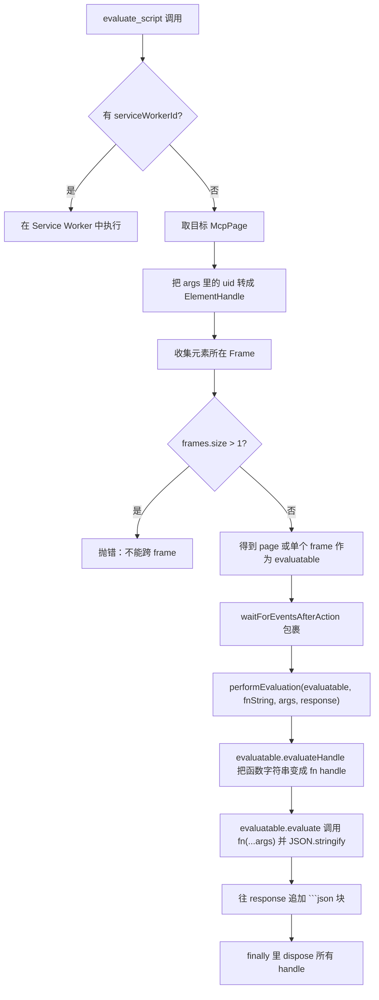
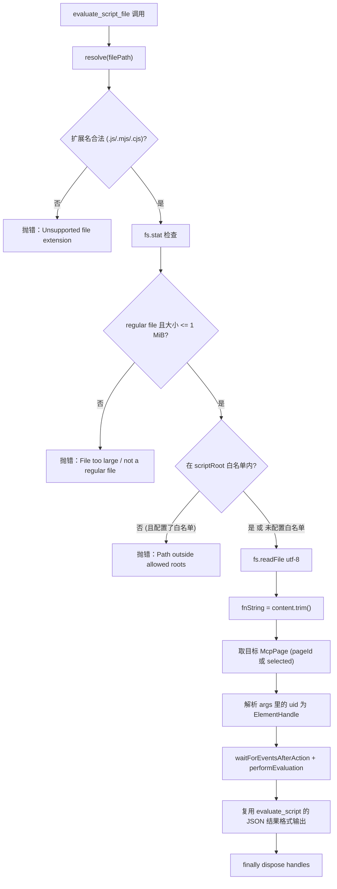

# `evaluate_script_file` 调研与实现方案

> 日期：2026-04-23
> 分支：`feat/evaluate-script-file`
> 相关 Issue：[#1775](https://github.com/ChromeDevTools/chrome-devtools-mcp/issues/1775)
> 相关 PR：[#1772](https://github.com/ChromeDevTools/chrome-devtools-mcp/pull/1772)

---

## 一、背景

当前 `chrome-devtools-mcp` 仅提供 `evaluate_script` 工具，要求将整段 JavaScript 函数体以**字符串形式**放入工具参数里。这种方式在 AI Agent 调用大型或结构复杂的脚本时存在明显痛点：

1. **Token 成本高**：数百行脚本需作为一个字符串参数随每次调用上传，占用大量上下文。
2. **转义脆弱**：脚本里的反引号、模板字符串、正则表达式、`\n`、`\"` 等字符在 JSON 序列化来回传递中极易被损坏。
3. **复用困难**：同一脚本在多个页面反复执行，需要每次重复发送内容。
4. **开发流不友好**：开发者常常已经在本地有一份完整的 `.js` 脚本想直接注入页面做测试/调试/自动化。

基于此，社区提出增加 `evaluate_script_file`，由 MCP Server 直接从本地文件系统读取脚本并在当前页面执行。

---

## 二、现有 `evaluate_script` 实现调研

代码位置：`src/tools/script.ts`（约 190 行）。

### 2.1 工具注册

```ts
export const evaluateScript = defineTool(cliArgs => {
  return {
    name: 'evaluate_script',
    description: `Evaluate a JavaScript function inside the currently selected page...`,
    annotations: {
      category: ToolCategory.DEBUGGING,
      readOnlyHint: false,
    },
    schema: {
      function: zod.string().describe(...),
      args: zod.array(zod.string()).optional(),
      dialogAction: zod.string().optional(),
      ...(cliArgs?.experimentalPageIdRouting ? pageIdSchema : {}),
      ...(cliArgs?.categoryExtensions ? {serviceWorkerId: ...} : {}),
    },
    handler: async (request, response, context) => { ... },
  };
});
```

关键点：

- 通过 `defineTool` 工厂方式注册，工具名固定为 `evaluate_script`，分类 `DEBUGGING`。
- `schema` 基于 `zod`，核心参数是 `function`（字符串形式的函数声明）和可选的 `args`（元素 `uid` 列表）。
- 条件式 schema：
  - `experimentalPageIdRouting` 开启时，允许传入 `pageId` 指定目标页。
  - `categoryExtensions` 开启时，支持 `serviceWorkerId`，可在扩展 Service Worker 中执行。

### 2.2 执行流程



### 2.3 关键实现细节

- `performEvaluation` 使用 Puppeteer 的两步走：
  1. `evaluateHandle("(" + fnString + ")")` —— 得到页面侧函数引用（避免参数重复序列化）。
  2. `evaluate((fn, ...args) => JSON.stringify(await fn(...args)), fn, ...args)` —— 在页面里执行并强制 JSON 序列化返回。
- `args` 是元素 `uid`，会先被解析为 `ElementHandle`；若来自多个 frame 则报错。
- 包裹在 `waitForEventsAfterAction(..., {handleDialog: dialogAction ?? 'accept'})` 中，以便处理 `alert/confirm/prompt`。
- 资源释放：`try/finally` 中 `arg.dispose()`、`fn.dispose()`。
- Service Worker 路径：通过 `context.getExtensionServiceWorkers()` 找到目标 worker，不支持 element `args`。

### 2.4 周边集成点

| 位置 | 作用 |
|---|---|
| `src/tools/tools.ts` | 通过 `Object.values(scriptTools)` 聚合导出，自动注册到 MCP Server |
| `src/bin/cliDefinitions.ts` | 自动生成的 CLI 命令定义（`npm run cli:generate`） |
| `src/bin/chrome-devtools-cli-options.ts` | CLI 选项与工具命令元数据 |
| `docs/tool-reference.md` | 工具参考文档（也有 token 预算标记） |
| `README.md` | 工具列表摘要（按 category 分组） |
| `tests/tools/script.test.ts` | 现有测试位置与模式 |
| `src/tools/slim/tools.ts` | Slim 模式的精简工具集合（不包含 evaluate_script） |

---

## 三、Issue #1775 与 PR #1772 讨论摘要

### 3.1 作者（achideal）的立场

- 新增 `evaluate_script_file(filePath, args?)` 从本地 FS 读取 JS 文件内容并在当前页面执行。
- 论证已考虑过替代方案但都不佳：
  - 让 Agent 自己 `read_file` 再塞给 `evaluate_script`：浪费 token、转义易坏。
  - `fetch()` 或动态 `<script>` 注入：脆弱、不通用。
- 已提交实现 PR #1772。

### 3.2 维护者 OrKoN 的反馈

> "Could you please file a feature request with details for your use case?"

要点：

- **先设计后实现**：要求作者先在 Issue 中详细阐述 use-case，再进入代码评审。
- Issue 被打上 `collecting-feedback` 标签，意味着项目方向尚未确定是否接纳。
- **言下之意的关注点（根据 MCP Server 一般设计原则合理推断）**：
  1. 文件系统访问的**安全边界**（MCP Server 不应成为任意 FS 读取的跳板）。
  2. 该功能是否可以由客户端（Agent 自己读文件）完成，而不必新增 Server 工具。
  3. 与现有 `evaluate_script` 的边界与重叠度。

### 3.3 natorion 的观点

在当前可获取的 Issue #1775 和 PR #1772 公开讨论中**未见 natorion 的任何评论或 review**。Reviewers 区域为 "No reviews"，参与者仅 achideal 与 OrKoN。因此本方案不能把"natorion 同意/不同意"作为既定前提，而是把 OrKoN 的评审思路作为主要约束。

> 若用户指的是另一处讨论（如内部/其他 issue），需要补充具体链接后再并入。

### 3.4 从两位立场整合出的设计约束

1. 功能需足够明确、只解决「大脚本字符串化」这一痛点，不膨胀为通用 FS 工具。
2. 行为与 `evaluate_script` 对齐，语义/返回/args/dialog/pageId 保持一致性。
3. 必须有**安全边界**（路径校验、失败错误明确），避免成为任意读文件的通道。
4. 文件内容必须是**函数声明**（箭头 / function 表达式），不是任意脚本片段。
5. 要配套测试与文档；`cliDefinitions.ts` 是自动生成产物，须通过 `npm run cli:generate` 更新。

---

## 四、`evaluate_script_file` 完整实现方案

### 4.1 工具签名

| 字段 | 类型 | 必填 | 说明 |
|---|---|---|---|
| `filePath` | string | 是 | JS 文件路径；推荐绝对路径，相对路径以当前工作目录解析 |
| `args` | string[] | 否 | 元素 `uid` 数组，语义与 `evaluate_script.args` 一致 |
| `dialogAction` | string | 否 | 与 `evaluate_script` 相同，默认 `accept` |
| `pageId` | number | 否 | 仅当 `experimentalPageIdRouting` 开启时可用 |

**刻意不支持**：

- `serviceWorkerId`（第一版不做，降低复杂度；后续若需要可单独加）
- 任意目录遍历 / 写文件 / 列目录 —— 保持纯读 + 执行

### 4.2 文件内容约束

- 文件内容必须是一个**可被 `evaluateHandle("(" + content + ")")` 包裹**的表达式，典型形式：

  ```js
  () => { return document.title; }
  ```

  或

  ```js
  async (el) => { return el.innerText; }
  ```

- 读取后做 `trim()` 处理；允许文件尾部分号，这是 `(fn);` 合法语法。
- 文件大小硬上限：例如 **1 MiB**，超过直接报错，防止把整页大 bundle 灌给 CDP。

### 4.3 安全与路径解析策略

> 这是对 OrKoN 可能关注的"安全边界"的回应，也是当前 PR 尚未覆盖、最值得补强的部分。

1. 路径规范化：
   ```ts
   const resolved = path.resolve(filePath);
   ```
2. 只接受 **`.js` / `.mjs` / `.cjs`** 扩展名，其他扩展名拒绝（避免无意间执行 `.sh`、`.html`）。
3. 读取前 `fs.stat`：
   - 必须是 regular file（拒绝目录、symlink-to-dir）。
   - `size <= MAX_SCRIPT_FILE_SIZE`（默认 1 MiB）。
4. **可选的根目录白名单**（默认关闭，后续 CLI 参数开放）：
   - 新增 CLI flag：`--scriptRoot <dir>`（可多次）。
   - 若配置了白名单，`resolved` 必须位于任一白名单目录下，否则拒绝。
5. 错误信息不暴露目录结构，仅返回 `Could not read script file: <resolvedPath>`（与 PR #1772 行为一致，便于调试）。

### 4.4 复用已有基础设施

最大化复用 `evaluate_script` 现有私有函数（需要把它们导出为模块内可见，或新增 helper 文件）：

- `performEvaluation(evaluatable, fnString, args, response)`
- `getPageOrFrame(page, frames)`

**重构建议**：将 `performEvaluation` / `getPageOrFrame` 从 `script.ts` 的模块私有函数改为**模块内导出**，两个工具共享。PR #1772 已是此方向，合理。

### 4.5 执行流程（对比 `evaluate_script`）



### 4.6 代码骨架

新增到 `src/tools/script.ts` 末尾：

```ts
import fs from 'node:fs/promises';
import path from 'node:path';

const MAX_SCRIPT_FILE_SIZE = 1 * 1024 * 1024; // 1 MiB
const ALLOWED_SCRIPT_EXTENSIONS = new Set(['.js', '.mjs', '.cjs']);

async function loadScriptFile(
  filePath: string,
  allowedRoots: readonly string[] | undefined,
): Promise<string> {
  const resolved = path.resolve(filePath);
  const ext = path.extname(resolved).toLowerCase();
  if (!ALLOWED_SCRIPT_EXTENSIONS.has(ext)) {
    throw new Error(
      `Unsupported script file extension: ${ext}. Allowed: .js, .mjs, .cjs`,
    );
  }

  if (allowedRoots && allowedRoots.length > 0) {
    const ok = allowedRoots.some(root => {
      const normRoot = path.resolve(root) + path.sep;
      return (resolved + path.sep).startsWith(normRoot);
    });
    if (!ok) {
      throw new Error('Script path is outside of allowed roots.');
    }
  }

  let stat;
  try {
    stat = await fs.stat(resolved);
  } catch (err) {
    throw new Error(`Could not read script file: ${resolved}`, {cause: err});
  }
  if (!stat.isFile()) {
    throw new Error(`Not a regular file: ${resolved}`);
  }
  if (stat.size > MAX_SCRIPT_FILE_SIZE) {
    throw new Error(
      `Script file too large (${stat.size} bytes, max ${MAX_SCRIPT_FILE_SIZE}).`,
    );
  }

  try {
    const content = await fs.readFile(resolved, 'utf-8');
    return content.trim();
  } catch (err) {
    throw new Error(`Could not read script file: ${resolved}`, {cause: err});
  }
}

export const evaluateScriptFile = defineTool(cliArgs => {
  return {
    name: 'evaluate_script_file',
    description:
      `Read a JavaScript file from the local filesystem and evaluate ` +
      `it inside the currently selected page. The file must contain a ` +
      `single JavaScript function declaration (arrow or function expression). ` +
      `Returns the response as JSON, so returned values have to be ` +
      `JSON-serializable. Useful for large scripts that are expensive ` +
      `to pass as string parameters.`,
    annotations: {
      category: ToolCategory.DEBUGGING,
      readOnlyHint: false,
    },
    schema: {
      filePath: zod.string().describe(
        'Path to a JavaScript file containing a single function declaration. ' +
          'Absolute paths recommended; relative paths resolve against the ' +
          'current working directory.',
      ),
      args: zod
        .array(
          zod.string().describe(
            'The uid of an element on the page from the page content snapshot',
          ),
        )
        .optional()
        .describe('An optional list of arguments to pass to the function.'),
      dialogAction: zod
        .string()
        .optional()
        .describe(
          'Handle dialogs while execution. "accept", "dismiss", or string for ' +
            'response of window.prompt. Defaults to accept.',
        ),
      ...(cliArgs?.experimentalPageIdRouting ? pageIdSchema : {}),
    },
    handler: async (request, response, context) => {
      const {
        args: uidArgs,
        filePath,
        pageId,
        dialogAction,
      } = request.params;

      const fnString = await loadScriptFile(
        filePath,
        cliArgs?.scriptRoots,
      );

      const mcpPage = cliArgs?.experimentalPageIdRouting
        ? context.getPageById(pageId)
        : context.getSelectedMcpPage();
      const page: Page = mcpPage.pptrPage;

      const args: Array<JSHandle<unknown>> = [];
      try {
        const frames = new Set<Frame>();
        for (const uid of uidArgs ?? []) {
          const handle = await mcpPage.getElementByUid(uid);
          frames.add(handle.frame);
          args.push(handle);
        }
        const evaluatable = await getPageOrFrame(page, frames);
        await mcpPage.waitForEventsAfterAction(
          async () => {
            await performEvaluation(evaluatable, fnString, args, response);
          },
          {handleDialog: dialogAction ?? 'accept'},
        );
      } finally {
        void Promise.allSettled(args.map(arg => arg.dispose()));
      }
    },
  };
});
```

### 4.7 对现有代码的最小改动清单

| 文件 | 改动 |
|---|---|
| `src/tools/script.ts` | 新增 `evaluateScriptFile`，把 `performEvaluation` / `getPageOrFrame` 保持模块内可见；引入 `node:fs/promises`、`node:path` |
| `src/tools/tools.ts` | 无需改动（`Object.values(scriptTools)` 自动包含新导出） |
| `src/bin/chrome-devtools-mcp-cli-options.ts` | （可选）新增 `--scriptRoots` CLI flag（字符串数组），默认空 |
| `src/bin/cliDefinitions.ts` | 自动生成：执行 `npm run cli:generate` |
| `docs/tool-reference.md` | 新增 `### evaluate_script_file` 段；token 数会自然更新 |
| `README.md` | Debugging 工具计数从 N 改为 N+1；新增锚点链接 |
| `tests/tools/script.test.ts` | 新增 `describe('evaluate_script_file')` |
| `tests/tools/fixtures/test-script*.js` | 新增 3 个测试 fixture（见下文） |

### 4.8 测试计划

**Fixtures（`tests/tools/fixtures/`）**：

```js
// test-script.js
() => {
  return document.title;
}

// test-script-async.js
async () => {
  await new Promise(res => setTimeout(res, 0));
  return 'async-works';
}

// test-script-with-args.js
(el) => {
  return el.id;
}
```

**测试矩阵**：

| 测试 | 断言 |
|---|---|
| 基础脚本 | 读取 `test-script.js`，返回 `document.title` |
| 异步脚本 | 读取 `test-script-async.js`，返回 `'async-works'` |
| 带元素 uid 参数 | 读取 `test-script-with-args.js`，传入 `args: ['1_1']`，返回元素 id |
| 文件不存在 | 抛出 `Could not read script file: ...` |
| 扩展名不合法 | 抛出 `Unsupported script file extension` |
| 文件超过大小上限 | 抛出 `Script file too large` |
| 相对路径 | 相对 `cwd` 解析成功 |
| 跨 frame（错误路径）| 抛出 `Elements from different frames can't be evaluated together.` |
| dialog 交互 | 脚本内 `prompt()`，`dialogAction: 'John Doe'` 返回 `'John Doe'` |
| 白名单（若启用）| 路径不在白名单 → 抛错；在白名单 → 成功 |

### 4.9 行为与 `evaluate_script` 的一致性检查

| 方面 | `evaluate_script` | `evaluate_script_file` |
|---|---|---|
| 返回 | ```json 代码块，JSON.stringify 结果 | 同 |
| `args` 语义 | 元素 uid → ElementHandle | 同 |
| 跨 frame 错误 | ✅ | ✅（复用） |
| dialog 处理 | ✅ | ✅ |
| `pageId`（实验） | ✅ | ✅ |
| Service Worker | ✅（`serviceWorkerId`） | ❌ 第一版不做 |
| 资源释放 | `try/finally dispose` | 同 |

### 4.10 对 PR #1772 的改进建议（反馈给上游）

结合 OrKoN 的关注点，建议作者在现有 PR 基础上补强：

1. **加扩展名白名单**：`.js/.mjs/.cjs`，避免把 `.html` / `.txt` 等喂进 `evaluateHandle`。
2. **加文件大小上限**：避免恶意/意外超大文件导致 CDP 崩溃。
3. **可选的根目录白名单**：通过 CLI flag 暴露，默认不启用；对企业/沙箱场景很重要。
4. **`dialogAction` 对齐**：当前 PR 代码缺少 `dialogAction` 与 `waitForEventsAfterAction` 的 dialog 处理包裹，会导致带 `alert/confirm/prompt` 的脚本挂起（与 `evaluate_script` 行为不一致）。
5. **Service Worker**：第一版保持不支持，但在 description 中明确说明"仅页面 / frame 环境"。
6. **文档补充**：在 `docs/tool-reference.md` 中给出安全边界、文件格式约束、典型 fixture 示例。

---

## 五、实施步骤（落地清单）

1. [ ] `src/tools/script.ts` 新增 `evaluateScriptFile`，抽取 `performEvaluation/getPageOrFrame` 复用。
2. [ ] `src/bin/chrome-devtools-mcp-cli-options.ts` 加 `--scriptRoots`（可选）。
3. [ ] `npm run cli:generate` 同步 `cliDefinitions.ts`。
4. [ ] 新增测试 fixtures 与 `evaluate_script_file` 测试套件。
5. [ ] `docs/tool-reference.md` 补新章节；`README.md` 更新 Debugging 工具计数与链接。
6. [ ] `npm run format` + `npm run build` + `npm run test` 全量通过。
7. [ ] 提交 PR，描述中引用 Issue #1775，并显式说明与 PR #1772 的差异与安全增强。

---

## 六、未决问题（待 OrKoN 确认）

1. 是否接受 `--scriptRoots` 白名单 flag？是否希望默认关闭、由用户显式配置？
2. Service Worker 评估是否作为第二版跟进？
3. 是否需要返回脚本解析后的源位置（便于错误栈映射）？
4. 是否接受文件大小上限 1 MiB；是否要设为 CLI 可调？

以上问题不阻塞基本实现，可在 PR 评审阶段迭代确认。
