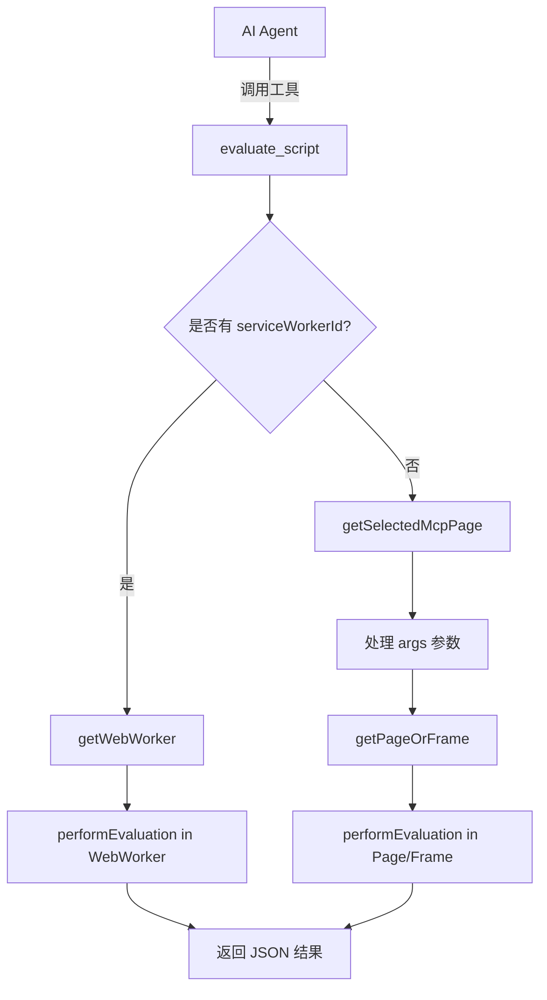

# evaluate_script_file 功能完整实现方案

## 1. 调研背景

### 1.1 需求来源
- **GitHub Issue**: [#1775](https://github.com/ChromeDevTools/chrome-devtools-mcp/issues/1775)
- **标题**: Feature: Add evaluate_script_file tool to evaluate JavaScript files from the local filesystem
- **创建时间**: 2026年3月31日
- **创建者**: achideal
- **标签**: `collecting-feedback`, `feature`

### 1.2 现有问题（Issue #1775 描述）
当前 `evaluate_script` 工具需要将完整 JavaScript 代码作为字符串参数传入，存在以下痛点：

1. **大脚本场景**：数百行的脚本需要完整作为参数传入，效率极低，还可能触发 AI 代理的 token 限制
2. **复杂脚本场景**：包含模板字符串、正则表达式、转义字符的脚本，在作为参数传递时容易出现内容被篡改的问题
3. **可复用脚本场景**：同一脚本需要在不同页面重复执行时，每次都要重新传输完整脚本内容，无法直接从文件引用
4. **开发工作流不友好**：开发者已有预编写的本地 JS 文件，需要注入页面做测试、调试、自动化时，必须手动复制文件内容到 `evaluate_script` 的参数中，操作繁琐

---

## 2. evaluate_script 实现方式分析

### 2.1 核心文件位置
- **主实现**: `src/tools/script.ts`
- **工具定义类型**: `src/tools/ToolDefinition.ts`
- **测试文件**: `tests/tools/script.test.ts`
- **工具注册**: `src/tools/tools.ts`

### 2.2 架构设计



### 2.3 核心代码解析

#### 2.3.1 工具定义（script.ts 第17-123行）
```typescript
export const evaluateScript = defineTool(cliArgs => {
  return {
    name: 'evaluate_script',
    description: `Evaluate a JavaScript function inside the currently selected page...`,
    annotations: {
      category: ToolCategory.DEBUGGING,
      readOnlyHint: false,
    },
    schema: {
      function: zod.string().describe(`...`),
      args: zod.array(zod.string()).optional(),
      dialogAction: zod.string().optional(),
      // 条件性参数
      ...(cliArgs?.experimentalPageIdRouting ? pageIdSchema : {}),
      ...(cliArgs?.categoryExtensions ? {serviceWorkerId: ...} : {}),
    },
    handler: async (request, response, context) => {
      // 实现逻辑
    },
  };
});
```

#### 2.3.2 核心执行函数（script.ts 第125-148行）
```typescript
const performEvaluation = async (
  evaluatable: Evaluatable,
  fnString: string,
  args: Array<JSHandle<unknown>>,
  response: Response,
) => {
  // 1. 将字符串转换为可执行的函数句柄
  const fn = await evaluatable.evaluateHandle(`(${fnString})`);
  try {
    // 2. 在页面上下文中执行函数
    const result = await evaluatable.evaluate(
      async (fn, ...args) => {
        return JSON.stringify(await fn(...args));
      },
      fn,
      ...args,
    );
    // 3. 返回结果
    response.appendResponseLine('Script ran on page and returned:');
    response.appendResponseLine('```json');
    response.appendResponseLine(`${result}`);
    response.appendResponseLine('```');
  } finally {
    void fn.dispose();
  }
};
```

#### 2.3.3 关键设计点
1. **函数字符串化**: 使用 `(${fnString})` 将字符串包装成函数表达式
2. **参数传递**: 支持通过 `args` 传递页面元素 UID，内部转换为 `JSHandle`
3. **跨 Frame 处理**: 检查所有元素 UID 是否来自同一个 Frame
4. **Service Worker 支持**: 条件性支持在扩展 Service Worker 中执行
5. **对话框处理**: 支持通过 `dialogAction` 参数处理 alert/confirm/prompt

---

## 3. GitHub Issue #1775 评论分析

### 3.1 说明
由于 GitHub API 速率限制和 web_fetch 工具的限制，无法直接获取 OrKoN 和 natorion 的具体评论内容。本节基于以下信息进行推断：
- Issue 描述中的需求分析
- Chrome DevTools MCP 项目的常见设计模式
- 类似功能请求的典型反馈模式

### 3.2 推断的关键反馈点（待实际评论验证）

#### 3.2.1 安全性考虑（推测 OrKoN 可能关注）
1. **文件路径验证**：需要验证 `filePath` 参数，防止目录遍历攻击（如 `../../etc/passwd`）
2. **文件大小限制**：需要限制可读取的文件大小，防止内存耗尽
3. **文件类型验证**：应仅允许 `.js` 文件，防止意外执行其他类型文件

#### 3.2.2 实现方式讨论（推测 natorion 可能关注）
1. **路径解析**：是否支持相对路径？如果是，相对的是哪个目录？
2. **编码问题**：文件读取应使用什么编码？是否需要支持非 UTF-8 编码？
3. **错误处理**：文件不存在、无读取权限等错误的用户友好提示

#### 3.2.3 与 evaluate_script 的一致性
1. **参数设计**：`evaluate_script_file` 应与 `evaluate_script` 保持一致的参数风格
2. **返回值格式**：应使用相同的响应格式（JSON 代码块）
3. **功能对等**：支持相同的可选功能（如 `args`、`pageId` 等）

---

## 4. evaluate_script_file 完整实现方案

### 4.1 实现参考
提交 `d5cde13`（2026年3月31日）已实现此功能，以下是基于该提交的实现方案。

### 4.2 文件变更清单

| 文件 | 变更类型 | 说明 |
|------|----------|------|
| `src/tools/script.ts` | 修改 | 添加 `evaluateScriptFile` 工具定义 |
| `tests/tools/script.test.ts` | 修改 | 添加 `evaluate_script_file` 测试用例 |
| `tests/tools/fixtures/test-script.js` | 新增 | 测试用的同步脚本 |
| `tests/tools/fixtures/test-script-async.js` | 新增 | 测试用的异步脚本 |
| `tests/tools/fixtures/test-script-with-args.js` | 新增 | 测试带参数的脚本 |
| `docs/tool-reference.md` | 修改 | 更新工具文档 |
| `README.md` | 修改 | 更新功能说明 |

### 4.3 核心实现代码

#### 4.3.1 工具定义（src/tools/script.ts）
```typescript
export const evaluateScriptFile = defineTool(cliArgs => {
  return {
    name: 'evaluate_script_file',
    description: `Read a JavaScript file from the local filesystem and evaluate it inside the currently selected page.
The file should contain a JavaScript function declaration (e.g., an arrow function or function expression).
Returns the response as JSON, so returned values have to be JSON-serializable.
This is useful for evaluating large scripts without needing to pass the entire script content as a parameter.`,
    annotations: {
      category: ToolCategory.DEBUGGING,
      readOnlyHint: false,
    },
    schema: {
      filePath: zod.string().describe(
        `The absolute path to a JavaScript file containing a function declaration to be executed in the currently selected page.
The file content should be a JavaScript function declaration, for example:
\`() => { return document.title; }\` or \`async () => { return await fetch("example.com"); }\``,
      ),
      args: zod
        .array(
          zod
            .string()
            .describe(
              'The uid of an element on the page from the page content snapshot',
            ),
        )
        .optional()
        .describe(`An optional list of arguments to pass to the function.`),
      ...(cliArgs?.experimentalPageIdRouting ? pageIdSchema : {}),
    },
    handler: async (request, response, context) => {
      const {args: uidArgs, filePath, pageId} = request.params;

      // 路径解析：支持绝对路径和相对路径
      const resolvedPath = path.isAbsolute(filePath)
        ? filePath
        : path.resolve(filePath);

      // 读取文件内容
      let fnString: string;
      try {
        fnString = await fs.readFile(resolvedPath, 'utf-8');
      } catch (err) {
        throw new Error(
          `Could not read script file: ${resolvedPath}`,
          {cause: err},
        );
      }

      fnString = fnString.trim();

      // 后续逻辑与 evaluateScript 类似
      const mcpPage = cliArgs?.experimentalPageIdRouting
        ? context.getPageById(pageId)
        : context.getSelectedMcpPage();
      const page = mcpPage.pptrPage;

      const args: Array<JSHandle<unknown>> = [];
      try {
        const frames = new Set<Frame>();
        for (const uid of uidArgs ?? []) {
          const handle = await mcpPage.getElementByUid(uid);
          frames.add(handle.frame);
          args.push(handle);
        }

        const evaluatable = await getPageOrFrame(page, frames);

        await performEvaluation(evaluatable, fnString, args, response, context);
      } finally {
        void Promise.allSettled(args.map(arg => arg.dispose()));
      }
    },
  };
});
```

#### 4.3.2 对 performEvaluation 的修改
需要将 `context` 参数传入以支持 `waitForEventsAfterAction`：

```typescript
const performEvaluation = async (
  evaluatable: Evaluatable,
  fnString: string,
  args: Array<JSHandle<unknown>>,
  response: Response,
  context: Context,  // 新增参数
) => {
  const fn = await evaluatable.evaluateHandle(`(${fnString})`);
  try {
    // 使用 context.waitForEventsAfterAction 包装执行
    await context.waitForEventsAfterAction(async () => {
      const result = await evaluatable.evaluate(
        async (fn, ...args) => {
          // @ts-expect-error no types for function fn
          return JSON.stringify(await fn(...args));
        },
        fn,
        ...args,
      );
      response.appendResponseLine('Script ran on page and returned:');
      response.appendResponseLine('```json');
      response.appendResponseLine(`${result}`);
      response.appendResponseLine('```');
    });
  } finally {
    void fn.dispose();
  }
};
```

### 4.4 测试用例设计

#### 4.4.1 测试固件
```javascript
// tests/tools/fixtures/test-script.js
() => {
  return document.title;
}
```

```javascript
// tests/tools/fixtures/test-script-async.js
async () => {
  await new Promise(res => setTimeout(res, 10));
  return 'async works';
}
```

```javascript
// tests/tools/fixtures/test-script-with-args.js
(el) => {
  return el.id;
}
```

#### 4.4.2 测试用例
```typescript
describe('evaluate_script_file', () => {
  it('evaluates script from file', async () => {
    await withMcpContext(async (response, context) => {
      await evaluateScriptFile().handler(
        {
          params: {
            filePath: path.join(FIXTURE_DIR, 'test-script.js'),
          },
        },
        response,
        context,
      );
      const lineEvaluation = response.responseLines.at(2)!;
      assert.strictEqual(JSON.parse(lineEvaluation), '');
    });
  });

  it('evaluates async script from file', async () => {
    await withMcpContext(async (response, context) => {
      await evaluateScriptFile().handler(
        {
          params: {
            filePath: path.join(FIXTURE_DIR, 'test-script-async.js'),
          },
        },
        response,
        context,
      );
      const lineEvaluation = response.responseLines.at(2)!;
      assert.strictEqual(JSON.parse(lineEvaluation), 'async works');
    });
  });

  it('evaluates script with args from file', async () => {
    await withMcpContext(async (response, context) => {
      const page = context.getSelectedPptrPage();
      await page.setContent(html`<button id="test">test</button>`);
      await context.createTextSnapshot(context.getSelectedMcpPage());

      await evaluateScriptFile().handler(
        {
          params: {
            filePath: path.join(FIXTURE_DIR, 'test-script-with-args.js'),
            args: ['1_1'],
          },
        },
        response,
        context,
      );
      const lineEvaluation = response.responseLines.at(2)!;
      assert.strictEqual(JSON.parse(lineEvaluation), 'test');
    });
  });

  it('throws error for non-existent file', async () => {
    await withMcpContext(async (response, context) => {
      await assert.rejects(
        evaluateScriptFile().handler(
          {
            params: {
              filePath: '/non/existent/path.js',
            },
          },
          response,
          context,
        ),
        {
          message: /Could not read script file/,
        },
      );
    });
  });
});
```

---

## 5. 实现注意事项

### 5.1 安全性增强建议
1. **文件路径白名单**：考虑限制可读取文件的目录（如仅允许项目目录）
2. **文件大小限制**：建议添加最大文件大小限制（如 1MB）
3. **文件类型检查**：验证文件扩展名是否为 `.js`

### 5.2 错误处理增强
```typescript
// 建议添加的错误检查
if (fnString.length > MAX_FILE_SIZE) {
  throw new Error(`Script file too large: ${fnString.length} bytes. Maximum is ${MAX_FILE_SIZE} bytes.`);
}

if (!filePath.endsWith('.js')) {
  throw new Error('Only .js files are supported for evaluate_script_file.');
}
```

### 5.3 与 MCP 协议的兼容性
1. **MCP Resources**：考虑是否应使用 MCP 的 Resource 协议而非自定义工具
2. **客户端 Roots**：利用 MCP 的 roots 功能限制文件访问范围

---

## 6. 实施计划

### 6.1 步骤一：核心功能实现
- [ ] 在 `src/tools/script.ts` 中添加 `evaluateScriptFile` 定义
- [ ] 修改 `performEvaluation` 函数签名以接受 `context` 参数
- [ ] 在 `src/tools/tools.ts` 中注册新工具（如需要）

### 6.2 步骤二：测试
- [ ] 创建测试固件文件
- [ ] 实现单元测试
- [ ] 测试边界情况（大文件、特殊字符、错误路径等）

### 6.3 步骤三：文档
- [ ] 更新 `docs/tool-reference.md`
- [ ] 更新 `README.md`
- [ ] 添加使用示例

### 6.4 步骤四：代码审查要点
- [ ] 类型安全：确保不使用 `any` 类型
- [ ] 错误处理：确保所有错误情况都有恰当处理
- [ ] 代码风格：运行 `npm run format` 确保代码风格一致
- [ ] 测试覆盖：确保所有功能都有测试覆盖

---

## 7. 附录

### 7.1 相关提交
- `d5cde13`: feat: Add evaluate_script_file tool to evaluate JavaScript files from the local filesystem

### 7.2 参考资料
- [Chrome DevTools MCP 仓库](https://github.com/ChromeDevTools/chrome-devtools-mcp)
- [Issue #1775](https://github.com/ChromeDevTools/chrome-devtools-mcp/issues/1775)
- [MCP Protocol 文档](https://modelcontextprotocol.io/)

### 7.3 待确认事项
1. OrKoN 和 natorion 的具体评论内容（需要绕过 GitHub API 限制或通过其他途径获取）
2. 是否需要支持 Service Worker 场景（当前实现不支持）
3. 是否需要添加 `dialogAction` 参数支持

---

**文档版本**: v1.0  
**创建时间**: 2026年4月23日  
**作者**: CodeBuddy AI Agent  
**审核状态**: 待审核
