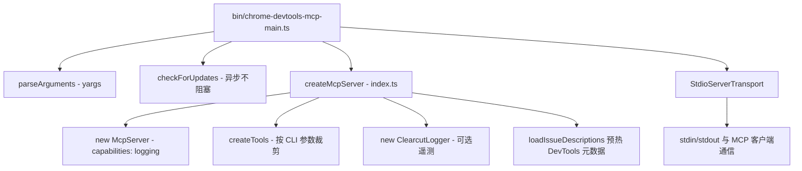
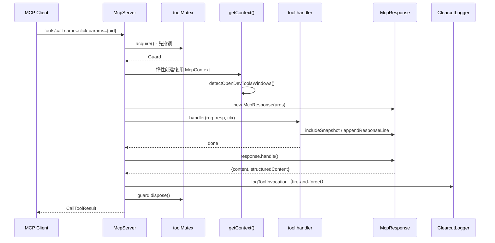
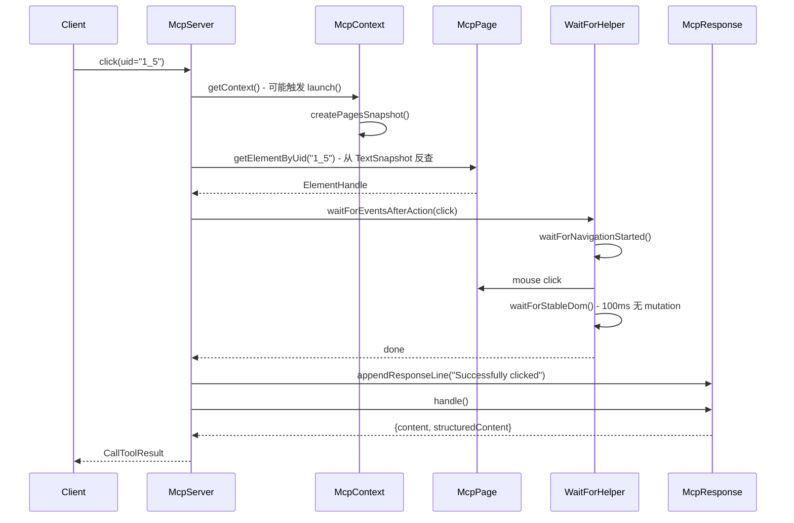

# 01 - MCP Server 整体架构与请求生命周期

> 关键源码：`src/index.ts`、`src/bin/chrome-devtools-mcp-main.ts`、`src/McpContext.ts`、`src/tools/tools.ts`

## 1. 项目定位

`chrome-devtools-mcp` 是一个 **MCP（Model Context Protocol）服务器**，把 Chrome DevTools + Puppeteer 的能力暴露给 AI Agent（Claude、Gemini、Cursor 等）。Agent 通过 `tools/call` 请求调用浏览器动作（click、navigate、take_snapshot、performance_start_trace 等）。

定位清晰地决定了它的三条设计主线：

1. **Agent-Agnostic**：走 MCP 标准协议，不绑定某一个 LLM；
2. **Token-Optimized**：返回语义摘要而非原始数据，大数据走文件；
3. **Deterministic Blocks**：每个工具是一个小而确定的原子动作，由 Agent 组合（详见 `docs/design-principles.md`）。

## 2. 启动拓扑



入口代码极其紧凑（`chrome-devtools-mcp-main.ts`）：

```12:53:src/bin/chrome-devtools-mcp-main.ts
await checkForUpdates(
  'Run `npm install chrome-devtools-mcp@latest` to update.',
);

export const args = parseArguments(VERSION);
...
const {server, clearcutLogger} = await createMcpServer(args, {logFile});
const transport = new StdioServerTransport();
await server.connect(transport);
```

值得学习的点：

- **Top-level await**：Node 20+ ESM 下使用顶层 `await`，让主入口读起来像脚本一样线性。
- **启动期的副作用精简**：`checkForUpdates` 被故意设计为"立即返回，后台执行"，不会阻塞 MCP 连接握手（详见第 15 篇）。
- **遥测可观察**：`logServerStart` 和 `logDailyActiveIfNeeded` 在连接后立即触发，且都用 `void` 标注为 fire-and-forget。

## 3. 工具请求生命周期

核心在 `createMcpServer` 中的 `registerTool` 闭包（`src/index.ts`）。每个工具调用都走同样的 pipeline：



对应源码骨架：

```194:277:src/index.ts
async (params): Promise<CallToolResult> => {
  const guard = await toolMutex.acquire();
  const startTime = Date.now();
  let success = false;
  try {
    const context = await getContext();
    await context.detectOpenDevToolsWindows();
    const response = serverArgs.slim
      ? new SlimMcpResponse(serverArgs)
      : new McpResponse(serverArgs);
    ...
    await tool.handler({params, page}, response, context);
    const {content, structuredContent} = await response.handle(tool.name, context);
    success = true;
    return {content};
  } catch (err) {
    ...
    return {content: [{type: 'text', text: errorText}], isError: true};
  } finally {
    void clearcutLogger?.logToolInvocation({...});
    guard.dispose();
  }
}
```

## 4. 值得学习的 6 个架构决策

### 4.1 Lazy Context 创建

`getContext()` 延迟到第一次工具调用时才启动/连接浏览器。这意味着：

- MCP 客户端连接本身不会唤醒 Chrome，避免"启动 IDE 就弹浏览器"的糟糕体验。
- 只要浏览器对象（`context.browser`）没变，就复用同一 `McpContext`，减少建连开销。

### 4.2 工具执行串行化

`toolMutex = new Mutex()` 保证**全局同时只有一个工具在执行**。这一刀切避免了：

- 两个动作同时操作页面引起的 DOM 竞态；
- 网络/控制台收集器状态错乱；
- 性能 trace 并发启动。

代价是吞吐量，但对 Agent 使用场景完全可接受（详见第 3 篇）。

### 4.3 统一 try/catch/finally

任何 tool handler 抛错都被 catch 转为 `isError: true` 的 `CallToolResult`。Agent 能继续对话，而不是连接断开。这是「自愈错误」设计原则的基础（详见第 20 篇）。

### 4.4 Response 对象的单向构建

Tool handler 不直接返回结构化数据，而是**往 response 上挂"意图"**：

- `response.includeSnapshot()` — 表示"请附带一份 a11y 快照"
- `response.setIncludeNetworkRequests(true, {...})` — 表示"请附带网络列表"

最后 `response.handle()` 统一收集 + 渲染。这是典型的 Builder 模式（详见第 8 篇）。

### 4.5 双模式响应：Slim vs Full

```203:205:src/index.ts
const response = serverArgs.slim
  ? new SlimMcpResponse(serverArgs)
  : new McpResponse(serverArgs);
```

Slim 模式只暴露 3 个工具（navigate、evaluate、screenshot），对应场景是"轻任务 + 弱模型"；Full 模式暴露 30+ 工具。切换只是换一个实现类（详见第 13 篇）。

### 4.6 结构化输出开关

```244:249:src/index.ts
if (serverArgs.experimentalStructuredContent) {
  result.structuredContent = structuredContent as Record<string, unknown>;
}
```

Response 同时生成文本 + JSON 两份，但是否把 JSON 发给客户端由 CLI 参数控制——**兼容当前 MCP 客户端能力差异**的典型做法。

## 5. 完整时序图（以 `click` 为例）



## 6. 可迁移的经验

| 场景 | 可借鉴 |
| --- | --- |
| 构建任何 MCP Server | 全局 Mutex + Builder Response + Lazy Context 三件套 |
| 延迟启动资源密集型子系统 | `getContext()` + 对象身份比对复用 |
| 兼容不同客户端能力 | 同一份响应数据，结构化/文本双通道输出 |
| Agent 友好的错误策略 | `try/catch` 兜底 + `isError: true`，对话不中断 |

## 7. 延伸阅读

- 工具注册机制 → [02-tool-definition-system.md](./02-tool-definition-system.md)
- 串行化原理 → [03-mutex-serialization.md](./03-mutex-serialization.md)
- Context 细节 → [04-mcp-context.md](./04-mcp-context.md)
