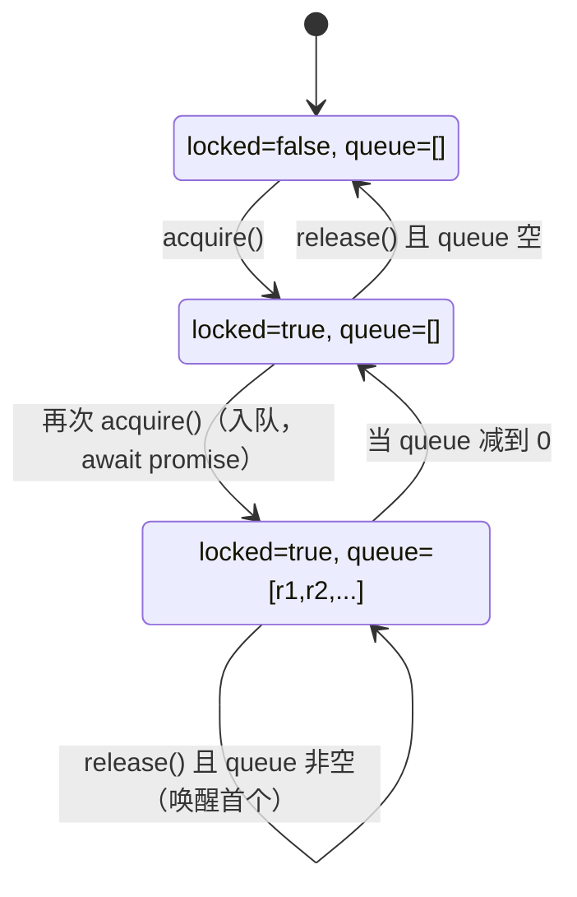

# 03 - Mutex 串行化与「单一工具执行」保证

> 关键源码：`src/Mutex.ts`、`src/index.ts` 的 `toolMutex`

## 1. 为什么需要全局 Mutex

一个 MCP 服务器面对的是 **Agent 的工具调用序列**。Agent 可能会"并行触发"多个工具（LLM 侧的 tool_calls 本身支持并行），而 Chrome + Puppeteer 的共享状态（selected page、network collector、trace 会话）**本质不支持并发**。

典型踩坑场景：

- 工具 A 正在 `performance_start_trace`，工具 B 试图 `click` — CDP 协议会崩；
- 工具 A 在做 `take_snapshot`，工具 B 在同一页面 `navigate` — 拿到的 a11y 节点 ID 全失效；
- 工具 A 在读网络列表，工具 B 触发了导航 — PageCollector 的 `navigations[0]` 在读取过程中被 splice。

项目选择的方案最简单粗暴但**极其稳妥**：**全局 Mutex，所有工具都走串行**。

## 2. 极简 Mutex 实现

```7:41:src/Mutex.ts
export class Mutex {
  static Guard = class Guard {
    #mutex: Mutex;
    constructor(mutex: Mutex) { this.#mutex = mutex; }
    dispose(): void { return this.#mutex.release(); }
  };

  #locked = false;
  #acquirers: Array<() => void> = [];

  async acquire(): Promise<InstanceType<typeof Mutex.Guard>> {
    if (!this.#locked) {
      this.#locked = true;
      return new Mutex.Guard(this);
    }
    const {resolve, promise} = Promise.withResolvers<void>();
    this.#acquirers.push(resolve);
    await promise;
    return new Mutex.Guard(this);
  }

  release(): void {
    const resolve = this.#acquirers.shift();
    if (!resolve) {
      this.#locked = false;
      return;
    }
    resolve();
  }
}
```

核心设计：

- **FIFO 等待队列**：`#acquirers` 是数组，`shift()` 保证先到先服务；
- **Promise.withResolvers()**：Node 22+ 的原生 API，替代手写 `new Promise((resolve) => ...)` + 外置引用；
- **Guard 模式**：`acquire()` 返回一个 Guard 对象，调用 `guard.dispose()` 释放锁 —— 让调用方用 `try/finally` 就能保证释放；
- **锁状态只在无等待者时重置**：`release()` 中如果有等待者，直接把锁"转交"给他，跳过 `#locked = false`，避免 race。

## 3. 使用模式

```195:275:src/index.ts
const guard = await toolMutex.acquire();
const startTime = Date.now();
let success = false;
try {
  ...
  await tool.handler(...);
  ...
  return result;
} catch (err) {
  ...
  return {content: [{type: 'text', text: errorText}], isError: true};
} finally {
  void clearcutLogger?.logToolInvocation({...});
  guard.dispose();
}
```

三个关键点：

1. **锁的粒度 = 整个工具调用周期**（包含 lazy context 创建、response.handle、formatter 等）；
2. **finally 必然释放**：无论抛任何异常都会解锁；
3. **遥测在 finally 里 fire-and-forget**：用 `void` 吞 promise，耗时完全不影响下一个工具。

## 4. 为什么不用 `async-mutex` 之类的三方库

- 依赖最小化（项目 production deps 几乎为零，参见 `package.json`）；
- 实现只有 30 行，一目了然；
- 可以完全定制行为——比如未来想加**优先级队列**或**读写锁**，改一个文件即可。

## 5. 状态机视图



注意：**从 `Locked` / `Queued` 回到 `Idle`**只发生在"释放时队列为空"的情况。这保证了唤醒等待者时锁不会被"偷取"（没有 check-then-act 的 race）。

## 6. 内部复用：`UniverseManager` 也用了相同的 Mutex

```55:90:src/DevtoolsUtils.ts
export class UniverseManager {
  readonly #mutex = new Mutex();

  async init(pages: Page[]) {
    try {
      await this.#mutex.acquire();
      ...
    } finally {
      this.#mutex.release();
    }
  }
```

这里锁的是**局部状态**（`#universes` WeakMap），粒度更细。说明 Mutex 不是"全局工具"专用——它是一个通用并发原语。

## 7. 这套设计的利弊

| 维度 | 评估 |
| --- | --- |
| 正确性 | ✅ 简单直接，不可能出现竞态 |
| 吞吐量 | ⚠️ 每次只跑 1 个工具，Agent 并发调用会排队 |
| 可观测性 | ✅ 排队时间隐含在 `latencyMs` 里，遥测可发现 |
| 可演进 | ✅ 未来可以改为按页面分 Mutex，无需改 handler |

项目选择「正确性优先」是合理的，因为：

- 绝大多数 Agent 流程是**顺序思考**（take_snapshot → click → wait → snapshot）；
- 单用户 MCP 的 QPS 通常个位数；
- Chrome 本身也更适合被"单一驱动者"操作。

## 8. 可迁移经验

1. **锁 + Guard + dispose** 是处理任何异步临界区的最佳写法，比 `lock()/unlock()` 对更不易漏释放；
2. **Promise.withResolvers()** 比手写封装更优雅，且不消耗任何内存额外开销；
3. **FIFO 队列**可以保证调用顺序可预期（对调试和重现 bug 非常重要）；
4. **跳过 `locked=false`**的优化细节：有等待者时不要"先解锁再唤醒"，要"直接转交"——这是教科书级别的写法。

## 9. 延伸阅读

- 服务器生命周期里的 Mutex 位置 → [01-mcp-server-architecture.md](./01-mcp-server-architecture.md)
- 另一个 Mutex 使用者（UniverseManager）→ [17-devtools-universe.md](./17-devtools-universe.md)
- 错误处理与 Mutex 的配合 → [20-error-handling-cleanup.md](./20-error-handling-cleanup.md)
