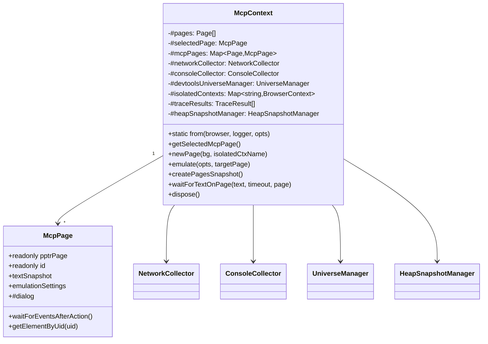
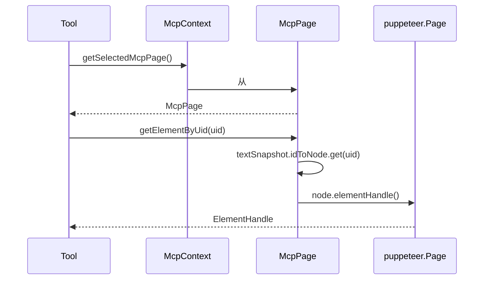

# 04 - McpContext：上下文中心化与多页面状态管理

> 关键源码：`src/McpContext.ts`、`src/McpPage.ts`

## 1. 为什么需要 Context

一个 Chrome 实例里有 N 个 Page，每个 Page 有自己的：

- Dialog 状态（alert/confirm/prompt/beforeunload 是否待处理）
- Emulation 设置（network conditions、CPU throttling、viewport、user agent、color scheme、geolocation）
- Accessibility Snapshot（UID → Node 映射）
- DevTools 打开状态 & 对应的 DevToolsPage
- Puppeteer 定时器（default timeout / navigation timeout）

同时存在**全局**状态：

- 当前选中的 page
- 网络/控制台事件收集器
- 正在运行的 trace / screen recorder
- Isolated browser contexts 的命名映射
- Extension service workers

**散在各处会把 handler 写死**，所以项目把所有状态汇总到 `McpContext` 这一个类，handler 只通过 `Context` 接口访问（`tools/ToolDefinition.ts`）。

## 2. 类结构速览



## 3. 工厂方法 + 私有构造

```145:155:src/McpContext.ts
static async from(
  browser: Browser, logger: Debugger, opts: McpContextOptions,
  locatorClass: typeof Locator = Locator,
) {
  const context = new McpContext(browser, logger, opts, locatorClass);
  await context.#init();
  return context;
}
```

- **私有构造函数** + 静态 `from` 工厂：保证任何实例都经过 `#init()`（启动 network/console 收集、创建 universe、拍快照）；
- 测试友好：`locatorClass` 可注入，让测试用"未 bundle 的 Locator"避开 Puppeteer 的严格实例检查。

## 4. 页面快照算法

`createPagesSnapshot()` 是 context 和真实浏览器状态同步的入口，每次工具调用都可能触发（由 `McpResponse.handle` 在 `includePages` 时调用）。

```483:526:src/McpContext.ts
async createPagesSnapshot(): Promise<Page[]> {
  const {pages: allPages, isolatedContextNames} = await this.#getAllPages();

  for (const page of allPages) {
    let mcpPage = this.#mcpPages.get(page);
    if (!mcpPage) {
      mcpPage = new McpPage(page, this.#nextPageId++);
      this.#mcpPages.set(page, mcpPage);
      void page.emulateFocusedPage(true).catch(...);
    }
    mcpPage.isolatedContextName = isolatedContextNames.get(page);
  }

  // Prune orphaned #mcpPages entries
  const currentPages = new Set(allPages);
  for (const [page, mcpPage] of this.#mcpPages) {
    if (!currentPages.has(page)) {
      mcpPage.dispose();
      this.#mcpPages.delete(page);
    }
  }

  this.#pages = allPages.filter(p =>
    this.#options.experimentalDevToolsDebugging || !p.url().startsWith('devtools://')
  );

  if ((!this.#selectedPage || this.#pages.indexOf(this.#selectedPage.pptrPage) === -1) && this.#pages[0]) {
    this.selectPage(this.#getMcpPage(this.#pages[0]));
  }
  ...
}
```

学习点：

- **增量更新**：已有的 `McpPage` 复用，不覆盖；
- **孤儿清理**：pages 列表差集，dispose 已消失的页面（避免内存泄漏和事件监听器残留）；
- **过滤 DevTools URL**：默认不把 `devtools://` 作为普通 page 暴露给 Agent；
- **自动修正 selected**：当前选中页被关了，自动选第一个活页面；
- **多 Agent 友好**：`emulateFocusedPage(true)` 对每个 page 都开启，保证在 headless / 多页场景下 `:focus-within` 等选择器行为一致。

## 5. 命名 Isolated Context

Agent 有时候要「模拟两个独立用户」，这时候需要**相互隔离的 cookie/storage**。项目用字符串命名映射到 `BrowserContext`：

```210:230:src/McpContext.ts
async newPage(background?: boolean, isolatedContextName?: string): Promise<McpPage> {
  let page: Page;
  if (isolatedContextName !== undefined) {
    let ctx = this.#isolatedContexts.get(isolatedContextName);
    if (!ctx) {
      ctx = await this.browser.createBrowserContext();
      this.#isolatedContexts.set(isolatedContextName, ctx);
    }
    page = await ctx.newPage();
  } else {
    page = await this.browser.newPage({background});
  }
  ...
}
```

且 `#getAllPages()` 会**自动发现**外部创建的 BrowserContext（例如手工打开的隐身），赋予 `isolated-context-N` 的自动名：

```575:582:src/McpContext.ts
for (const ctx of this.browser.browserContexts()) {
  if (ctx !== defaultCtx && !ctx.closed && !knownContexts.has(ctx)) {
    const name = `isolated-context-${this.#nextIsolatedContextId++}`;
    this.#isolatedContexts.set(name, ctx);
    contextToName.set(ctx, name);
  }
}
```

**设计亮点**：Agent 只认字符串 name（稳定），内部绑定 BrowserContext 实例（可变），两者之间通过映射解耦。

## 6. Emulation 的"纯设置 + 重放"模式

`emulate()` 接受一个 options 对象，对每一个字段：

- 缺省 → 重置到默认
- 提供 → 应用到 puppeteer 并记录到 `mcpPage.emulationSettings`

```252:343:src/McpContext.ts
async emulate(options, targetPage?) {
  const page = targetPage ?? this.getSelectedPptrPage();
  const mcpPage = this.#getMcpPage(page);
  const newSettings: EmulationSettings = {...mcpPage.emulationSettings};

  if (!options.networkConditions) {
    await page.emulateNetworkConditions(null);
    delete newSettings.networkConditions;
  } else if (options.networkConditions === 'Offline') {
    await page.emulateNetworkConditions({offline: true, ...});
    newSettings.networkConditions = 'Offline';
  }
  ...
  mcpPage.emulationSettings = Object.keys(newSettings).length ? newSettings : {};
  this.#updateSelectedPageTimeouts();
}
```

这样 `restoreEmulation(page)` 只需要 `this.emulate(page.emulationSettings, page.pptrPage)` 就能把设置重新打到 puppeteer 上——典型的**状态分离**（本地 store）+**副作用重放**（applier）。

## 7. 动态 Timeout 缩放

```418:433:src/McpContext.ts
#updateSelectedPageTimeouts() {
  const page = this.#getSelectedMcpPage();
  const cpuMultiplier = page.cpuThrottlingRate;
  page.pptrPage.setDefaultTimeout(DEFAULT_TIMEOUT * cpuMultiplier);
  const networkMultiplier = getNetworkMultiplierFromString(page.networkConditions);
  page.pptrPage.setDefaultNavigationTimeout(NAVIGATION_TIMEOUT * networkMultiplier);
}
```

当 Agent 模拟 Slow 3G + 4x CPU 时，puppeteer 的等待超时自动乘以倍数，避免误报"timeout"。这是一个非常细但常被忽略的细节：**模拟场景越恶劣，自动化越容易超时报错**，手动上调倍数才能让测试稳定。

## 8. WeakMap + Map 的组合拳

| 数据 | 容器 | 原因 |
| --- | --- | --- |
| `#mcpPages` | `Map<Page, McpPage>` | Page 对象本身已被 `#pages` 数组持有，Map 负责 id/meta 映射；按需 prune |
| `#extensionPages` | `WeakMap<Target, Page>` | Target 会被 Puppeteer 自动释放，WeakMap 自动清理 |
| `#extensionServiceWorkerMap` | `WeakMap<Target, string>` | 同上 |
| `#subscribedPages` (ConsoleCollector) | `WeakMap<Page, PageEventSubscriber>` | Page 被销毁时对应的 subscriber 自动回收 |

**经验**：当 key 的生命周期由**框架**管理、无法手动遍历时，用 WeakMap；需要遍历或者主动清理时，用 Map。

## 9. 依赖注入式的 Context 协议

handler 依赖的 Context 不是 `McpContext` 本身，而是 `tools/ToolDefinition.ts` 里的只读接口：

```168:237:src/tools/ToolDefinition.ts
export type Context = Readonly<{
  isRunningPerformanceTrace(): boolean;
  recordedTraces(): TraceResult[];
  getPageById(pageId: number): ContextPage;
  newPage(bg?, isolatedContextName?): Promise<ContextPage>;
  emulate(options, targetPage?): Promise<void>;
  saveFile(data, path, ext): Promise<{filename}>;
  waitForTextOnPage(text, timeout?, page?): Promise<Element>;
  ...
}>;
```

这层接口：

1. **限定 handler 的权限范围**（不能乱改 `browser` 字段）；
2. **方便 mock 测试**（测试只需实现接口即可）；
3. **隔离实现变更**（`McpContext` 私有字段随便改）。

## 10. 架构流程图



## 11. 可迁移经验

| 经验 | 说明 |
| --- | --- |
| 工厂方法 + 私有构造 | 异步初始化的类都应该这么做 |
| 按需 + Lazy 快照 | 不要在构造时做重活，留给第一次使用时同步 |
| 状态分离 + Applier | EmulationSettings 与 Puppeteer 调用分离，便于重放 |
| 只读接口投递 | handler 依赖接口而非具体类，实现可替换 |
| WeakMap 救命 | 挂在 Puppeteer 对象上的附加数据必须 WeakMap |

## 12. 延伸阅读

- Page 级封装 → [07-text-snapshot.md](./07-text-snapshot.md)
- Page 采集器 → [05-page-collector.md](./05-page-collector.md)
- 等待机制 → [06-wait-for-helper.md](./06-wait-for-helper.md)
