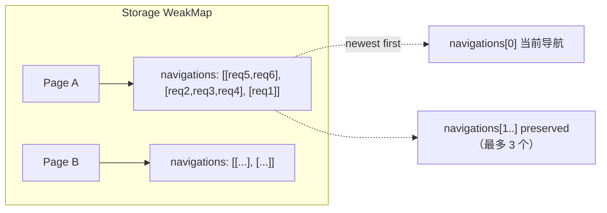

# 05 - PageCollector：跨导航资源采集与稳定 ID 体系

> 关键源码：`src/PageCollector.ts`、`src/utils/id.ts`

## 1. 收集器解决的三个问题

Agent 经常需要问「**上一次导航之后**发的所有请求是什么？」「给我 id=42 的请求详情」「还要带上跨导航保留的之前几次的请求」。

实现这些能力需要：

1. **按页面**订阅 puppeteer 的 `request`、`console`、`issue`、`framenavigated` 等事件；
2. **按导航分桶**：主 frame 导航一次，开新一桶，Agent 可选读取"仅当前桶"或"保留桶"；
3. **稳定的数字 ID**：请求对象/控制台消息对象在整个会话期间可被 Agent 引用；
4. **自动清理**：页面关闭要解绑监听器、清空存储。

`PageCollector<T>` 是一个**泛型基类**，`NetworkCollector`、`ConsoleCollector` 继承它，差异只在"每种事件对应哪些 puppeteer event"与"splitAfterNavigation 的特殊规则"。

## 2. 数据结构



- `storage: WeakMap<Page, Array<Array<WithSymbolId<T>>>>`
- `navigations[0]` 永远是"当前导航"的新数据；
- 主 frame 导航时，`unshift([])` 开新桶；
- `splice(maxNavigationSaved)` 砍掉多余的旧桶（默认 3）。

## 3. 符号 ID 机制：`stableIdSymbol`

```7:22:src/utils/id.ts
export function createIdGenerator() {
  let i = 1;
  return () => {
    if (i === Number.MAX_SAFE_INTEGER) i = 0;
    return i++;
  };
}

export const stableIdSymbol = Symbol('stableIdSymbol');
export type WithSymbolId<T> = T & {[stableIdSymbol]?: number};
```

在 puppeteer 给出的 request/message 对象上**挂一个 Symbol 属性**保存数字 id。好处：

- **不污染原对象**：Symbol 属性不会被 `Object.keys` 遍历，不会干扰 puppeteer 内部逻辑；
- **全会话稳定**：即使 Agent 过很久再来取 id=42，对象还在 navigations 数组里，id 也没变；
- **每页独立计数**：每个 page 一个 `idGenerator`，不会跨页冲突。

使用时：

```185:201:src/PageCollector.ts
getIdForResource(resource: WithSymbolId<T>): number {
  return resource[stableIdSymbol] ?? -1;
}

getById(page: Page, stableId: number): T {
  const item = this.find(page, item => item[stableIdSymbol] === stableId);
  if (item) return item;
  throw new Error('Request not found for selected page');
}
```

## 4. 动态监听器注入

基类不知道具体要监听什么事件，由子类通过构造参数**注入一个 ListenerMap 工厂**：

```65:71:src/PageCollector.ts
constructor(
  browser: Browser,
  listeners: (collector: (item: T) => void) => ListenerMap<PageEvents>,
) { ... }
```

注入的 factory 接收一个 `collector` 回调（内部会给 item 加 ID 再 push 到当前桶），返回一组事件名→handler 的映射。例如 `ConsoleCollector`：

```107:118:src/McpContext.ts
this.#consoleCollector = new ConsoleCollector(this.browser, collect => {
  return {
    console: event => collect(event),
    uncaughtError: event => collect(event),
    devtoolsAggregatedIssue: event => collect(event),
  } as ListenerMap;
});
```

`NetworkCollector` 则默认只监听 `request`：

```361:375:src/PageCollector.ts
constructor(browser, listeners = collect => ({
  request: req => collect(req),
})) { super(browser, listeners); }
```

**这个工厂模式** 让基类知道"怎么分桶"、子类只关心"什么事件进桶"。

## 5. 导航切桶算法

基类默认实现很简单：

```146:154:src/PageCollector.ts
protected splitAfterNavigation(page: Page) {
  const navigations = this.storage.get(page);
  navigations.unshift([]);
  navigations.splice(this.maxNavigationSaved);
}
```

但网络请求比较特殊：**导航请求本身**是旧桶里的最后一个 request（它触发了 framenavigated），应该被划到新桶里。`NetworkCollector` 覆写了：

```376:400:src/PageCollector.ts
override splitAfterNavigation(page: Page) {
  const navigations = this.storage.get(page) ?? [];
  const requests = navigations[0];

  const lastRequestIdx = requests.findLastIndex(request => {
    return request.frame() === page.mainFrame()
      ? request.isNavigationRequest()
      : false;
  });

  if (lastRequestIdx !== -1) {
    const fromCurrentNavigation = requests.splice(lastRequestIdx);
    navigations.unshift(fromCurrentNavigation);
  } else {
    navigations.unshift([]);
  }
  navigations.splice(this.maxNavigationSaved);
}
```

- `findLastIndex` 从后往前找最近一次导航请求；
- `splice(lastRequestIdx)` 既拿出又从旧桶删除，自然地把导航请求"移到"新桶；
- 没有导航请求（罕见）就 fallback 到普通开新桶。

## 6. 生命周期与自动绑定

```73:109:src/PageCollector.ts
async init(pages: Page[]) {
  for (const page of pages) this.addPage(page);
  this.#browser.on('targetcreated', this.#onTargetCreated);
  this.#browser.on('targetdestroyed', this.#onTargetDestroyed);
}

#onTargetCreated = async (target: Target) => {
  const page = await target.page();
  if (page) this.addPage(page);
};

#onTargetDestroyed = async (target: Target) => {
  const page = await target.page();
  if (page) this.cleanupPageDestroyed(page);
};
```

只绑一次 browser-level 事件，自动跟随新建/销毁的页面。**无需工具层面关心"新标签要不要开始收集"**。

## 7. ConsoleCollector 的特殊扩展

控制台数据不仅来自 puppeteer 的 `console` 事件，还需要：

- Puppeteer 无法直接识别的 **DevTools AggregatedIssue**（CORS、Mixed Content、cookie 警告等）；
- **Runtime.exceptionThrown**（puppeteer 本身会发 `pageerror` 但丢失 targetId 等信息）。

所以 `ConsoleCollector` 又挂了一个 `PageEventSubscriber`（PageCollector.ts 244-359 行），直接订阅 CDP：

```276:312:src/PageCollector.ts
async subscribe() {
  this.#resetIssueAggregator();
  this.#page.on('framenavigated', this.#onFrameNavigated);
  this.#page.on('issue', this.#onIssueAdded);
  this.#session.on('Runtime.exceptionThrown', this.#onExceptionThrown);
}
```

重点细节：

- **primaryKey 去重**：同一个 issue 反复触发只记一次；
- **IssueAggregator 重置**：导航时 `#resetIssueAggregator()`，否则旧 issue 会污染新页面；
- **FakeIssuesManager**：DevTools 的 `IssuesAggregator` 依赖完整的 IssuesManager，项目用一个只实现必要方法的 Fake 替身。

## 8. 数据读取策略

```166:183:src/PageCollector.ts
getData(page: Page, includePreservedData?: boolean): T[] {
  const navigations = this.storage.get(page);
  if (!navigations) return [];

  if (!includePreservedData) return navigations[0];

  const data: T[] = [];
  for (let index = this.maxNavigationSaved; index >= 0; index--) {
    if (navigations[index]) data.push(...navigations[index]);
  }
  return data;
}
```

- 默认只返回当前桶（token 友好）；
- 可选返回所有保留桶，**按时间升序**（index 从大到小遍历）；
- 这和 `list_network_requests` 工具的 `includePreservedRequests` 参数一一对应。

## 9. 可迁移经验

| 经验 | 说明 |
| --- | --- |
| 泛型基类 + 注入 ListenerMap | 「事件分桶」是可复用的能力，可扩展到日志、metrics 采集 |
| Symbol 挂 ID | 不想污染三方对象时的最佳手段 |
| WeakMap 存储 | Key 是 puppeteer Page，生命周期由框架管，WeakMap 自动清理 |
| 每页一个 idGenerator | 避免跨页 ID 冲突，也让序号从 1 开始对 Agent 友好 |
| 导航切桶的"导航请求归属新桶" | 符合 devtools network panel 的直觉 |
| primaryKey 去重 + 重置 aggregator | 控制台/issue 长期运行时避免内存膨胀的通用套路 |

## 10. 延伸阅读

- 上下文里如何调用 → [04-mcp-context.md](./04-mcp-context.md)
- 网络数据展示 → [18-formatter-system.md](./18-formatter-system.md)
- 分页与 token 节省 → [09-token-optimization.md](./09-token-optimization.md)
