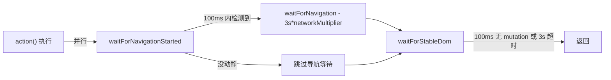
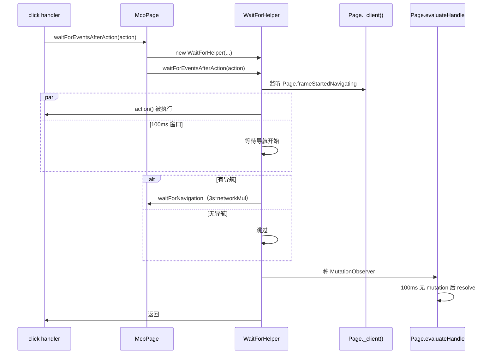

# 06 - WaitForHelper：智能等待（导航 + DOM 稳定）

> 关键源码：`src/WaitForHelper.ts`、`src/McpPage.ts` 的 `waitForEventsAfterAction`

## 1. 问题：Agent 期望「按一下就结束」

Agent 在调用 `click`、`fill`、`navigate_page` 后，**期望返回时页面已经稳定**——否则它下一步拍快照拿到的是旧 DOM。但实际情况复杂：

- 点击可能触发导航，也可能只是弹层；
- SPA 点击可能导致异步渲染（Fetch + 虚拟 DOM 更新 + 懒加载组件）；
- 有些页面"点击后 3 秒才开始 fetch"；
- Slow 3G / CPU throttling 模拟下，所有时间都要放大。

一套**通用等待策略**要在「不超时」和「早退」之间找平衡。

## 2. WaitForHelper 的 3 段式等待



三段的 timeout（针对默认情况）：

| 阶段 | 默认超时 | 放大因子 |
| --- | --- | --- |
| expectNavigationIn | 100ms | × CPU multiplier |
| navigationTimeout | 3000ms | × network multiplier |
| stableDomFor（连续静默） | 100ms | × CPU multiplier |
| stableDomTimeout（总窗口） | 3000ms | × CPU multiplier |

## 3. `waitForStableDom`：MutationObserver 闭环

```36:83:src/WaitForHelper.ts
async waitForStableDom(): Promise<void> {
  const stableDomObserver = await this.#page.evaluateHandle(timeout => {
    let timeoutId: ReturnType<typeof setTimeout>;
    function callback() {
      clearTimeout(timeoutId);
      timeoutId = setTimeout(() => {
        domObserver.resolver.resolve();
        domObserver.observer.disconnect();
      }, timeout);
    }
    const domObserver = {
      resolver: Promise.withResolvers<void>(),
      observer: new MutationObserver(callback),
    };
    callback(); // 先启动计时
    domObserver.observer.observe(document.body, {
      childList: true, subtree: true, attributes: true,
    });
    return domObserver;
  }, this.#stableDomFor);

  this.#abortController.signal.addEventListener('abort', async () => {
    try {
      await stableDomObserver.evaluate(observer => {
        observer.observer.disconnect();
        observer.resolver.resolve();
      });
      await stableDomObserver.dispose();
    } catch { /* 忽略 */ }
  });

  return Promise.race([
    stableDomObserver.evaluate(async observer => await observer.resolver.promise),
    this.timeout(this.#stableDomTimeout).then(() => { throw new Error('Timeout'); }),
  ]);
}
```

核心思路：

- **通过 `evaluateHandle` 在页面里种一个 observer**，返回的 JSHandle 绑着 observer 和 Promise.withResolvers；
- **每次 mutation 重置计时器**，只有连续 `stableDomFor` 没有 mutation 时才 resolve；
- **Promise.race 加总窗口**：最坏情况也不会挂死；
- **abort 信号清理**：外部 action 抛错会触发 `#abortController.abort()`，observer 在页面侧也被 disconnect。

## 4. `waitForNavigationStarted`：区分真假导航

```85:115:src/WaitForHelper.ts
async waitForNavigationStarted() {
  const navigationStartedPromise = new Promise<boolean>(resolve => {
    const listener = (event: Protocol.Page.FrameStartedNavigatingEvent) => {
      if ([
        'historySameDocument',
        'historyDifferentDocument',
        'sameDocument',
      ].includes(event.navigationType)) {
        resolve(false);  // SPA 路由变更不算导航
        return;
      }
      resolve(true);
    };

    this.#page._client().on('Page.frameStartedNavigating', listener);
    this.#abortController.signal.addEventListener('abort', () => {
      resolve(false);
      this.#page._client().off('Page.frameStartedNavigating', listener);
    });
  });

  return await Promise.race([
    navigationStartedPromise,
    this.timeout(this.#expectNavigationIn).then(() => false),
  ]);
}
```

要点：

- **用 CDP 的 `Page.frameStartedNavigating` 而不是 puppeteer 的 `framenavigated`**：前者在导航刚开始就发，后者要等导航完成；
- **过滤 SPA 同文档导航**：`history.pushState` 不应触发 `waitForNavigation`，否则会超时；
- **100ms 窗口判定**：如果 action 执行完后 100ms 都没开始导航，就认为不会导航。

## 5. 编排：`waitForEventsAfterAction`

```127:178:src/WaitForHelper.ts
async waitForEventsAfterAction(action, options?) {
  if (options?.handleDialog) {
    // 注册 dialog handler
  }

  const navigationFinished = this.waitForNavigationStarted()
    .then(navigationStated => {
      if (navigationStated) {
        return this.#page.waitForNavigation({
          timeout: options?.timeout ?? this.#navigationTimeout,
          signal: this.#abortController.signal,
        });
      }
    })
    .catch(error => logger(error));

  try {
    await action();
  } catch (error) {
    this.#abortController.abort();
    throw error;
  }

  try {
    await navigationFinished;
    await this.waitForStableDom();
  } catch (error) {
    logger(error);
  } finally {
    this.#abortController.abort();
  }
}
```

**编排上的设计决策**：

1. **navigationFinished 是"先挂起"**：不等它 resolve 就去跑 action。这是因为 `waitForNavigationStarted` 内部就是监听，必须早于 action 触发；
2. **action 抛错立即 abort**：让 observer、navigation 等都收到 abort 信号被清理；
3. **navigationFinished 的错误 swallow**：很多情况下导航没发生（action 只是点开弹层），错误是预期的，不向外抛；
4. **稳定 DOM 必须在导航之后**：否则 `evaluateHandle` 会跑在旧上下文上，拿到的 observer 失效。

## 6. 模拟场景下的超时放大

```19:29:src/WaitForHelper.ts
constructor(
  page: Page,
  cpuTimeoutMultiplier: number,
  networkTimeoutMultiplier: number,
) {
  this.#stableDomTimeout = 3000 * cpuTimeoutMultiplier;
  this.#stableDomFor = 100 * cpuTimeoutMultiplier;
  this.#expectNavigationIn = 100 * cpuTimeoutMultiplier;
  this.#navigationTimeout = 3000 * networkTimeoutMultiplier;
  this.#page = page as unknown as CdpPage;
}
```

```181:198:src/WaitForHelper.ts
export function getNetworkMultiplierFromString(condition: string | null): number {
  switch (condition) {
    case 'Fast 4G': return 1;
    case 'Slow 4G': return 2.5;
    case 'Fast 3G': return 5;
    case 'Slow 3G': return 10;
  }
  return 1;
}
```

**设计哲学**：模拟越慢，等得越久。Slow 3G 下 3s 的 navigation timeout 直接放大到 30s，避免误报 timeout。

## 7. McpPage 的包装

```117:133:src/McpPage.ts
createWaitForHelper(cpuMultiplier: number, networkMultiplier: number): WaitForHelper {
  return new WaitForHelper(this.pptrPage, cpuMultiplier, networkMultiplier);
}

waitForEventsAfterAction(action, options?): Promise<void> {
  const helper = this.createWaitForHelper(
    this.cpuThrottlingRate,
    getNetworkMultiplierFromString(this.networkConditions),
  );
  return helper.waitForEventsAfterAction(action, options);
}
```

**每次 action 都 new 一个 WaitForHelper**：因为 `#abortController` 是一次性的，重用会复杂化生命周期。

## 8. 完整时序



## 9. 这套设计规避的 4 个坑

| 坑 | 规避手段 |
| --- | --- |
| SPA 的 `history.pushState` 被当作真导航 | 过滤 `*SameDocument` / `sameDocument` |
| 动画持续 mutation 导致永远等不到 stable | `Promise.race` 加总超时兜底 |
| action 抛错，observer 泄漏在页面 | `#abortController.abort()` + 页面侧 disconnect |
| 模拟慢网络时 navigation 超时 | network multiplier 线性缩放 |

## 10. 可迁移经验

1. **"事件监听要先注册"原则**：`waitForNavigationStarted` 必须在 action 之前挂上去；
2. **观察者 + 总超时双保险**：`Promise.race([observable, total_timeout])` 是写稳定等待的标准模板；
3. **AbortController 串联多级清理**：无论是 page 侧的 observer 还是 node 侧的 timer，都通过一个 controller 统一取消；
4. **评估 Action 的副作用分类**：同步/异步/导航/弹窗 — 针对每种副作用设计对应的等待策略。

## 11. 延伸阅读

- Click / Fill 等工具怎样使用 → [02-tool-definition-system.md](./02-tool-definition-system.md)
- Emulation 与时间缩放 → [04-mcp-context.md](./04-mcp-context.md)
- Dialog 的清理 → [20-error-handling-cleanup.md](./20-error-handling-cleanup.md)
