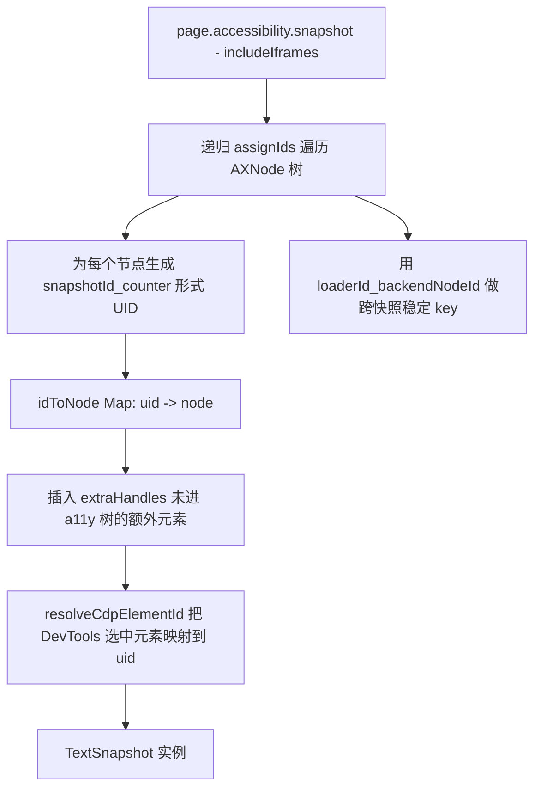
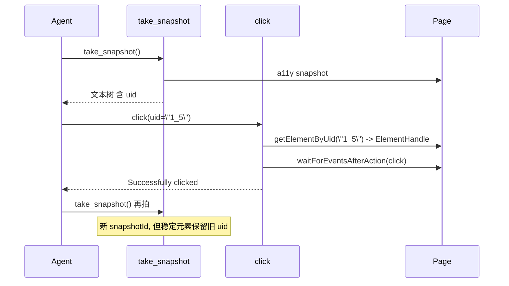

# 07 - TextSnapshot：可访问性树序列化与 UID 映射

> 关键源码：`src/TextSnapshot.ts`、`src/McpPage.ts`、`src/formatters/SnapshotFormatter.ts`

## 1. 为什么不用 HTML？

Agent 要选择元素，最朴素的方案是把整份 HTML 丢给它。这有两大问题：

1. **Token 爆炸**：大站点一个页面 HTML 动辄几十万 token；
2. **选择器不稳定**：Agent 生成的 CSS/XPath 在下次 DOM 变更后很可能失效。

项目的方案是：**基于无障碍树（Accessibility Tree）序列化**，给每个节点赋一个**短 UID**，后续工具通过 UID 回查元素。这是"结构化 + 轻量 + 稳定"的平衡点。

## 2. Snapshot 的构造流程



代码入口 `TextSnapshot.create`：

```47:149:src/TextSnapshot.ts
static async create(page: McpPage, options = {}): Promise<TextSnapshot> {
  const verbose = options.verbose ?? false;
  const rootNode = await page.pptrPage.accessibility.snapshot({
    includeIframes: true,
    interestingOnly: !verbose,
  });
  ...
  const snapshotId = TextSnapshot.nextSnapshotId++;
  let idCounter = 0;
  const idToNode = new Map<string, TextSnapshotNode>();
  const seenUniqueIds = new Set<string>();

  const assignIds = (node): TextSnapshotNode => {
    const backendNodeId: number = node.backendNodeId;
    const uniqueBackendId = `${node.loaderId}_${backendNodeId}`;
    const existingMcpId = uniqueBackendNodeIdToMcpId.get(uniqueBackendId);
    let id = existingMcpId ?? `${snapshotId}_${idCounter++}`;
    if (!existingMcpId) uniqueBackendNodeIdToMcpId.set(uniqueBackendId, id);
    seenUniqueIds.add(uniqueBackendId);

    const nodeWithId = {...node, id, children: (node.children ?? []).map(assignIds)};
    if (node.role === 'option') nodeWithId.value = node.name; // 特殊处理
    idToNode.set(nodeWithId.id, nodeWithId);
    return nodeWithId;
  };
  ...
}
```

## 3. 三个精妙的 ID 设计

### 3.1 `snapshotId_counter` 格式

- `snapshotId` 全局自增，保证不同快照之间 UID 不冲突；
- `counter` 在单次快照内自增，生成紧凑的 `"3_17"` 格式；
- Agent 看到的 UID 短而无歧义。

### 3.2 跨快照复用：`uniqueBackendNodeIdToMcpId`

```75:87:src/TextSnapshot.ts
const uniqueBackendId = `${node.loaderId}_${backendNodeId}`;
const existingMcpId = uniqueBackendNodeIdToMcpId.get(uniqueBackendId);
if (existingMcpId !== undefined) {
  id = existingMcpId;  // 复用老 UID
} else {
  id = `${snapshotId}_${idCounter++}`;
  uniqueBackendNodeIdToMcpId.set(uniqueBackendId, id);
}
```

**同一个节点在多次 snapshot 之间保持同一个 UID**。这样 Agent 的"记忆"稳固：

- 它记下"uid=2_5 是登录按钮"；
- 过几步又拍了 snapshot（snapshotId 变了），按钮还是 `2_5`；
- 除非页面真的重新加载（loaderId 变），UID 才可能变化。

### 3.3 快照后清理无效映射

```142:146:src/TextSnapshot.ts
for (const key of uniqueBackendNodeIdToMcpId.keys()) {
  if (!seenUniqueIds.has(key)) {
    uniqueBackendNodeIdToMcpId.delete(key);
  }
}
```

当元素从页面消失时，对应映射被清掉，避免 map 无限增长。

## 4. 插入"非 a11y 树"的元素（ExtraHandles）

某些元素 a11y 树不包含（例如 `role="presentation"` 的容器、纯视觉元素），但 Agent 通过 **in-page tools** 获得了它的 ElementHandle，想要把它也纳入快照。`insertExtraNodes` 做了这件极其复杂的事：

```154:315:src/TextSnapshot.ts
private static async insertExtraNodes(page, idToNode, seenUniqueIds, snapshotId, idCounter, rootNodeWithId, seenBackendNodeIds, extraHandles) {
  // 1. 为每个 extraHandle 创建一个 extraNode（role=tag name）
  // 2. 找到它的最近 a11y 祖先 findAncestorNode(handle)
  // 3. 用 DOM.describeNode 查询 extraNode 的 DOM 后代
  // 4. 把那些也在 ancestor 的 children 里的节点"转移"到 extraNode 名下（重新 parent）
}
```

**关键技术点**：

- `findAncestorNode`：通过 `handle.evaluateHandle(el => el.parentElement)` 逐层向上，用 `backendNodeId` 匹配 a11y 树里已有节点；
- `findDescendantNodes`：通过 CDP `DOM.describeNode({depth:-1, pierce:true})` 一次拿到完整子树的 backendNodeId 集合；
- `moveChildNodes`：把属于 extraNode 的子节点从祖先的 children 中**拆走**并 reparent，保持树结构正确。

这个算法保证：**即便插入的元素原本不在 a11y 树中，Agent 看到的树依然拓扑正确**。

## 5. UID → ElementHandle 的反查

```328:357:src/McpPage.ts
async getElementByUid(uid: string): Promise<ElementHandle<Element>> {
  if (!this.textSnapshot) {
    throw new Error(`No snapshot found for page ${this.id ?? '?'}. Use ${takeSnapshot.name} to capture one.`);
  }
  const node = this.textSnapshot.idToNode.get(uid);
  if (!node) throw new Error(`Element uid "${uid}" not found on page ${this.id}.`);
  return this.#resolveElementHandle(node, uid);
}

async #resolveElementHandle(node, uid): Promise<ElementHandle<Element>> {
  const message = `Element with uid ${uid} no longer exists on the page.`;
  try {
    const handle = await node.elementHandle();
    if (!handle) throw new Error(message);
    return handle;
  } catch (error) {
    throw new Error(message, {cause: error});
  }
}
```

**关键点**：

- `node.elementHandle()` 是 puppeteer 返回的 lazy getter，每次调用重新从 backendNodeId 解析 ElementHandle；
- 如果元素已被移除，抛出清晰提示；
- 错误信息指向 `take_snapshot`，让 Agent 知道怎么自愈。

## 6. SnapshotFormatter：输出给 Agent 的文本

```17:55:src/formatters/SnapshotFormatter.ts
toString(): string {
  const chunks: string[] = [];
  const root = this.#snapshot.root;
  ...
  chunks.push(this.#formatNode(root, 0));
  return chunks.join('');
}

#formatNode(node: TextSnapshotNode, depth = 0): string {
  const attributes = this.#getAttributes(node);
  const line =
    ' '.repeat(depth * 2) +
    attributes.join(' ') +
    (node.id === this.#snapshot.selectedElementUid
      ? ' [selected in the DevTools Elements panel]'
      : '') +
    '\n';
  ...
}
```

输出例子：

```
uid=1_0 RootWebArea "Sign In"
  uid=1_1 heading "Sign In" level="1"
  uid=1_3 textbox "Email" [selected in the DevTools Elements panel]
  uid=1_5 button "Continue" disableable
```

**设计选择**：

- **缩进显示树结构**：比 JSON 更省 token，且 Agent 一眼能看懂层次；
- **`"name"` 用引号包裹**：避免 role `"button"` 和 name `button` 混淆；
- **布尔属性压缩**：`disableable`、`focusable` 不带 `=true`；
- **标注 DevTools 选中元素**：帮助 Agent 和"人类开发者"建立视线同步。

## 7. 快照与交互的闭环



## 8. 可迁移经验

| 经验 | 说明 |
| --- | --- |
| 用 a11y 树而非 DOM 做 LLM 视图 | 去除样式/布局噪音，天然结构化 |
| 短 UID + 跨快照保持稳定 | 让 Agent 的引用可靠，降低选择器失败率 |
| 用 Symbol / Map 保存 snapshot 元数据 | 不污染 AXNode，易回收 |
| "插入外部元素"算法 | a11y 能力的缺失可以用 CDP `DOM.describeNode` 补齐 |
| Formatter 分离 | 文本/JSON 双通道共用同一 tree |

## 9. 性能考虑

- `interestingOnly: !verbose` 默认只留交互元素，避免快照过大；
- `includeIframes: true` 是必须的（现代 SPA 广泛用 iframe）；
- `seenUniqueIds` / `seenBackendNodeIds` 两个 Set 保证 O(1) 查重；
- `queue + while(queue.pop())` 在 `resolveCdpElementId` 里用 DFS（Last In First Out），避免递归栈过深。

## 10. 延伸阅读

- Agent 如何操作被选中元素 → [02-tool-definition-system.md](./02-tool-definition-system.md)
- Snapshot 文本输出格式 → [18-formatter-system.md](./18-formatter-system.md)
- UID 如何参与执行 in-page tools → [07 节的 extraHandles] + [04-mcp-context.md](./04-mcp-context.md)
