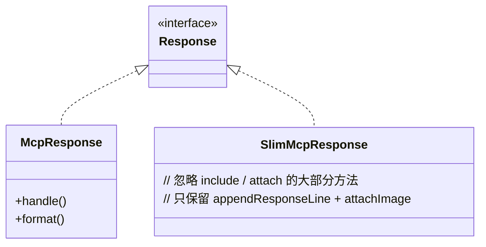
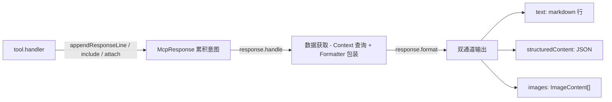

# 08 - McpResponse：响应构建器与结构化/文本双输出

> 关键源码：`src/McpResponse.ts`、`src/SlimMcpResponse.ts`、`src/tools/ToolDefinition.ts` 的 `Response` 接口

## 1. 一个工具的输出复杂度

`click` 工具调用完，Agent 可能想同时看到：

1. 一条文字反馈"Successfully clicked"；
2. 如果请求了 `includeSnapshot=true`，要附一份 a11y 快照；
3. 当前模拟设置（network / viewport / UA）；
4. 当前页面是否有 dialog 待处理；
5. 当前页面列表（如果刚发生导航导致 URL 变了）；
6. 结构化的 JSON（供 MCP 客户端程序化使用）。

如果让 handler 直接构造最终输出，handler 会 5 行业务 + 50 行格式化，重复极多。

**项目的解法**：handler 向 `response` 挂"意图" → `response.handle()` 统一汇总 → `response.format()` 产出文本+结构化双版本。典型的 **Builder + Template Method**。

## 2. Response 接口：handler 能做什么

```102:151:src/tools/ToolDefinition.ts
export interface Response {
  appendResponseLine(value: string): void;
  setHeapSnapshotAggregates(...): void;
  setHeapSnapshotStats(...): void;
  setIncludePages(value: boolean): void;
  setIncludeNetworkRequests(value: boolean, options?): void;
  setIncludeConsoleData(value: boolean, options?): void;
  includeSnapshot(params?: SnapshotParams): void;
  attachImage(value: ImageContentData): void;
  attachNetworkRequest(reqId: number, options?): void;
  attachConsoleMessage(msgid: number): void;
  attachDevToolsData(data: DevToolsData): void;
  setTabId(tabId: string): void;
  attachTraceSummary(trace: TraceResult): void;
  attachTraceInsight(trace, insightSetId, insightName): void;
  setListExtensions(): void;
  attachLighthouseResult(result: LighthouseData): void;
  setListInPageTools(): void;
  setListWebMcpTools(): void;
}
```

**观察**：

- 方法全是**无返回值**（纯副作用挂意图）；
- 命名用 `set*` / `include*` / `attach*` 三大动词，语义分明：
  - `set*`：设置一个开关/值（pages 列表、tab id）
  - `include*`：让响应把某类集合纳入（包含分页参数）
  - `attach*`：附加单个对象（单个请求、单张截图、trace summary）

## 3. handle()：一锅烩的汇总器

```427:652:src/McpResponse.ts
async handle(toolName: string, context: McpContext) {
  if (this.#includePages) await context.createPagesSnapshot();
  if (this.#includeExtensionServiceWorkers) await context.createExtensionServiceWorkersSnapshot();

  let snapshot: SnapshotFormatter | string | undefined;
  if (this.#snapshotParams) {
    this.#page.textSnapshot = await TextSnapshot.create(this.#page, {...});
    ...
    snapshot = this.#snapshotParams.filePath
      ? await context.saveFile(...) // 落盘
      : new SnapshotFormatter(this.#page.textSnapshot); // 内联
  }

  let detailedNetworkRequest: NetworkFormatter | undefined;
  if (this.#attachedNetworkRequestId) {
    const request = context.getNetworkRequestById(this.#page, this.#attachedNetworkRequestId);
    detailedNetworkRequest = await NetworkFormatter.from(request, {...});
  }

  let detailedConsoleMessage: ConsoleFormatter | IssueFormatter | undefined;
  // console 详情...

  let consoleMessages, networkRequests, extensions, inPageTools, webmcpTools;
  // 集合数据...

  return this.format(toolName, context, {
    detailedConsoleMessage, consoleMessages, snapshot,
    detailedNetworkRequest, networkRequests,
    traceInsight, traceSummary, extensions, lighthouseResult,
    inPageTools, webmcpTools,
  });
}
```

**结构特点**：

- 每个 `if` 对应一个"意图"，按需触发数据查询；
- 查询后把原始数据**包装成 Formatter** 传给 `format()`，由后者决定文本格式；
- 所有分支汇总成一个 `data` 对象传下去，避免 `format` 需要重新访问 Response 私有字段。

## 4. format()：文本 + 结构化两种输出

```654:1066:src/McpResponse.ts
format(toolName, context, data): {content, structuredContent} {
  const structuredContent: {...} = {};
  const response = [];

  if (this.#textResponseLines.length) {
    structuredContent.message = this.#textResponseLines.join('\n');
    response.push(...this.#textResponseLines);
  }

  if (this.#page?.networkConditions) {
    response.push(`Emulating network conditions: ${networkConditions}`);
    structuredContent.networkConditions = networkConditions;
  }

  // ... 几十个并列分支

  const text: TextContent = {type: 'text', text: response.join('\n')};
  const images: ImageContent[] = this.#images.map(...);
  return {
    content: [text, ...images],
    structuredContent,
  };
}
```

**关键设计**：

- **两份数据对齐输出**：`response.push(...)` 喂人类可读的文本，`structuredContent.xxx` 喂机器可读的 JSON，两者永远同步；
- **一次遍历**：没有"先建 JSON 再转文本"或反之，避免重复逻辑；
- **images 独立通道**：MCP 协议支持 `image` content type，截图直接走这条；
- **文本 join('\n')**：最终就是一大块 markdown/plain 混合文本。

## 5. 分页公共逻辑

```1068:1101:src/McpResponse.ts
#dataWithPagination<T>(data: T[], pagination?: PaginationOptions) {
  const paginationResult = paginate<T>(data, pagination);
  const response = [];
  if (paginationResult.invalidPage) response.push('Invalid page number provided. Showing first page.');
  const {startIndex, endIndex, currentPage, totalPages} = paginationResult;
  response.push(`Showing ${startIndex + 1}-${endIndex} of ${data.length} (Page ${currentPage + 1} of ${totalPages}).`);
  if (pagination) {
    if (paginationResult.hasNextPage) response.push(`Next page: ${currentPage + 1}`);
    if (paginationResult.hasPreviousPage) response.push(`Previous page: ${currentPage - 1}`);
  }
  return {info: response, items, pagination: {...}};
}
```

网络请求、控制台消息、Heap 聚合数据都走这个泛型方法，避免三份重复分页代码。

## 6. SlimMcpResponse：简化子类



在 `--slim` 模式下，只有 navigate / evaluate / screenshot 3 个工具，**SlimMcpResponse 直接继承并忽略"不用的" setter**，把输出精简到极致。这是"小模型/轻任务"场景的产品设计。

## 7. 结构化输出对齐的 5 个细节

观察 `format()` 中的模式，能学到很多：

### 7.1 模拟设置集中输出

```714:745:src/McpResponse.ts
const networkConditions = this.#page?.networkConditions;
if (networkConditions) {
  const timeout = this.#page!.pptrPage.getDefaultNavigationTimeout();
  response.push(`Emulating network conditions: ${networkConditions}`);
  response.push(`Default navigation timeout set to ${timeout} ms`);
  structuredContent.networkConditions = networkConditions;
  structuredContent.navigationTimeout = timeout;
}
```

**任何**工具调用的响应都会提醒 Agent "现在是 Slow 3G + 4x CPU + 手机视口"，避免 Agent 忘记自己在模拟。

### 7.2 Dialog 提示 + 引导

```747:761:src/McpResponse.ts
const dialog = this.#page?.getDialog();
if (dialog) {
  response.push(`# Open dialog
${dialog.type()}: ${dialog.message()}${defaultValueIfNeeded}.
Call ${handleDialog.name} to handle it before continuing.`);
  ...
}
```

未处理的 dialog 会被主动提示 + 指路到 `handle_dialog` 工具，这是**自愈错误**的绝佳范例。

### 7.3 分类的页面输出（普通 / 扩展）

```763:812:src/McpResponse.ts
const {regularPages, extensionPages} = allPages.reduce((acc, page) => {
  if (page.url().startsWith('chrome-extension://')) acc.extensionPages.push(page);
  else acc.regularPages.push(page);
  return acc;
}, {regularPages: [], extensionPages: []});
```

把 `chrome-extension://` 与普通页面分桶，Agent 不容易误 click 到扩展页面。

### 7.4 Lighthouse 结果的人可读化

```866:887:src/McpResponse.ts
if (data.lighthouseResult) {
  const {summary, reports} = data.lighthouseResult;
  response.push('## Lighthouse Audit Results');
  response.push(`Mode: ${summary.mode}`);
  response.push(`Device: ${summary.device}`);
  ...
  for (const score of summary.scores) {
    response.push(`- ${score.title}: ${(score.score ?? 0) * 100} (${score.id})`);
  }
  ...
}
```

Lighthouse 原始 JSON 几百 KB，这里只输出关键分数 + 报告路径。

### 7.5 Snapshot 落盘 vs 内联

```889:898:src/McpResponse.ts
if (data.snapshot) {
  if (typeof data.snapshot === 'string') {
    response.push(`Saved snapshot to ${data.snapshot}.`);
    structuredContent.snapshotFilePath = data.snapshot;
  } else {
    response.push('## Latest page snapshot');
    response.push(data.snapshot.toString());
    structuredContent.snapshot = data.snapshot.toJSON();
  }
}
```

同一个字段两种形态：文件路径字符串 / Formatter 实例。调用方 `handle()` 先决定好走哪个分支。

## 8. 为什么要搞双通道

MCP 目前的现状是：

- **部分客户端**（如 Claude Desktop）会显示 `content[].text`；
- **部分客户端**开始支持 `structuredContent` 的程序化解析；
- **通用 Agent**还是喜欢 markdown 文本里用正则抽信息。

双通道保证：

- 不支持 structured 的客户端，Agent 读文本依然能完成任务；
- 支持 structured 的客户端，程序可以免解析直接调用字段；
- 项目不需要做双份工具实现。

## 9. 架构图



## 10. 可迁移经验

| 经验 | 说明 |
| --- | --- |
| Builder + Template Method | handler 只挂意图，不管实现；handle+format 负责渲染 |
| 双通道输出同源 | 一次遍历喂两种格式，杜绝"文本和 JSON 不一致" |
| 挂意图的三个动词 | `set/include/attach` 非常有表现力，值得借鉴 |
| 共享设置"永远输出" | 模拟状态、dialog 提示始终带上，Agent 不会忘 |
| 大数据落盘、路径回传 | `snapshotFilePath`、`requestBodyFilePath` 节省 token |

## 11. 延伸阅读

- 具体的 Formatter → [18-formatter-system.md](./18-formatter-system.md)
- 分页策略 → [09-token-optimization.md](./09-token-optimization.md)
- Slim 模式 → [13-slim-mode-progressive-complexity.md](./13-slim-mode-progressive-complexity.md)
