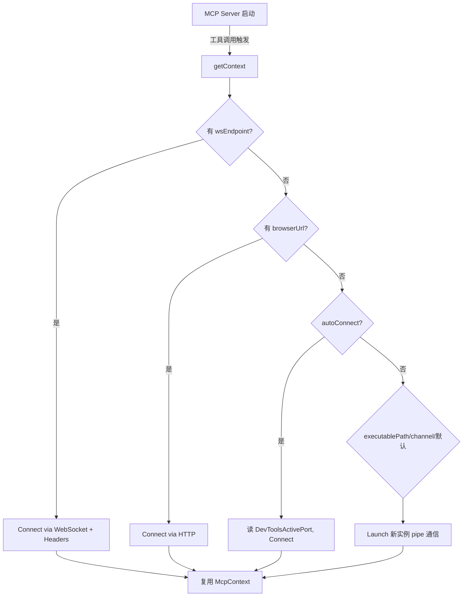

# 10 - 浏览器连接策略：Launch / Connect / AutoConnect

> 关键源码：`src/browser.ts`、`src/bin/chrome-devtools-mcp-cli-options.ts`、`src/index.ts` 中的 `getContext`

## 1. 为什么要三种连接模式

MCP Server 要服务的场景差异巨大：

| 场景 | 典型需求 | 最佳模式 |
| --- | --- | --- |
| 开发本地 Agent，偶尔跑一下 | 启动一个专用 profile，别污染我自己的 Chrome | **Launch** |
| 我要登录 gmail 测试，自动化要复用 cookie | 连我已经开的那个浏览器 | **Connect** |
| 我在一个沙箱里跑 Agent，无法启动 Chrome | 连沙箱外的远程 Chrome | **Connect via browserUrl/wsEndpoint** |
| Chrome 144+，我希望"点一下许可"自动连 | 无需暴露端口 | **AutoConnect** |

如果只提供 "Launch"，不能复用登录态；只提供 "Connect"，需要用户复杂配置。这套组合拳覆盖了所有主流需求。

## 2. 路由逻辑

```77:105:src/index.ts
const browser =
  serverArgs.browserUrl || serverArgs.wsEndpoint || serverArgs.autoConnect
    ? await ensureBrowserConnected({
        browserURL: serverArgs.browserUrl,
        wsEndpoint: serverArgs.wsEndpoint,
        wsHeaders: serverArgs.wsHeaders,
        channel: serverArgs.autoConnect ? (serverArgs.channel as Channel) : undefined,
        userDataDir: serverArgs.userDataDir,
        devtools,
      })
    : await ensureBrowserLaunched({
        headless: serverArgs.headless,
        executablePath: serverArgs.executablePath,
        channel: serverArgs.channel as Channel,
        isolated: serverArgs.isolated ?? false,
        userDataDir: serverArgs.userDataDir,
        ...
      });
```

**路由规则**：

- 任意一个连接参数被设置 → `ensureBrowserConnected`；
- 全部为空 → `ensureBrowserLaunched`；
- 连接模式下，**只有 autoConnect 才把 channel 传下去**——否则 browserUrl/wsEndpoint 已经足够定位浏览器，多传 channel 会引起冲突。

## 3. Launch 模式

```173:261:src/browser.ts
export async function launch(options: McpLaunchOptions): Promise<Browser> {
  const profileDirName = channel && channel !== 'stable' ? `chrome-profile-${channel}` : 'chrome-profile';

  let userDataDir = options.userDataDir;
  if (!isolated && !userDataDir) {
    userDataDir = path.join(os.homedir(), '.cache',
      options.viaCli ? 'chrome-devtools-mcp-cli' : 'chrome-devtools-mcp',
      profileDirName,
    );
    await fs.promises.mkdir(userDataDir, {recursive: true});
  }

  const args = [...(options.chromeArgs ?? []), '--hide-crash-restore-bubble'];
  if (headless) args.push('--screen-info={3840x2160}');
  if (options.devtools) args.push('--auto-open-devtools-for-tabs');

  if (!headless) detectDisplay();

  try {
    const browser = await puppeteer.launch({
      channel: puppeteerChannel,
      targetFilter: makeTargetFilter(options.enableExtensions),
      executablePath,
      defaultViewport: null,
      userDataDir,
      pipe: true,  // 关键：用 pipe 而非 websocket 通信
      headless,
      args,
      ignoreDefaultArgs,
      acceptInsecureCerts: options.acceptInsecureCerts,
      handleDevToolsAsPage: true,
      enableExtensions: options.enableExtensions,
    });
    ...
    return browser;
  } catch (error) {
    if (userDataDir && error.message.includes('The browser is already running')) {
      throw new Error(
        `The browser is already running for ${userDataDir}. Use --isolated to run multiple browser instances.`,
        {cause: error},
      );
    }
    throw error;
  }
}
```

**设计亮点**：

### 3.1 Profile 路径的约定

- 默认在 `~/.cache/chrome-devtools-mcp/chrome-profile-<channel>`；
- `viaCli` 模式下分开 `chrome-devtools-mcp-cli/` 目录（避免 CLI 用法与 MCP 用法共享相同 profile 导致冲突）；
- 永远不要动用户真正的 Chrome profile—— 保护用户隐私和数据安全。

### 3.2 Isolated 模式

`--isolated` 跳过 userDataDir 生成，每次启动都是空 profile，**Chrome 退出后被自动清理**。适合 CI 环境。

### 3.3 `pipe: true` 而不是 WebSocket

```224:227
pipe: true,
```

Puppeteer 默认用 WebSocket 连 Chrome，这需要分配端口。`pipe: true` 用 **stdin/stdout pipe 通信**，优势：

- 无需端口，不受防火墙影响；
- 更安全（没有暴露端口被第三方连接的风险）；
- 更快（无 WebSocket 握手开销）；
- 扩展安装必须用 pipe（`--categoryExtensions` 要求）。

### 3.4 Linux DISPLAY 探测

```155:171:src/browser.ts
export function detectDisplay(): void {
  if (os.platform() === 'win32' || os.platform() === 'darwin') return;
  if (!process.env['DISPLAY']) {
    try {
      const result = execSync(
        `ps -u $(id -u) -o pid= | xargs -I{} cat /proc/{}/environ 2>/dev/null | tr '\\0' '\\n' | grep -m1 '^DISPLAY=' | cut -d= -f2`,
      );
      const display = result.toString('utf8').trim();
      process.env['DISPLAY'] = display;
    } catch { /* no-op */ }
  }
}
```

**极具工程经验的细节**：很多 Linux 用户在 tty 里运行 MCP server（systemd service 等），缺 `DISPLAY` 会让 Chrome 显示失败。这段代码：

- 遍历同一 UID 的所有进程；
- 读 `/proc/<pid>/environ`；
- 找到第一个 `DISPLAY=` 值就用；
- 完全 best-effort，失败就 silent。

### 3.5 错误提示明确

`"The browser is already running for ${userDataDir}. Use --isolated to run multiple browser instances."`

不是报错，是**指引**——第 20 篇详谈的 Self-Healing Error。

## 4. Connect 模式的三条分支

```54:119:src/browser.ts
export async function ensureBrowserConnected(options: {...}) {
  const {channel, enableExtensions} = options;
  if (browser?.connected) return browser;

  const connectOptions = {targetFilter: makeTargetFilter(enableExtensions), defaultViewport: null, handleDevToolsAsPage: true};

  let autoConnect = false;
  if (options.wsEndpoint) {
    // 分支 1：直接 ws
    connectOptions.browserWSEndpoint = options.wsEndpoint;
    if (options.wsHeaders) connectOptions.headers = options.wsHeaders;
  } else if (options.browserURL) {
    // 分支 2：HTTP 端点，puppeteer 自己去 /json/version 抓 ws
    connectOptions.browserURL = options.browserURL;
  } else if (channel || options.userDataDir) {
    // 分支 3：autoConnect - 读本地 Chrome 的 DevToolsActivePort
    const userDataDir = options.userDataDir;
    if (userDataDir) {
      autoConnect = true;
      const portPath = path.join(userDataDir, 'DevToolsActivePort');
      const fileContent = await fs.promises.readFile(portPath, 'utf8');
      const [rawPort, rawPath] = fileContent.split('\n').map(l => l.trim()).filter(Boolean);
      ...
      const browserWSEndpoint = `ws://127.0.0.1:${port}${rawPath}`;
      connectOptions.browserWSEndpoint = browserWSEndpoint;
    } else {
      connectOptions.channel = (channel === 'stable' ? 'chrome' : `chrome-${channel}`) as ChromeReleaseChannel;
    }
  }
  ...
}
```

### 4.1 wsEndpoint + wsHeaders

最底层的方式，Agent 自己把 WebSocket URL + 认证 header 都传进来。适合**已有协议代理**的企业场景。

### 4.2 browserURL

只要 HTTP 端点，Puppeteer 访问 `http://.../json/version` 取 `webSocketDebuggerUrl`。最常见的远程调试方式。

### 4.3 AutoConnect（Chrome 144+）

从 Chrome 144 开始，Chrome 进程会把 DevTools 端口写到 `userDataDir/DevToolsActivePort`。项目直接读这个文件拼 WS URL，**用户无需配置端口**：

- `chrome://inspect/#remote-debugging` 里点"允许"就行；
- MCP Server 读取端口 → 连接 → Chrome 弹确认对话框；
- 用户点允许，自动化开始。

```83:98:src/browser.ts
const fileContent = await fs.promises.readFile(portPath, 'utf8');
const [rawPort, rawPath] = fileContent.split('\n').map(line => line.trim()).filter(line => !!line);
if (!rawPort || !rawPath) throw new Error(`Invalid DevToolsActivePort '${fileContent}' found`);
const port = parseInt(rawPort, 10);
if (isNaN(port) || port <= 0 || port > 65535) throw new Error(`Invalid port '${rawPort}' found`);
const browserWSEndpoint = `ws://127.0.0.1:${port}${rawPath}`;
```

**端口号校验** `0 < port <= 65535` 是标准的防御性编程。

## 5. Target 过滤器：不暴露 chrome:// 页面

```23:44:src/browser.ts
function makeTargetFilter(enableExtensions = false) {
  const ignoredPrefixes = new Set(['chrome://', 'chrome-untrusted://']);
  if (!enableExtensions) ignoredPrefixes.add('chrome-extension://');

  return function targetFilter(target: Target): boolean {
    if (target.url() === 'chrome://newtab/') return true;
    if (target.url().startsWith('chrome://inspect')) return true;
    for (const prefix of ignoredPrefixes) {
      if (target.url().startsWith(prefix)) return false;
    }
    return true;
  };
}
```

- 默认屏蔽 `chrome://`, `chrome-untrusted://`, `chrome-extension://`；
- **例外**：新标签页 `chrome://newtab/` 要保留（否则浏览器没可用页面就出错）；
- `chrome://inspect` 要保留（AutoConnect 模式下这就是唯一的页面）；
- `enableExtensions` 开启时，才让 Agent 看到扩展页面。

## 6. 单例 `browser` 模块变量

```21:21:src/browser.ts
let browser: Browser | undefined;
```

```263:271:src/browser.ts
export async function ensureBrowserLaunched(options): Promise<Browser> {
  if (browser?.connected) return browser;
  browser = await launch(options);
  return browser;
}
```

**模块作用域的单例** + connected 检查：MCP Server 整个生命周期复用同一个 Browser 实例；如果连接掉了（用户手动关浏览器），下次调用会重新启动。

## 7. 三种模式的决策树



## 8. 错误提示策略

```124:131:src/browser.ts
try {
  browser = await puppeteer.connect(connectOptions);
} catch (err) {
  throw new Error(
    `Could not connect to Chrome. ${autoConnect
      ? `Check if Chrome is running and remote debugging is enabled by going to chrome://inspect/#remote-debugging.`
      : `Check if Chrome is running.`}`,
    {cause: err},
  );
}
```

- AutoConnect 和手动 Connect 给出**不同的指导语**；
- `cause: err` 保留原始错误链，便于调试。

## 9. 可迁移经验

| 经验 | 说明 |
| --- | --- |
| 一个变量三种模式 | 在 CLI/配置层用多个选项，内部用条件展开路由即可 |
| `pipe: true` 通信 | Node 子进程级别的通信比 WebSocket 更安全快速 |
| 模块级单例 + `connected` 检查 | 避免全局 singleton 类，简单有效 |
| 端口/文件格式防御性校验 | 读取外部状态时永远先验证 |
| 错误提示带自愈指引 | 指向具体 UI 操作，Agent 和人都能解决 |
| Linux DISPLAY 探测 | 体现对多运行环境的深度认知 |
| Isolated 模式支持 | CI / 多用户环境的标配 |

## 10. 延伸阅读

- 生命周期中浏览器是什么时候起来的 → [01-mcp-server-architecture.md](./01-mcp-server-architecture.md)
- 连接后 Context 如何接管 → [04-mcp-context.md](./04-mcp-context.md)
- Daemon 模式下浏览器如何共享 → [14-daemon-ipc.md](./14-daemon-ipc.md)
