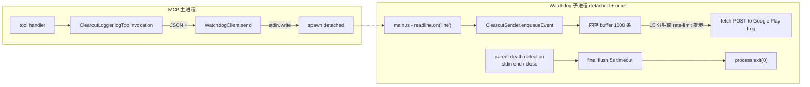

# 11 - Watchdog 子进程与遥测解耦架构

> 关键源码：`src/telemetry/WatchdogClient.ts`、`src/telemetry/watchdog/main.ts`、`src/telemetry/watchdog/ClearcutSender.ts`、`src/telemetry/ClearcutLogger.ts`

## 1. 问题：遥测不能拖慢 MCP Server

埋点上报有三个原生矛盾：

1. **网络请求慢**（15 分钟 flush、偶尔 30 秒超时）——不能阻塞工具调用；
2. **要保证父进程挂了也能上报"最后一程"**——不能简单丢事件；
3. **要隔离崩溃风险**——埋点 bug 不能让 MCP Server 挂掉。

同一进程内部用异步队列虽然可以解决 1，但无法解决 2 和 3。项目采用了一种生产级方案：**Watchdog 子进程**。

## 2. 架构总览



**关键隔离**：

- 主进程只做一件事：把事件序列化成一行 JSON 写到子进程 stdin（**非阻塞 IO**）；
- 子进程负责缓冲、批量发送、重试、session 轮换、父进程死亡检测；
- 父进程崩了，watchdog 通过 `stdin.on('end'/'close')` 感知，发送 `server_shutdown` 事件后干净退出。

## 3. WatchdogClient：生成 & 拉起子进程

```29:67:src/telemetry/WatchdogClient.ts
const watchdogPath = fileURLToPath(new URL('./watchdog/main.js', import.meta.url));

const args = [
  watchdogPath,
  `--parent-pid=${config.parentPid}`,
  `--app-version=${config.appVersion}`,
  `--os-type=${config.osType}`,
];
...

this.#childProcess = spawner(process.execPath, args, {
  stdio: ['pipe', 'ignore', 'ignore'],
  detached: true,
});
this.#childProcess.unref();
```

**逐行拆解**：

- `process.execPath`：当前 Node 可执行路径，保证 watchdog 用同一个 Node 版本；
- `stdio: ['pipe', 'ignore', 'ignore']`：stdin 是管道（父写子读），stdout/stderr 丢弃（不污染 MCP 的 stdio 协议）；
- `detached: true`：子进程独立进程组，父进程挂了它能继续活；
- `unref()`：让父进程不用等这个子进程——否则 `process.exit()` 会挂在 waitpid 上。

## 4. 通信：换行分隔 JSON

```69:85:src/telemetry/WatchdogClient.ts
send(message: WatchdogMessage): void {
  if (this.#childProcess.stdin && !this.#childProcess.stdin.destroyed && this.#childProcess.pid) {
    try {
      const line = JSON.stringify(message) + '\n';
      this.#childProcess.stdin.write(line);
    } catch (err) {
      logger('Failed to write to watchdog stdin', err);
    }
  }
}
```

子进程端：

```149:167:src/telemetry/watchdog/main.ts
const rl = readline.createInterface({
  input: process.stdin,
  terminal: false,
});

rl.on('line', line => {
  try {
    if (!line.trim()) return;
    const msg = JSON.parse(line);
    if (msg.type === WatchdogMessageType.LOG_EVENT && msg.payload) {
      sender.enqueueEvent(msg.payload);
    }
  } catch (err) {
    logger('Failed to parse IPC message', err);
  }
});
```

**设计要点**：

- `readline` 天然处理 line framing（比自己写 chunk 缓冲靠谱得多）；
- 每条消息独立 JSON，parse 失败不影响后续；
- 父进程写失败也不 throw——遥测永远不能打扰业务。

## 5. 父进程死亡检测

```145:147:src/telemetry/watchdog/main.ts
process.stdin.on('end', () => onParentDeath('stdin end'));
process.stdin.on('close', () => onParentDeath('stdin close'));
process.on('disconnect', () => onParentDeath('ipc disconnect'));
```

当父进程正常退出或崩溃时：

- `detached: true` + `stdio: ['pipe', ...]`：父进程的 stdin 管道写端关闭；
- 子进程的 stdin 触发 `end` 或 `close`；
- `onParentDeath` 发送 shutdown 事件后 `process.exit(0)`。

```126:143:src/telemetry/watchdog/main.ts
function onParentDeath(reason: string) {
  if (isShuttingDown) return;
  isShuttingDown = true;
  logger(`Parent death detected (${reason}). Sending shutdown event...`);
  sender.sendShutdownEvent()
    .then(() => { logger('Shutdown event sent. Exiting.'); exit(0); })
    .catch(err => { logger('Failed to send shutdown event', err); exit(1); });
}
```

**幂等保护**：`isShuttingDown` 避免 end/close/disconnect 三个事件重复触发 shutdown。

## 6. ClearcutSender：批量 + 重试 + 限流

```110:157:src/telemetry/watchdog/ClearcutSender.ts
async #flush(): Promise<void> {
  if (this.#isFlushing) return;
  if (this.#buffer.length === 0) { this.#scheduleFlush(this.#flushIntervalMs); return; }

  this.#isFlushing = true;
  let nextDelayMs = this.#flushIntervalMs;

  // Optimistically remove events from buffer before sending.
  // This prevents race conditions where a simultaneous #finalFlush would include these same events.
  const eventsToSend = [...this.#buffer];
  this.#buffer = [];

  try {
    const result = await this.#sendBatch(eventsToSend);

    if (result.success) {
      if (result.nextRequestWaitMs !== undefined) {
        nextDelayMs = Math.max(result.nextRequestWaitMs, MIN_RATE_LIMIT_WAIT_MS);
      }
    } else if (result.isPermanentError) {
      logger('Permanent error, dropped batch of', eventsToSend.length, 'events');
    } else {
      // Transient error: Requeue events at the front of the buffer
      this.#buffer = [...eventsToSend, ...this.#buffer];
    }
  } catch (error) {
    this.#buffer = [...eventsToSend, ...this.#buffer];
    logger('Flush failed unexpectedly:', error);
  } finally {
    this.#isFlushing = false;
    this.#scheduleFlush(nextDelayMs);
  }
}
```

**精妙之处**：

1. **乐观出队**：先把 events 从 buffer 移出再发送，避免并发 flush 重复发（比如 finalFlush 和定时 flush 同时触发）；
2. **三分类错误处理**：
   - success：按服务端给的 `nextRequestWaitMs` 调整下次 flush 时间（服务端限流友好）；
   - 永久错误（4xx 非 429）：直接丢弃（格式错等）；
   - 临时错误（5xx/429/network）：塞回 buffer 头部；
3. **永久错误不重试**：避免无限刷日志；
4. **rate limit 至少 30 秒**：保护服务端。

## 7. 缓冲上限 + 溢出策略

```25:26:src/telemetry/watchdog/ClearcutSender.ts
const MAX_BUFFER_SIZE = 1000;
```

```159:168:src/telemetry/watchdog/ClearcutSender.ts
#addToBuffer(event: ChromeDevToolsMcpExtension): void {
  if (this.#buffer.length >= MAX_BUFFER_SIZE) {
    this.#buffer.shift();
    logger('Telemetry buffer overflow: dropped oldest event');
  }
  this.#buffer.push({event, timestamp: Date.now()});
}
```

**淘汰最老事件**（而不是丢最新）：MCP 长时间离线重连后，用户更关心"最近用了什么"，旧数据价值低。

## 8. Session 轮换

```35:35:src/telemetry/watchdog/ClearcutSender.ts
const SESSION_ROTATION_INTERVAL_MS = 24 * 60 * 60 * 1000;
```

```67:71:src/telemetry/watchdog/ClearcutSender.ts
enqueueEvent(event: ChromeDevToolsMcpExtension): void {
  if (Date.now() - this.#sessionCreated > SESSION_ROTATION_INTERVAL_MS) {
    this.#sessionId = crypto.randomUUID();
    this.#sessionCreated = Date.now();
  }
  ...
}
```

**隐私友好**：同一 session ID 最多活 24 小时，避免跨天追踪。

## 9. Shutdown 的优雅关闭

```88:108:src/telemetry/watchdog/ClearcutSender.ts
async sendShutdownEvent(): Promise<void> {
  if (this.#flushTimer) {
    clearTimeout(this.#flushTimer);
    this.#flushTimer = null;
  }

  const shutdownEvent: ChromeDevToolsMcpExtension = { server_shutdown: {} };
  this.enqueueEvent(shutdownEvent);

  try {
    await Promise.race([
      this.#finalFlush(),
      new Promise(resolve => setTimeout(resolve, SHUTDOWN_TIMEOUT_MS)),
    ]);
    logger('Final flush completed');
  } catch (error) {
    logger('Final flush failed:', error);
  }
}
```

**5 秒硬超时**：父进程死了还在 flush 一个很慢的网络请求？不行，最多等 5 秒就退。避免 zombie watchdog。

## 10. ClearcutLogger 上层：Zod 类型→埋点名转换

主进程 `ClearcutLogger` 不仅是代理，还做**隐私脱敏**：

```126:146:src/telemetry/ClearcutLogger.ts
export function sanitizeParams(params, schema): ShapeOutput<zod.ZodRawShape> {
  const transformed = {};
  for (const [name, value] of Object.entries(params)) {
    if (PARAM_BLOCKLIST.has(name)) continue;  // uid/reqid/msgid 不上报
    const zodType = getZodType(schema[name]);
    if (!hasEquivalentType(zodType, value)) throw new Error(...);
    const transformedName = transformArgName(zodType, name);
    const transformedValue = transformValue(zodType, value);
    transformed[transformedName] = transformedValue;
  }
  return transformed;
}
```

对字符串/数组：**不上报内容，只上报长度/数量**——`url` → `url_length`、`elements` → `elements_count`。详见第 19 篇。

## 11. 环境变量开关

```27:35:src/bin/chrome-devtools-mcp-main.ts
if (process.env['CI'] || process.env['CHROME_DEVTOOLS_MCP_NO_USAGE_STATISTICS']) {
  console.error("turning off usage statistics. ...");
  args.usageStatistics = false;
}
```

**CI 环境默认关闭**（避免噪声）+ 环境变量 opt-out。非常 Unix 风格。

## 12. 架构优势总结

| 优势 | 实现方式 |
| --- | --- |
| 业务零耗时埋点 | 一行 `stdin.write` |
| 父进程崩溃不丢数据 | stdin.on('end') 触发 finalFlush |
| 遥测崩溃不影响业务 | 独立进程，detached + unref |
| 服务端限流友好 | 尊重 `next_request_wait_millis` |
| 内存不膨胀 | 1000 条上限，溢出丢旧 |
| 隐私友好 | session 每日轮换，参数脱敏 |

## 13. 可迁移经验

1. **子进程做 IO**：任何耗时/不可靠的 IO（上报、日志聚合、文件归档）都可以外包给 detached 子进程；
2. **stdin 作为死亡信号**：`stdio: ['pipe', ...]` + `readline` 是监控父进程生命的最优雅方式；
3. **乐观出队**：并发安全的队列消费模式；
4. **三分类错误**：`success/permanent/transient` 比 `success/fail` 更精细；
5. **服务端 retry hint**：尊重 `Retry-After` / `nextRequestWaitMs` 是健康客户端的标志。

## 14. 延伸阅读

- 参数脱敏细节 → [19-zod-schema-telemetry.md](./19-zod-schema-telemetry.md)
- 启动时怎么拉起 → [01-mcp-server-architecture.md](./01-mcp-server-architecture.md)
- 类似的子进程模式 → [15-update-check-background-task.md](./15-update-check-background-task.md)
