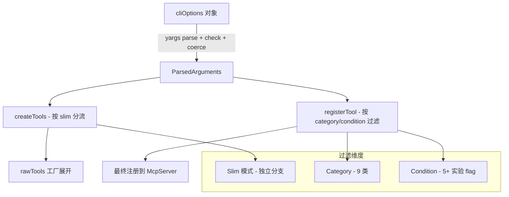

# 12 - 工具分类与条件注册的特性开关体系

> 关键源码：`src/tools/categories.ts`、`src/index.ts` 中的 `registerTool`、`src/bin/chrome-devtools-mcp-cli-options.ts`

## 1. 为什么需要一个开关系统

30+ 个工具，按场景细分：

- 有的用户只要 Input + Navigation；
- 有的做性能优化，要 Performance + Network；
- 有的做扩展开发，需要 Extensions（但这组默认关掉，要明确打开）；
- 实验性工具（Vision、Memory、Screencast、Webmcp）可能污染模型；
- In-page tools / WebMCP 需要特定 Chrome 版本才工作。

**一股脑暴露所有工具** 会让 Agent 选择困难并污染 prompt；**给每个工具一个 flag** 会把 CLI 参数写爆。

项目用「**Category + Condition** 二维结构」把开关数量压到最小。

## 2. 两层控制

### 2.1 Category：大类开关（9 个）

```7:17:src/tools/categories.ts
export enum ToolCategory {
  INPUT = 'input',
  NAVIGATION = 'navigation',
  EMULATION = 'emulation',
  PERFORMANCE = 'performance',
  NETWORK = 'network',
  DEBUGGING = 'debugging',
  EXTENSIONS = 'extensions',
  IN_PAGE = 'in-page',
  MEMORY = 'memory',
}

export const OFF_BY_DEFAULT_CATEGORIES = [ToolCategory.EXTENSIONS];
```

每个工具声明自己属于一个 category（`annotations.category`）。CLI 对应的开关：

- `--category-emulation=false`
- `--category-performance=false`
- `--category-network=false`
- `--category-extensions=true`（默认关，启用了才能注册）
- `--category-in-page-tools=true`（实验）

### 2.2 Condition：单工具条件（字符串数组）

```46:48:src/tools/ToolDefinition.ts
annotations: {
  ...
  conditions?: string[];
}
```

常见 conditions：

- `computerVision`（需要 `--experimental-vision`）
- `experimentalMemory`
- `experimentalInteropTools`
- `screencast`
- `experimentalWebmcp`

例如 `click_at(x,y)` 只在 vision 模式下开放：

```86:116:src/tools/input.ts
export const clickAt = definePageTool({
  name: 'click_at',
  annotations: {
    category: ToolCategory.INPUT,
    readOnlyHint: false,
    conditions: ['computerVision'],
  },
  ...
});
```

## 3. 注册器的过滤逻辑

```118:178:src/index.ts
function registerTool(tool: ToolDefinition | DefinedPageTool): void {
  if (tool.annotations.category === ToolCategory.EMULATION && serverArgs.categoryEmulation === false) return;
  if (tool.annotations.category === ToolCategory.PERFORMANCE && serverArgs.categoryPerformance === false) return;
  if (tool.annotations.category === ToolCategory.NETWORK && serverArgs.categoryNetwork === false) return;
  if (tool.annotations.category === ToolCategory.EXTENSIONS && serverArgs.categoryExtensions === false) return;
  if (tool.annotations.category === ToolCategory.IN_PAGE && !serverArgs.categoryInPageTools) return;

  if (tool.annotations.conditions?.includes('computerVision') && !serverArgs.experimentalVision) return;
  if (tool.annotations.conditions?.includes('experimentalMemory') && !serverArgs.experimentalMemory) return;
  if (tool.annotations.conditions?.includes('experimentalInteropTools') && !serverArgs.experimentalInteropTools) return;
  if (tool.annotations.conditions?.includes('screencast') && !serverArgs.experimentalScreencast) return;
  if (tool.annotations.conditions?.includes('experimentalWebmcp') && !serverArgs.experimentalWebmcp) return;
  ...

  server.registerTool(tool.name, ...);
}
```

**核心就是一串 if + early return**——简单粗暴，但**可读性极高**。

## 4. 默认策略

| Category | Default | 原因 |
| --- | --- | --- |
| INPUT | ✅ 默认开 | Agent 核心能力 |
| NAVIGATION | ✅ 默认开 | 同上 |
| DEBUGGING | ✅ 默认开 | Snapshot/Screenshot 必备 |
| EMULATION | ✅ 默认开（可关） | 响应通用，但 token 敏感用户可关 |
| PERFORMANCE | ✅ 默认开（可关） | 同上 |
| NETWORK | ✅ 默认开（可关） | 同上 |
| EXTENSIONS | ❌ 默认关 | 需要 pipe 连接 + Chrome 版本限制 |
| IN_PAGE | ❌ 默认关 | 实验性 |
| MEMORY | ❌ 默认关 | 实验性 |

**"Off by default" 的设计哲学**：实验或有兼容性限制的能力，不因存在而干扰普通用户。

## 5. Flag 的依赖与冲突

在 `chrome-devtools-mcp-cli-options.ts` 里，`yargs` 的 `conflicts` / `implies` 字段强制一致性：

```15:23:src/bin/chrome-devtools-mcp-mcp-cli-options.ts
autoConnect: {
  type: 'boolean',
  description: '...',
  conflicts: ['isolated', 'executablePath'],
  default: false,
  coerce: (value) => { ... },
},
```

```42:73:src/bin/chrome-devtools-mcp-cli-options.ts
wsEndpoint: {
  type: 'string',
  conflicts: ['browserUrl'],
  coerce: ...,
},
wsHeaders: {
  type: 'string',
  implies: 'wsEndpoint',  // 没有 wsEndpoint 就不能单独用 wsHeaders
  ...
},
```

```196:202:src/bin/chrome-devtools-mcp-cli-options.ts
experimentalFfmpegPath: {
  type: 'string',
  describe: '...',
  implies: 'experimentalScreencast',
},
```

**Yargs 做了两件事**：

1. **互斥**：browserUrl 和 wsEndpoint 不能同时给，避免歧义；
2. **蕴含**：wsHeaders 必须配合 wsEndpoint，否则没有意义。

好处：错误配置在解析阶段就报出来，不会等到运行时才挂。

## 6. Pre-parse 校验与 coerce

```30:40:src/bin/chrome-devtools-mcp-cli-options.ts
browserUrl: {
  type: 'string',
  alias: 'u',
  conflicts: ['wsEndpoint'],
  coerce: (url: string | undefined) => {
    if (!url) return;
    try {
      new URL(url);
    } catch {
      throw new Error(`Provided browserUrl ${url} is not valid URL.`);
    }
    return url;
  },
},
```

```125:141:src/bin/chrome-devtools-mcp-cli-options.ts
viewport: {
  coerce: (arg: string | undefined) => {
    if (!arg) return;
    const [width, height] = arg.split('x').map(Number);
    if (!width || !height || Number.isNaN(width) || Number.isNaN(height)) {
      throw new Error('Invalid viewport. Expected format is `1280x720`.');
    }
    return { width, height };
  },
},
```

`coerce` = 校验 + 规范化 + 默认值，一步到位。调用方拿到的就是 `{width, height}` 结构化对象。

## 7. 默认值的 `check` 钩子

```298:310:src/bin/chrome-devtools-mcp-cli-options.ts
.check(args => {
  // We can't set default in the options else
  // Yargs will complain
  if (!args.channel && !args.browserUrl && !args.wsEndpoint && !args.executablePath) {
    args.channel = 'stable';
  }
  return true;
})
```

**不能直接在 option 里 `default: 'stable'`**，因为 channel 跟 browserUrl/wsEndpoint 互斥，yargs 会拒绝。解法：用 `check` 钩子在解析完成后补默认值。

## 8. 组合开关

实战配置举例：

```json
{
  "args": [
    "chrome-devtools-mcp@latest",
    "--no-category-emulation",
    "--no-category-performance",
    "--no-category-network",
    "--experimental-vision"
  ]
}
```

效果：

- 只保留 Input/Navigation/Debugging（核心 7 个工具）；
- 加上 `click_at` 这类视觉工具；
- 让 Claude 3.5 Sonnet 等有视觉能力的模型发挥作用；
- 极大压缩 prompt token。

## 9. 特殊开关：`--slim`

```28:46:src/tools/tools.ts
export const createTools = (args: ParsedArguments) => {
  const rawTools = args.slim
    ? Object.values(slimTools)
    : [...Object.values(consoleTools), ...Object.values(emulationTools), ...];
```

Slim 模式 **完全绕过 category 判断**，直接用 slim 专属的 3 个工具。这是**"产品模式"** 级别的开关，而不是 category 级别的（详见第 13 篇）。

## 10. Flag Usage 埋点

用户启用了哪些 flag？项目有专门的 `computeFlagUsage` 送到遥测：

```52:52:src/bin/chrome-devtools-mcp-main.ts
void clearcutLogger?.logServerStart(computeFlagUsage(args, cliOptions));
```

这样产品团队可以**数据驱动**地决定：

- 哪些 flag 高频使用 → 考虑变成默认开/默认关？
- 哪些实验性 flag 毕业可以成为正式功能？
- 哪些组合出 bug 最多？

## 11. 架构图



## 12. 可迁移经验

| 经验 | 说明 |
| --- | --- |
| 两层开关 | Category 粗粒度 + Condition 细粒度 |
| 默认关实验功能 | 降低噪声，放心迭代 |
| yargs conflicts / implies | 让错误配置尽早暴露 |
| coerce 校验 + 规范化 | 省去 handler 里的 if/else |
| check 钩子补默认 | 处理 conflict 场景下 default 无法直接写的问题 |
| 枚举 + 常量数组 | `OFF_BY_DEFAULT_CATEGORIES` 让策略集中 |
| Flag 用量埋点 | 数据驱动开关的存废 |

## 13. 延伸阅读

- Slim 模式的产品设计 → [13-slim-mode-progressive-complexity.md](./13-slim-mode-progressive-complexity.md)
- 工具定义系统 → [02-tool-definition-system.md](./02-tool-definition-system.md)
- Flag 埋点 → [19-zod-schema-telemetry.md](./19-zod-schema-telemetry.md)
