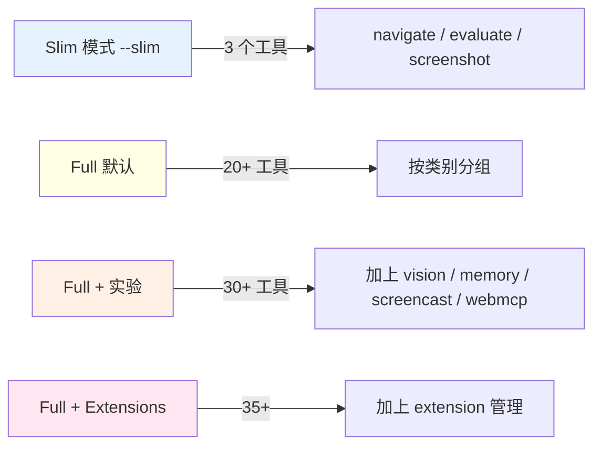

# 13 - Slim 模式与 Agent 能力的渐进式暴露

> 关键源码：`src/tools/slim/tools.ts`、`src/SlimMcpResponse.ts`、`src/bin/chrome-devtools-mcp-cli-options.ts`

## 1. 为什么需要 Slim 模式

Agent 市场上的模型能力差异极大：

| 模型类别 | 能力特征 | 适合的工具集 |
| --- | --- | --- |
| GPT-4 / Claude Opus | 强推理、长 context | 全量 30+ 工具 |
| Haiku / GPT-4o mini | 快但容易 tool selection 错 | 精简工具集 |
| 轻量本地模型 | 长 prompt 表现差 | 3~5 个最核心工具 |
| 自动化脚本场景 | 不需要复杂调试 | 仅 navigate + evaluate + screenshot |

如果只有全量模式，小模型会：

- **Prompt token 被工具描述吃掉**（30+ 工具 × 100 字平均 = 3000 token，是系统消息的一半以上）；
- **tool selection 混乱**（`click_at` vs `click` vs `fill` vs `fill_form` 傻傻分不清）；
- **参数 schema 太复杂**，调用频繁失败。

`--slim` 模式正是对这些场景的响应——**设计原则"Progressive Complexity"的实操**。

## 2. Slim 的工具集

```6:92:src/tools/slim/tools.ts
export const screenshot = definePageTool({
  name: 'screenshot',
  description: `Takes a screenshot`,
  schema: {},  // 无参数！
  handler: async (request, response, context) => {
    const screenshot = await page.pptrPage.screenshot({type: 'png', optimizeForSpeed: true});
    const {filepath} = await context.saveTemporaryFile(screenshot, `screenshot.png`);
    response.appendResponseLine(filepath);
  },
});

export const navigate = definePageTool({
  name: 'navigate',
  description: `Loads a URL`,
  schema: {url: zod.string().describe('URL to navigate to')},  // 只有 url
  handler: ...,
});

export const evaluate = definePageTool({
  name: 'evaluate',
  description: `Evaluates a JavaScript script`,
  schema: {script: zod.string().describe(`JS script to run on the page`)},
  handler: async (request, response) => {
    try {
      const result = await page.pptrPage.evaluate(request.params.script);
      response.appendResponseLine(JSON.stringify(result));
    } catch (err) {
      response.appendResponseLine(String(err.message));
    }
  },
});
```

对比全量版：

| 对比项 | Slim `screenshot` | Full `take_screenshot` |
| --- | --- | --- |
| 参数 | 无 | format / quality / uid / fullPage / filePath 共 5 个 |
| 响应 | 只返回文件路径 | 路径 or base64 内联，超过 2MB 自动落盘 |
| 错误 | 不捕获（让外层 Mutex 兜底） | 详细错误信息 |

**Slim 模式牺牲了灵活性，换来**：

- 更短的工具描述；
- Agent 无需推理参数组合；
- 返回固定格式，易于解析。

## 3. 工具切换机制

```28:46:src/tools/tools.ts
export const createTools = (args: ParsedArguments) => {
  const rawTools = args.slim
    ? Object.values(slimTools)
    : [...Object.values(consoleTools), ...Object.values(emulationTools), ...];
  ...
};
```

一个分支。所有 category 过滤、condition 过滤**全部跳过**，slim 模式就是 3 个工具。

## 4. SlimMcpResponse：极简响应

```15:32:src/SlimMcpResponse.ts
export class SlimMcpResponse extends McpResponse {
  override async handle(
    _toolName: string,
    _context: McpContext,
  ): Promise<{content, structuredContent}> {
    const text: TextContent = {
      type: 'text',
      text: this.responseLines.join('\n'),
    };
    return {
      content: [text],
      structuredContent: text,
    };
  }
}
```

**整个实现只有 8 行**。什么 pages / network / console / trace / lighthouse 全不管——slim 模式下 handler 不会调用这些 setter，即便调用了也会被 handle 忽略。

继承而不是重写的优势：

- 复用 `appendResponseLine`、`attachImage`、`responseLines` getter；
- 类型兼容：`McpResponse` 在 handler 里可用的任何方法都能在 SlimMcpResponse 上调用（handler 代码无需改）。

## 5. 运行时切换

```203:205:src/index.ts
const response = serverArgs.slim
  ? new SlimMcpResponse(serverArgs)
  : new McpResponse(serverArgs);
```

同样一行选择。核心调度器对 Slim/Full 零感知。

## 6. Progressive Complexity 原则（design-principles.md）

> **Progressive Complexity**: Tools should be simple by default (high-level actions) but offer advanced optional arguments for power users.

Slim 是这一原则的**极端化**：把高级能力全部砍掉，只保留"navigate / 取屏 / evalJS"三板斧。

再往下看全量模式的 `take_screenshot`：

```22:46:src/tools/screenshot.ts
schema: {
  format: zod.enum(['png', 'jpeg', 'webp']).default('png'),
  quality: zod.number().min(0).max(100).optional(),
  uid: zod.string().optional().describe('...'),
  fullPage: zod.boolean().optional(),
  filePath: zod.string().optional(),
},
```

- **简单默认值**：`format` 默认 png，quality 默认无；
- **可选高级项**：uid 截取单个元素，fullPage 截全页；
- **互斥校验**：`uid` 和 `fullPage` 不能同时给（在 handler 里检查）。

**同一工具内部** 也在渐进——不使用高级参数的用户，只写 `{}` 就行。

## 7. 三层暴露模型



**用户路径**：

1. 新手/小模型 → Slim
2. 日常开发 → Full 默认
3. 调优性能 → Full + Performance 已默认开，打开 CrUX 等
4. 开发扩展 → `--category-extensions`
5. 用视觉模型 → `--experimental-vision`

逐步打开，不强制。

## 8. Disclaimer 的差异化

```292:310:src/index.ts
export const logDisclaimers = (args) => {
  console.error(`chrome-devtools-mcp exposes content of the browser...`);

  if (!args.slim && args.performanceCrux) {
    console.error(`Performance tools may send trace URLs to the Google CrUX API...`);
  }

  if (!args.slim && args.usageStatistics) {
    console.error(`Google collects usage statistics to improve Chrome DevTools MCP...`);
  }
};
```

Slim 模式**连 disclaimer 都简化**——没有 performance 工具就不提 CrUX，没有详细埋点场景就不提 usage stats。细节处见功力。

## 9. 可迁移经验

| 经验 | 说明 |
| --- | --- |
| 同一产品两套"技能树" | Slim + Full 是模型能力的动态适配 |
| 继承 + 空 override | `SlimMcpResponse` 最大程度复用 |
| 路由只做一处分支 | `createTools` 和 `new Response` 两处即可 |
| 工具本身也要 progressive | 简单参数默认+高级参数可选 |
| Disclaimer 按场景差异化 | 避免"噪音免责声明"污染 |

## 10. 反向思考：什么时候不该用 Slim

- 用户需要多页管理 → Slim 没有 list_pages / select_page
- 需要 snapshot-based 精确操作 → Slim 没有 uid 机制
- 要分析 trace → 完全没有 performance_*

**产品要主动告诉用户**：在 slim 模式下某些问题解决不了。Docs 的 `docs/slim-tool-reference.md` 显式列了 3 个工具，并推荐"基本浏览任务"场景。

## 11. 扩展思考：未来可以加

- `--tier=slim|basic|pro|expert`：多级技能树；
- `--custom-tools=click,fill,take_snapshot`：让用户自己选；
- 按 MCP 客户端名**自动**选（Claude Desktop → Pro，小模型 → Slim）。

`ClearcutLogger.setClientName()` 已经识别出了客户端种类，技术上可行。

## 12. 延伸阅读

- Category 开关 → [12-tool-categories-feature-flags.md](./12-tool-categories-feature-flags.md)
- Response 架构 → [08-mcp-response-builder.md](./08-mcp-response-builder.md)
- Token 优化（Slim 的核心动机）→ [09-token-optimization.md](./09-token-optimization.md)
