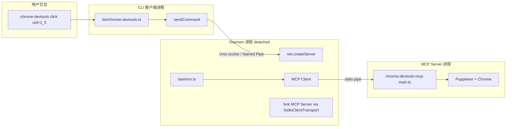

# 14 - Daemon IPC 架构：CLI 复用 MCP 服务

> 关键源码：`src/daemon/daemon.ts`、`src/daemon/client.ts`、`src/daemon/utils.ts`、`src/bin/chrome-devtools.ts`

## 1. 为什么需要 Daemon

项目有两种入口：

- **MCP 模式**：`chrome-devtools-mcp` 作为 Claude/Gemini 的 MCP Server 跑；
- **CLI 模式**：`chrome-devtools click <uid>` 当命令行工具用（看 `docs/cli.md`）。

**CLI 模式下每次执行都启动 Chrome** 会让用户抓狂：

- 启动 Chrome 要 2~5 秒；
- 每次执行都打开新窗口，登录状态会丢；
- 冷启动占 CLI 总时间 90%。

项目的解法：**Daemon 模式** —— 后台常驻一个"服务进程"，保留 Chrome 连接，CLI 每次只发一条 IPC 消息即可。

## 2. 架构总览



**三层架构**：

1. **CLI (client)**：临时进程，连 socket、发命令、拿结果、退出；
2. **Daemon**：detached 常驻进程，接 CLI 请求、转发给 MCP Server；
3. **MCP Server**：daemon 通过 stdio 启动，Chrome 连接藏在这层。

## 3. 跨平台 Socket 路径

POSIX 的 Unix socket 路径**最多 104 字符**（macOS）/ 108（Linux），超长会 `ENAMETOOLONG`。项目的兼容实现：

```27:47:src/daemon/utils.ts
export function getSocketPath(sessionId: string): string {
  const uid = os.userInfo().uid;
  const suffix = sessionId ? `-${sessionId}` : '';
  const appName = APP_NAME + suffix;

  if (IS_WINDOWS) {
    // Windows uses Named Pipes, not file paths.
    return path.join('\\\\.\\pipe', appName, 'server.sock');
  }

  // 1. Try XDG_RUNTIME_DIR (Linux standard, sometimes macOS)
  if (process.env.XDG_RUNTIME_DIR) {
    return path.join(process.env.XDG_RUNTIME_DIR, appName, 'server.sock');
  }

  // 2. macOS/Unix Fallback: Use /tmp/
  // We use /tmp/ because it is much shorter than ~/Library/Application Support/
  return path.join('/tmp', `${appName}-${uid}.sock`);
}
```

**三个平台三种策略**：

- Windows：Named Pipe（格式 `\\.\pipe\...`）；
- Linux：XDG_RUNTIME_DIR（通常 `/run/user/<uid>`）；
- macOS / 无 XDG 的 Linux：`/tmp/`（不用 `~/Library/Application Support/` 因为路径太长）；
- UID 后缀防止多用户共享主机时互相踩。

## 4. 进程活性检测

```96:107:src/daemon/utils.ts
export function isDaemonRunning(sessionId: string): boolean {
  const pid = getDaemonPid(sessionId);
  if (pid) {
    try {
      process.kill(pid, 0); // Throws if process doesn't exist
      return true;
    } catch {
      // Process is dead, stale PID file. Proceed with startup.
    }
  }
  return false;
}
```

**`process.kill(pid, 0)` 技巧**：signal `0` 不发实际信号，只检查目标进程是否存在。比开 socket 试探快 100 倍，也不会触发任何副作用。

进一步：**stale PID 文件自动忽略**——daemon 崩溃留下 pid 文件，下次 CLI 启动新 daemon，不会误以为还在。

## 5. Daemon 启动与就绪检测

```70:93:src/daemon/client.ts
export async function startDaemon(mcpArgs: string[] = [], sessionId: string) {
  if (isDaemonRunning(sessionId)) return;

  const pidFilePath = getPidFilePath(sessionId);
  if (fs.existsSync(pidFilePath)) fs.unlinkSync(pidFilePath);

  const child = spawn(process.execPath, [DAEMON_SCRIPT_PATH, ...mcpArgs], {
    detached: true,
    stdio: 'ignore',
    env: {...process.env, CHROME_DEVTOOLS_MCP_SESSION_ID: sessionId},
    cwd: process.cwd(),
    windowsHide: true,
  });
  child.unref();

  await waitForFile(pidFilePath);
}
```

**就绪信号用文件**：daemon 启动后把自己的 pid 写入 pid 文件（`daemon.ts` 的 42-43 行），CLI 用 `fs.watchFile` 等文件出现。

```29:68:src/daemon/client.ts
function waitForFile(filePath: string, removed = false) {
  return new Promise<void>((resolve, reject) => {
    const check = () => {
      const exists = fs.existsSync(filePath);
      if (removed) return !exists;
      if (!exists) return false;
      try { return fs.statSync(filePath).size > 0; } catch { return false; }
    };

    if (check()) { resolve(); return; }

    const timer = setTimeout(() => {
      fs.unwatchFile(filePath);
      reject(new Error(`Timeout...`));
    }, FILE_TIMEOUT);

    fs.watchFile(filePath, {interval: 500}, () => {
      if (check()) {
        clearTimeout(timer);
        fs.unwatchFile(filePath);
        resolve();
      }
    });
  });
}
```

**亮点**：

- **`size > 0` 判断**：避免读到空文件（write 未 flush）；
- **`interval: 500ms`**：避免 CPU 占用过高；
- **10 秒超时**：足够 Chrome 启动；
- **双向使用**：`removed=true` 反过来等文件消失（`stopDaemon` 用）。

## 6. Socket 通信：PipeTransport

```151:163:src/daemon/daemon.ts
server = createServer(socket => {
  const transport = new PipeTransport(socket, socket);
  transport.onmessage = async (message: string) => {
    const response = await handleRequest(JSON.parse(message));
    transport.send(JSON.stringify(response));
    socket.end();
  };
  socket.on('error', error => { logger('Socket error:', error); });
});
```

- `PipeTransport` 是 MCP SDK 里的双向消息 codec（处理 framing），daemon 用它同时对接 socket 和对上的 MCP 客户端；
- **每个连接一个请求**：CLI 发一条命令，daemon 回复后 `socket.end()`，复用连接反而更复杂；
- Socket 错误只 log，不崩服务器。

## 7. Daemon 内部：启动 MCP Server 作为子进程

```54:75:src/daemon/daemon.ts
async function setupMCPClient() {
  mcpTransport = new StdioClientTransport({
    command: process.execPath,
    args: [INDEX_SCRIPT_PATH, ...mcpServerArgs],
    env: process.env as Record<string, string>,
  });
  mcpClient = new Client(
    {name: DAEMON_CLIENT_NAME, version: VERSION},
    {capabilities: {}},
  );
  await mcpClient.connect(mcpTransport);
}
```

**巧妙的架构复用**：daemon 对外是 socket server，对内是 MCP client——它**把 MCP Server 当成"被托管的子服务"**。这样：

- MCP Server 完全不用改代码；
- Daemon 作为透明中转，不需要重实现 tool registry；
- CLI 无感：它只知道"我发 `invoke_tool` 给 daemon"。

## 8. 请求转发

```86:125:src/daemon/daemon.ts
async function handleRequest(msg: DaemonMessage) {
  try {
    if (msg.method === 'invoke_tool') {
      if (!mcpClient) throw new Error('MCP client not initialized');
      const {tool, args} = msg;
      const result = await mcpClient.callTool({
        name: tool,
        arguments: args || {},
      });
      return {success: true, result: JSON.stringify(result)};
    } else if (msg.method === 'stop') {
      await started;  // 防止和启动赛跑
      setImmediate(() => { void cleanup(); });
      return {success: true, message: 'stopping'};
    } else if (msg.method === 'status') {
      return {success: true, result: JSON.stringify({pid, socketPath, startDate, version, args})};
    }
    return {success: false, error: `Unknown method: ${JSON.stringify(msg, null, 2)}`};
  } catch (error) {
    return {success: false, error: error instanceof Error ? error.message : String(error)};
  }
}
```

三种命令：

- `invoke_tool` → 转给 MCP Client；
- `stop` → 优雅退出；
- `status` → 返回 daemon 自身元信息。

**`await started`**：在 stop 时防止 "启动还没完成就被 stop" 的 race condition。

## 9. 信号处理与清理

```224:232:src/daemon/daemon.ts
process.on('SIGTERM', () => { void cleanup(); });
process.on('SIGINT', () => { void cleanup(); });
process.on('SIGHUP', () => { void cleanup(); });
```

```191:221:src/daemon/daemon.ts
async function cleanup() {
  try { await mcpClient?.close(); } catch (error) { ... }
  try { await mcpTransport?.close(); } catch (error) { ... }
  if (server) {
    await new Promise<void>(resolve => { server!.close(() => resolve()); });
  }
  if (!IS_WINDOWS) {
    try { fs.unlinkSync(socketPath); } catch { /* ignore */ }
  }
  if (fs.existsSync(pidFilePath)) fs.unlinkSync(pidFilePath);
  process.exit(0);
}
```

**清理顺序**：

1. 关 MCP client（让 server 也能 graceful shutdown）；
2. 关 MCP transport；
3. 关 socket server；
4. 删 socket 文件（non-Windows）；
5. 删 pid 文件；
6. 退出。

每一步独立 try/catch——**清理过程中任何一步失败，不影响下一步**。

## 10. 参数序列化：CLI → Daemon → MCP Server

```109:136:src/daemon/utils.ts
export function serializeArgs(options, argv): string[] {
  const args: string[] = [];
  for (const key of Object.keys(options)) {
    if (argv[key] === undefined || argv[key] === null) continue;
    const value = argv[key];
    const kebabKey = key.replace(/[A-Z]/g, m => `-${m.toLowerCase()}`);
    if (typeof value === 'boolean') {
      args.push(value ? `--${kebabKey}` : `--no-${kebabKey}`);
    } else if (Array.isArray(value)) {
      for (const item of value) args.push(`--${kebabKey}`, String(item));
    } else {
      args.push(`--${kebabKey}`, String(value));
    }
  }
  return args;
}
```

**CamelCase → kebab-case 的自动转换**：CLI yargs 默认生成 `camelCase`，但 MCP Server 只认 `--kebab-case`。一个函数把所有选项还原成命令行参数数组。

## 11. 响应格式的双模式

```150:189:src/daemon/client.ts
export async function handleResponse(response, format: 'json' | 'md') {
  if (response.isError) return JSON.stringify(response.content);
  if (format === 'json') {
    if (response.structuredContent) return JSON.stringify(response.structuredContent);
  }
  const chunks = [];
  for (const content of response.content) {
    if (content.type === 'text') chunks.push(content.text);
    else if (content.type === 'image') {
      // 图像写到临时文件
      const imageData = content.data;
      ...
      const data = Buffer.from(imageData, 'base64');
      const name = crypto.randomUUID();
      const {filepath} = await saveTemporaryFile(data, `${name}${extension}`);
      chunks.push(`Saved to ${filepath}.`);
    }
  }
  return format === 'md' ? chunks.join(' ') : JSON.stringify(chunks);
}
```

CLI 可以要 markdown（给人看）或 json（给脚本看）。图像统一写到临时目录再回传路径，避免 base64 污染终端。

## 12. 性能收益

| 动作 | 无 Daemon | 有 Daemon |
| --- | --- | --- |
| 首次 `chrome-devtools navigate` | 3s（启动 daemon + MCP + Chrome） | 3s |
| 第二次 `chrome-devtools click` | 3s 完整冷启动 | 50ms 仅 socket 往返 |
| 100 次连续命令 | 300s | 5s |

**数量级的提升**，CLI 变得真的可用。

## 13. 可迁移经验

| 经验 | 说明 |
| --- | --- |
| 三进程架构 | CLI/Daemon/Core 分工明确，CLI 保持轻量 |
| 跨平台 socket 路径 | Windows 用 Named Pipe，Linux XDG，macOS /tmp |
| `process.kill(pid, 0)` | 最轻量的进程存活检测 |
| PID 文件 + 文件系统就绪信号 | 跨进程启动同步的通用模式 |
| detached + unref | 子进程完全独立生命周期 |
| 路由器架构复用 | Daemon 当 MCP Client，零改动上游 |
| 信号处理 + 分步 cleanup | 每步独立 try/catch 防止级联失败 |

## 14. 延伸阅读

- 子进程架构的另一个应用 → [11-watchdog-telemetry.md](./11-watchdog-telemetry.md)
- 为什么 MCP Server 本身要保留 `pipe: true` → [10-browser-connection.md](./10-browser-connection.md)
- Response 的结构化输出 → [08-mcp-response-builder.md](./08-mcp-response-builder.md)
