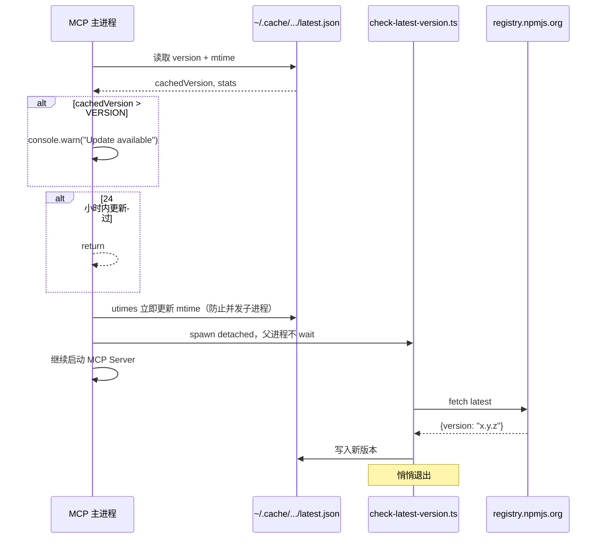
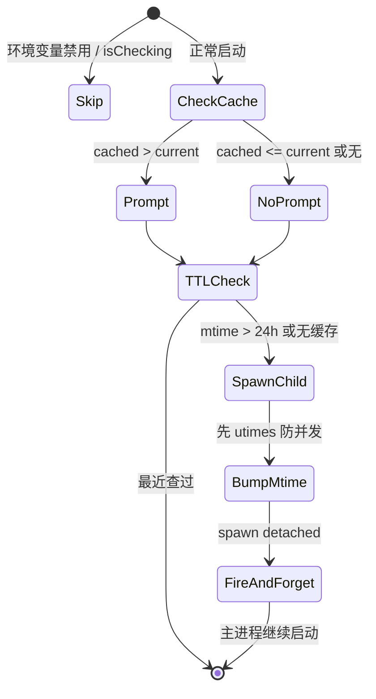

# 15 - 自动更新检查与非阻塞后台任务模式

> 关键源码：`src/utils/check-for-updates.ts`、`src/bin/check-latest-version.ts`、`src/bin/chrome-devtools-mcp-main.ts`

## 1. 问题：npm 版本检测是个典型的"耗时又不重要"任务

- MCP Server 作为 stdio 协议，启动期对延迟非常敏感；
- 检查 npm 可能花 200ms ~ 3s（跨国访问 registry）；
- 用户可能在网络断开环境使用——不能因为检查失败就启动失败；
- 频繁检查占带宽，也没必要（一天一次足够）。

项目的方案用了 **4 个精妙的 trick**：

1. 本地缓存 + 24 小时 TTL；
2. 主进程读缓存但**不发起实际网络请求**；
3. 单独 spawn 一个子进程去 fetch，detached 跑飞；
4. 进程内锁（`isChecking`）+ 文件 mtime 锁防止并发。

## 2. 执行流程



## 3. 主进程部分

```27:97:src/utils/check-for-updates.ts
export async function checkForUpdates(message: string) {
  if (isChecking || process.env['CHROME_DEVTOOLS_MCP_NO_UPDATE_CHECKS']) return;
  isChecking = true;

  const cachePath = path.join(
    os.homedir(),
    '.cache',
    'chrome-devtools-mcp',
    'latest.json',
  );

  let cachedVersion: string | undefined;
  let stats: {mtimeMs: number} | undefined;
  try {
    stats = await fs.stat(cachePath);
    const data = await fs.readFile(cachePath, 'utf8');
    cachedVersion = JSON.parse(data).version;
  } catch {
    // Ignore errors reading cache.
  }

  if (cachedVersion && semver.lt(VERSION, cachedVersion)) {
    console.warn(`\nUpdate available: ${VERSION} -> ${cachedVersion}\n${message}\n`);
  }

  const now = Date.now();
  if (stats && now - stats.mtimeMs < 24 * 60 * 60 * 1000) {
    return;  // 24h 内查过，直接退出
  }

  // Update mtime immediately to prevent multiple subprocesses.
  try {
    const parentDir = path.dirname(cachePath);
    await fs.mkdir(parentDir, {recursive: true});
    const nowTime = new Date();
    if (stats) {
      await fs.utimes(cachePath, nowTime, nowTime);
    } else {
      await fs.writeFile(cachePath, JSON.stringify({version: VERSION}));
    }
  } catch { /* Ignore errors. */ }

  // In a separate process, check the latest available version number
  // and update the local snapshot accordingly.
  const scriptPath = path.join(import.meta.dirname, '..', 'bin', 'check-latest-version.js');

  try {
    const child = child_process.spawn(
      process.execPath,
      [scriptPath, cachePath],
      {detached: true, stdio: 'ignore'},
    );
    child.unref();
  } catch {
    // Fail silently in case of any errors.
  }
}
```

**每一行都有设计**：

### 3.1 `isChecking` 进程内锁

防止一个进程内多次调用重复检测（比如 CLI 和 MCP 同时启动）。

### 3.2 环境变量 escape hatch

`CHROME_DEVTOOLS_MCP_NO_UPDATE_CHECKS` 让企业内网/CI 用户彻底关掉检查。

### 3.3 全局缓存目录

`~/.cache/chrome-devtools-mcp/latest.json` 跟 userDataDir 同级，符合 XDG 目录规范（虽然 macOS 不严格遵循）。

### 3.4 cache read + try/catch

即使文件不存在、JSON 解析失败、权限问题——**全部吃掉**。因为这是"锦上添花"功能，绝不能让用户启动失败。

### 3.5 语义版本比较

`semver.lt(VERSION, cachedVersion)` —— 正确处理 `1.10.0 > 1.9.9`。手写字符串比较必翻车。

### 3.6 双重 TTL 保护

**关键设计**：

1. **先提示**：即使 24h 内查过，只要 cached > current 就提示（让刚更新了缓存的下一次启动立即看到提示）；
2. **再决定是否重查**：24h 内不重查；
3. **立即 bump mtime**：哪怕子进程还没返回，mtime 已经更新，避免几毫秒窗口内多次 spawn。

### 3.7 Detached Spawn

```85:92:src/utils/check-for-updates.ts
const child = child_process.spawn(process.execPath, [scriptPath, cachePath], {
  detached: true,
  stdio: 'ignore',
});
child.unref();
```

- `detached: true` + `unref()`：父进程不等子进程；
- `stdio: 'ignore'`：子进程输出丢弃，不污染 MCP stdio；
- spawn 本身可能失败（磁盘满/exec 失败）也吞掉。

**效果**：主进程在 <5ms 内完成"检测 + 提示 + spawn 子任务"全流程，感觉不到耗时。

## 4. 子进程部分

```11:32:src/bin/check-latest-version.ts
const cachePath = process.argv[2];

if (cachePath) {
  try {
    const response = await fetch('https://registry.npmjs.org/chrome-devtools-mcp/latest');
    const data = response.ok ? await response.json() : null;

    if (data && typeof data === 'object' && 'version' in data && typeof data.version === 'string') {
      await fs.mkdir(path.dirname(cachePath), {recursive: true});
      await fs.writeFile(cachePath, JSON.stringify({version: data.version}));
    }
  } catch {
    // Ignore errors.
  }
}
```

子进程**总共 20 行**：

- 从 argv[2] 拿缓存路径；
- fetch npm registry；
- 数据格式严格检查（type guard）；
- 写入缓存；
- 任何错误都吞掉。

**纯粹一个副作用任务**，没有任何返回值。

## 5. 为什么不用 child_process.fork + IPC？

看起来可以：主进程 fork 子进程，子进程做完通过 IPC 发回版本，主进程打印。但**会让主进程依赖子进程的结果**，又回到"启动慢"问题。

当前设计的精髓是：**本次启动用的是上次启动的数据**。异步取数据只是为**下次**做准备。这是一个**离线优先（offline-first）+ 最终一致性** 的模式。

## 6. 对比：内嵌 fetch 的坏处

```ts
// 反例
async function badCheckUpdate() {
  const response = await fetch('https://registry.npmjs.org/...', {
    signal: AbortSignal.timeout(1000),  // 即使设超时
  });
  const data = await response.json();
  // 用户依然要等 0~1000ms
}
```

**即便加了超时**：

- 弱网用户启动延迟 1 秒；
- 内网隔离用户永远 1 秒等待；
- AbortSignal 依然可能残留 fetch 任务在后台。

项目方案的延迟 = **硬盘 IO** 级别，稳定 <5ms。

## 7. 完整状态机



## 8. 这套模式的通用化

"后台任务 + 本地缓存 + 下次受益"可以套用在很多场景：

| 场景 | 缓存对象 | TTL |
| --- | --- | --- |
| 版本检查（本项目） | latest.json | 24h |
| DNS 预解析 | IP 地址 | 1h |
| 公共配置抓取 | settings.json | 1 天 |
| Token 续签 | token.json | 有效期 -10% |
| 用户信息 | profile.json | 1 周 |

**通用模板**：

```ts
async function lazyCachedFetch(cachePath, ttl, fetcher) {
  const stats = await fs.stat(cachePath).catch(() => null);
  const cached = stats ? JSON.parse(await fs.readFile(cachePath, 'utf8')) : null;
  if (cached) useCachedData(cached);
  if (!stats || Date.now() - stats.mtimeMs > ttl) {
    await fs.utimes(cachePath, new Date(), new Date()).catch(() => {});
    spawnDetachedFetcher(cachePath, fetcher);
  }
}
```

## 9. 可迁移经验

| 经验 | 说明 |
| --- | --- |
| 本地缓存优先 | 启动关键路径永远不依赖网络 |
| 子进程 detached + unref | 任何"可延后"的网络任务都可以这么做 |
| 先 bump mtime 再 spawn | 防止并发 spawn 撞车的低成本方案 |
| semver.lt 比较版本 | 别手写字符串比较 |
| 所有错误都 swallow | 锦上添花的功能，失败不影响主流程 |
| 环境变量 escape hatch | 企业/CI 友好 |
| 提前提示，滞后查询 | 用上一次的结果，为下一次做准备 |

## 10. 延伸阅读

- 启动入口的全景 → [01-mcp-server-architecture.md](./01-mcp-server-architecture.md)
- 另一个 detached 子进程的应用 → [11-watchdog-telemetry.md](./11-watchdog-telemetry.md)
