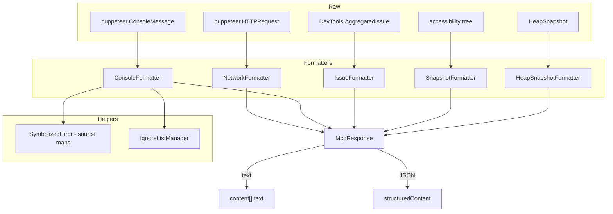

# 18 - Formatter 体系与结构化输出双通道

> 关键源码：`src/formatters/*.ts`、`src/McpResponse.ts` 中的调用

## 1. Formatter 的统一契约

项目有 5 个 Formatter：

| Formatter | 对应数据 |
| --- | --- |
| `ConsoleFormatter` | 控制台消息、未捕获异常 |
| `IssueFormatter` | DevTools AggregatedIssue |
| `NetworkFormatter` | 网络请求 |
| `SnapshotFormatter` | a11y 快照 |
| `HeapSnapshotFormatter` | 堆快照聚合数据 |

它们**遵循同一套契约**：

```ts
class SomeFormatter {
  // 构造（私有 + 静态 from，见异步工厂）
  private constructor(...) {}
  static async from(raw, options) { ... }  // 可能 await 更多数据

  toString(): string           // 短格式（列表项）
  toStringDetailed?(): string  // 详细格式（单项展开）
  toJSON(): object             // 结构化短版
  toJSONDetailed?(): object    // 结构化详细版
}
```

**同源双输出**：`toString()` 基于 `toJSON()` 渲染，保证一致性。例如：

```174:181:src/formatters/ConsoleFormatter.ts
toString(): string {
  return convertConsoleMessageConciseToString(this.toJSON());
}

toStringDetailed(): string {
  return convertConsoleMessageConciseDetailedToString(this.toJSONDetailed());
}
```

## 2. 短格式 vs 详细格式

```218:232:src/formatters/ConsoleFormatter.ts
function convertConsoleMessageConciseToString(msg: ConsoleMessageConcise) {
  return `msgid=${msg.id} [${msg.type}] ${msg.text} (${msg.argsCount} args)`;
}

function convertConsoleMessageConciseDetailedToString(msg: ConsoleMessageDetailed) {
  const result = [
    `ID: ${msg.id}`,
    `Message: ${msg.type}> ${msg.text}`,
    formatArgs(msg),
    ...(msg.stackTrace ? ['### Stack trace', msg.stackTrace] : []),
  ].filter(line => !!line);
  return result.join('\n');
}
```

**短格式**：一行摘要，用于列表（`list_console_messages`）；
**详细格式**：多行 markdown，用于 `get_console_message(msgid)`。

这是"先列表再详情"的典型 LLM 友好模式——Agent 看到列表挑关心的再展开，不会让长 stack trace 污染短摘要。

## 3. NetworkFormatter：异步数据加载

```64:73:src/formatters/NetworkFormatter.ts
static async from(request: HTTPRequest, options: NetworkFormatterOptions): Promise<NetworkFormatter> {
  const instance = new NetworkFormatter(request, options);
  if (options.fetchData) {
    await instance.#loadDetailedData();
  }
  return instance;
}
```

`fetchData` 开关决定是否要拉 body/headers：

- 列表场景：`fetchData=false`，只用 request 对象已有的 method/url/status；
- 详情场景：`fetchData=true`，await body 拉取、可选落盘。

**避免了 O(N) 次昂贵 API 调用**——列表 100 条请求，不会触发 100 次 body fetch。

## 4. ConsoleFormatter：源码映射 + 异步栈

ConsoleFormatter 最复杂，因为要处理：

- 普通 console.log / warn / error；
- 未捕获异常（UncaughtError）；
- 带 args 的 log（`console.log("user:", user)`）；
- 源码映射栈；
- 异步调用链（async fragment）；
- Error cause chain；
- IgnoreList（框架代码不显示）。

### 4.1 IgnoreList 过滤

```81:103:src/formatters/ConsoleFormatter.ts
const ignoreListManager = options?.devTools?.universe.context.get(DevTools.DevTools.IgnoreListManager);
const isIgnored: IgnoreCheck = options.isIgnoredForTesting || (frame => {
  if (!ignoreListManager) return false;
  if (frame.uiSourceCode) {
    return ignoreListManager.isUserOrSourceMapIgnoreListedUISourceCode(frame.uiSourceCode);
  }
  if (frame.url) {
    return ignoreListManager.isUserIgnoreListedURL(frame.url as any);
  }
  return false;
});
```

**IgnoreListManager** 是 DevTools 的"隐藏第三方代码"功能（比如 node_modules 里的代码）。在格式化 stack trace 时跳过匹配的 frame：

```302:308:src/formatters/ConsoleFormatter.ts
function formatFragment(fragment, formatter): string[] {
  const frames = fragment.frames.filter(frame => !formatter.isIgnored(frame));
  return frames.map(formatFrame);
}
```

Agent 看到的栈更聚焦在用户业务代码。

### 4.2 异步栈分隔符

```310:323:src/formatters/ConsoleFormatter.ts
function formatAsyncFragment(fragment, formatter): string[] {
  const formattedFrames = formatFragment(fragment, formatter);
  if (formattedFrames.length === 0) return [];

  const separatorLineLength = 40;
  const prefix = `--- ${fragment.description || 'async'} `;
  const separator = prefix + '-'.repeat(separatorLineLength - prefix.length);
  return [separator, ...formattedFrames];
}
```

输出示例：

```
at handleClick (Login.tsx:42:3)
at onClick (Button.tsx:12:5)
--- Promise.then -----------------------
at fetchData (api.ts:8:10)
at loadUser (Login.tsx:25:14)
```

**可视化的边界**让 Agent / 开发者快速理解异步边界。

### 4.3 Cause chain

```338:350:src/formatters/ConsoleFormatter.ts
function formatCause(cause, formatter): string[] {
  if (!cause) return [];
  return [
    `Caused by: ${cause.message}`,
    ...formatStackTraceInner(cause.stackTrace, cause.cause, formatter),
  ];
}
```

递归展开 `Error(..., {cause: innerErr})` 链。

### 4.4 栈长度限制

```264:282:src/formatters/ConsoleFormatter.ts
const STACK_TRACE_MAX_LINES = 50;

function formatStackTrace(stackTrace, cause, formatter): string {
  const lines = formatStackTraceInner(stackTrace, cause, formatter);
  const includedLines = lines.slice(0, STACK_TRACE_MAX_LINES);
  const reminderCount = lines.length - includedLines.length;

  return [
    ...includedLines,
    reminderCount > 0 ? `... and ${reminderCount} more frames` : '',
    'Note: line and column numbers use 1-based indexing',
  ].filter(line => !!line).join('\n');
}
```

- 最多显示 50 行，超出显示 `... and N more frames`；
- **主动声明 1-based indexing**：避免 Agent 把 column 当 0-based 解释。

## 5. SnapshotFormatter：树形缩进

```39:55:src/formatters/SnapshotFormatter.ts
#formatNode(node: TextSnapshotNode, depth = 0): string {
  const chunks: string[] = [];
  const attributes = this.#getAttributes(node);
  const line =
    ' '.repeat(depth * 2) +
    attributes.join(' ') +
    (node.id === this.#snapshot.selectedElementUid
      ? ' [selected in the DevTools Elements panel]'
      : '') +
    '\n';
  chunks.push(line);

  for (const child of node.children) {
    chunks.push(this.#formatNode(child, depth + 1));
  }
  return chunks.join('');
}
```

- 2 空格/级缩进；
- 每行一个节点；
- 属性自动按字母排序（Object.keys(...).sort()）——**稳定输出**利于 diff 和缓存。

### 5.1 布尔属性压缩

```152:167:src/formatters/SnapshotFormatter.ts
const booleanPropertyMap: Record<string, string> = {
  disabled: 'disableable',
  expanded: 'expandable',
  focused: 'focusable',
  selected: 'selectable',
};

const excludedAttributes = new Set(['id', 'role', 'name', 'elementHandle', 'children', 'backendNodeId', 'loaderId']);
```

- `disabled: true` 在文本里输出 `disableable`（而不是 `disabled="true"`）；
- `excludedAttributes` 排除内部字段，避免污染输出。

## 6. IssueFormatter：CDP Issue 到人类可读

DevTools `AggregatedIssue` 是结构化诊断（MixedContent、CORS、COEP 等）。格式化器：

- 把 `issueCode` 翻译成 human-readable 描述（借助 `issue-descriptions.ts`）；
- 把 issue 关联的请求 ID / 元素 backendNodeId 转换成 MCP 的 reqid / uid；
- 对用户代码给出修复建议链接。

```516:524:src/McpResponse.ts
const formatter = new IssueFormatter(message, {
  id: consoleMessageStableId,
  requestIdResolver: context.resolveCdpRequestId.bind(context, this.#page),
  elementIdResolver: this.#page.resolveCdpElementId.bind(this.#page),
});
```

**依赖注入**：formatter 自己不知道怎么 resolve ID，由 McpResponse 注入回调。**保持 formatter 纯粹、可测试**。

## 7. HeapSnapshotFormatter：排序与聚合

```914:931:src/McpResponse.ts
if (aggregates) {
  const sortedEntries = HeapSnapshotFormatter.sort(aggregates);

  const paginationData = this.#dataWithPagination(sortedEntries, this.#heapSnapshotOptions.pagination);

  structuredContent.pagination = paginationData.pagination;
  response.push(...paginationData.info);

  const paginatedRecord = Object.fromEntries(paginationData.items);
  const formatter = new HeapSnapshotFormatter(paginatedRecord);

  response.push(formatter.toString());
  structuredContent.heapSnapshotData = formatter.toJSON();
}
```

- **先排序再分页**：按大小降序，Top 20 内存占用 class；
- 分页结果再交给 formatter 渲染。

## 8. 依赖关系



## 9. 私有构造 + 静态 from 模式的价值

5 个 Formatter 几乎全部采用：

```ts
private constructor(...) {}
static async from(raw, options): Promise<Formatter>
```

理由：

- `from` 可以 `await` 加载详情（`NetworkFormatter.from` 的 body fetch）；
- 构造函数本身是同步的，`async constructor` 语言不支持；
- `private constructor` 强制调用方走 `from`，防止跳过初始化；
- 测试时可以 inject `resolvedXxxForTesting` 跳过真实查询。

## 10. Testing-friendly 参数

```20:23:src/formatters/ConsoleFormatter.ts
resolvedArgsForTesting?: unknown[];
resolvedStackTraceForTesting?: DevTools.DevTools.StackTrace.StackTrace.StackTrace;
resolvedCauseForTesting?: SymbolizedError;
isIgnoredForTesting?: IgnoreCheck;
```

测试可以直接提供解析好的栈/args，跳过真实 CDP 交互。**测试时不需要真浏览器**就能验证格式化逻辑。

## 11. 双输出同源的检查清单

每个 Formatter 都必须保证：

- `toString()` 和 `toJSON()` **数据一致**（用户看到的文字和程序读到的 JSON 不矛盾）；
- `toStringDetailed()` 包含 `toString()` 的全部信息（详细版是超集）；
- JSON 字段名稳定（Agent 用 JSONPath 或 schema 约束都能对齐）。

## 12. 可迁移经验

| 经验 | 说明 |
| --- | --- |
| 双输出（text + JSON） | 同源构造，杜绝不一致 |
| 短/详细双模式 | 列表用短、详情用详细 |
| 异步 `from` 工厂 | 私有构造 + static 初始化，支持 await |
| 依赖注入 resolver | Formatter 不查数据库，由外部注入回调 |
| IgnoreList / 长度截断 | 控制输出噪音和大小 |
| Testing 注入点 | `resolvedXxxForTesting` 让测试免 mock 复杂依赖 |
| 稳定排序 | `Object.keys().sort()` 或 `HeapSnapshotFormatter.sort` 让结果可预测 |

## 13. 延伸阅读

- Response 如何调度 Formatter → [08-mcp-response-builder.md](./08-mcp-response-builder.md)
- SymbolizedError 的来源 → [17-devtools-universe.md](./17-devtools-universe.md)
- Heap snapshot 机制 → `src/HeapSnapshotManager.ts`
