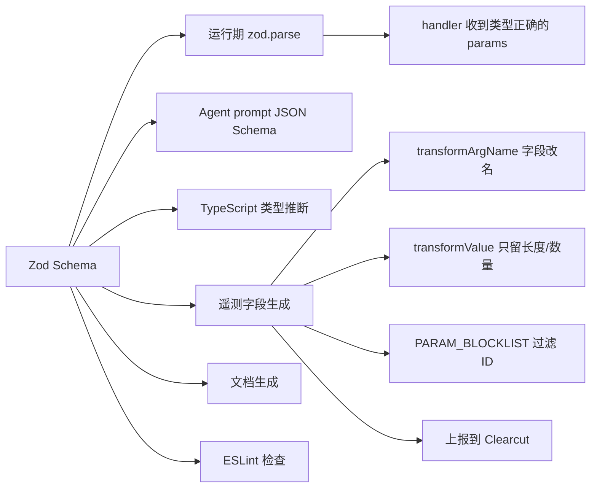

# 19 - Zod Schema 驱动的工具声明与隐私友好埋点

> 关键源码：`src/tools/ToolDefinition.ts`、`src/telemetry/ClearcutLogger.ts`、各 `tools/*.ts`

## 1. Schema 一处声明，多处使用

每个工具的 Zod schema **同时扮演**：

1. **运行时参数校验器**（MCP SDK 调 zod.parse）；
2. **Agent 的工具 prompt 文档**（JSON Schema 通过 `.describe()` 注入）；
3. **TypeScript 类型来源**（`zod.objectOutputType<Schema, ZodTypeAny>`）；
4. **遥测字段元数据**（`ClearcutLogger` 遍历 schema 生成埋点 key 与类型）；
5. **文档生成的数据源**（`scripts/generate-docs.ts` 生成 markdown）。

**一份数据 5 种用途**，是"schema-first"设计的典范。

## 2. 类型推导链

```34:64:src/tools/ToolDefinition.ts
export interface BaseToolDefinition<Schema extends zod.ZodRawShape = zod.ZodRawShape> {
  name: string;
  description: string;
  annotations: {
    title?: string;
    category: ToolCategory;
    readOnlyHint: boolean;
    conditions?: string[];
  };
  schema: Schema;
}

export interface ToolDefinition<Schema extends zod.ZodRawShape = zod.ZodRawShape> extends BaseToolDefinition<Schema> {
  schema: Schema;
  handler: (request: Request<Schema>, response: Response, context: Context) => Promise<void>;
}

export interface Request<Schema extends zod.ZodRawShape> {
  params: zod.objectOutputType<Schema, zod.ZodTypeAny>;
}
```

泛型 `Schema extends zod.ZodRawShape` 让 handler 的 `request.params` 自动推断为正确类型。例如：

```ts
schema: {
  uid: zod.string(),
  dblClick: zod.boolean().optional(),
}
// request.params 自动变为: { uid: string; dblClick?: boolean }
```

## 3. Describe 是 Agent 的核心输入

```26:56:src/tools/script.ts
schema: {
  function: zod.string().describe(
`A JavaScript function declaration to be executed by the tool in the currently selected page.
Example without arguments: \`() => {
  return document.title
}\` or \`async () => {
  return await fetch("example.com")
}\`.
Example with arguments: \`(el) => {
  return el.innerText;
}\`
`),
  args: zod.array(zod.string().describe('The uid of an element on the page from the page content snapshot'))
    .optional()
    .describe('An optional list of arguments to pass to the function.'),
  ...
}
```

这些描述会被 MCP 客户端直接呈现给 Agent，**关键设计**：

- 带具体例子（模型 few-shot），不只是类型说明；
- `Example with arguments:` + 代码块：明确教 Agent 如何组合 `args`；
- 数组项也 describe：`args` 的每个 string 都有自己的描述（Agent 知道它是 uid 而非任意字符串）。

## 4. Schema 变换（Transform）

```349:360:src/tools/ToolDefinition.ts
export const timeoutSchema = {
  timeout: zod
    .number()
    .int()
    .optional()
    .describe(`Maximum wait time in milliseconds. If set to 0, the default timeout will be used.`)
    .transform(value => {
      return value && value <= 0 ? undefined : value;
    }),
};
```

**Transform 在解析后执行**：Agent 传 `timeout: 0` → 透明转为 `undefined`。handler 永远收到规范化后的值，不用判断边界。

类似的还有：

```23:41:src/bin/chrome-devtools-mcp-cli-options.ts
autoConnect: {
  type: 'boolean',
  ...
  coerce: (value: boolean | undefined) => {
    if (!value) return;
    return value;
  },
},
```

CLI 层的 `coerce` 相当于 CLI schema 的 transform。

## 5. 自定义 ESLint 规则：`@local/enforce-zod-schema`

```323:331:src/tools/input.ts
schema: {
  elements: zod.array(
    // eslint-disable-next-line @local/enforce-zod-schema
    zod.object({
      uid: zod.string().describe('The uid of the element to fill out'),
      value: zod.string().describe('Value for the element'),
    }),
  ).describe('Elements from snapshot to fill out.'),
  includeSnapshot: includeSnapshotSchema,
},
```

项目有一条**自定义 ESLint 规则**，强制每个字段都要 `.describe()`。这里用 `zod.object` 作为数组项，规则允许例外（用 disable 注释明确）。

**工程效益**：即便是新人或 AI 写的代码，也必须补齐文档，避免 Agent prompt 空洞。

## 6. 遥测侧如何消费 Schema

### 6.1 类型提取

```40:59:src/telemetry/ClearcutLogger.ts
export function getZodType(zodType: zod.ZodTypeAny): ZodType {
  const def = zodType._def;
  const typeName = def.typeName;

  if (typeName === 'ZodOptional' || typeName === 'ZodDefault' || typeName === 'ZodNullable') {
    return getZodType(def.innerType);
  }
  if (typeName === 'ZodEffects') {
    return getZodType(def.schema);
  }

  if (isZodType(typeName)) return typeName;
  throw new Error(`Unsupported zod type for tool parameter: ${typeName}`);
}
```

**递归剥离包装**：`.optional()` / `.default()` / `.nullable()` / `.transform()` 都是 Zod 的包装器，需要往内找到核心类型。只支持 5 种基础类型（String、Number、Boolean、Array、Enum），其他类型抛错——**明确的契约**。

### 6.2 字段名与值的脱敏

```25:25:src/telemetry/ClearcutLogger.ts
export const PARAM_BLOCKLIST = new Set(['uid', 'reqid', 'msgid']);
```

```63:105:src/telemetry/ClearcutLogger.ts
export function transformArgName(zodType: ZodType, name: string): string {
  const snakeCaseName = name.replace(/[A-Z]/g, letter => `_${letter.toLowerCase()}`);
  if (zodType === 'ZodString') return `${snakeCaseName}_length`;
  else if (zodType === 'ZodArray') return `${snakeCaseName}_count`;
  else return snakeCaseName;
}

function transformValue(zodType: ZodType, value: unknown): LoggedToolCallArgValue {
  if (zodType === 'ZodString') return (value as string).length;
  else if (zodType === 'ZodArray') return (value as unknown[]).length;
  else return value as LoggedToolCallArgValue;
}
```

**隐私友好的脱敏规则**：

| 字段类型 | 埋点字段 | 埋点值 |
| --- | --- | --- |
| `url` (string) | `url_length` | `42`（长度） |
| `filePath` (string) | `file_path_length` | `25` |
| `elements` (array) | `elements_count` | `3` |
| `includeSnapshot` (bool) | `include_snapshot` | `true` |
| `format` (enum) | `format` | `"png"` |
| **`uid` (string)** | ❌ 不上报 | - |
| **`reqid` (number)** | ❌ 不上报 | - |

- **字符串只记长度**：url、脚本内容、文件路径都不泄露；
- **数组只记数量**：填表单的字段个数而不是字段值；
- **布尔/数字/枚举如实上报**：这些本身信息量小；
- **显式 blocklist**：高熵 ID（uid、reqid、msgid）不上报。

### 6.3 类型安全检查

```106:124:src/telemetry/ClearcutLogger.ts
function hasEquivalentType(zodType: ZodType, value: unknown): boolean {
  if (zodType === 'ZodString') return typeof value === 'string';
  else if (zodType === 'ZodArray') return Array.isArray(value);
  else if (zodType === 'ZodNumber') return typeof value === 'number';
  else if (zodType === 'ZodBoolean') return typeof value === 'boolean';
  else if (zodType === 'ZodEnum') return typeof value === 'string' || typeof value === 'number' || typeof value === 'boolean';
  return false;
}

export function sanitizeParams(params, schema): ShapeOutput<zod.ZodRawShape> {
  ...
  for (const [name, value] of Object.entries(params)) {
    if (PARAM_BLOCKLIST.has(name)) continue;
    const zodType = getZodType(schema[name]);
    if (!hasEquivalentType(zodType, value)) {
      throw new Error(`parameter ${name} has type ${zodType} but value ${value} is not of equivalent type`);
    }
    ...
  }
}
```

运行期验证 "schema 说是 string，值真的是 string"。防御写错的 transform（比如 transform 把 string 变成 boolean）。

## 7. 生成遥测元数据的离线脚本

`scripts/update_tool_call_metrics.ts` 把所有工具 schema 离线扫描生成 `tool_call_metrics.json`（`src/telemetry/`）：

```json
{
  "click": { "uid_length": "number", "dbl_click": "boolean", ... },
  "fill": { "uid_length": "number", "value_length": "number", ... }
}
```

这份文件**跟 Clearcut 服务端的 schema 注册对齐**，是客户端和服务端保持一致的契约。

## 8. JSON Schema 7 中的 HTMLElement

in-page tools 允许工具声明"参数是 HTMLElement 类型"：

```49:98:src/McpResponse.ts
export function replaceHtmlElementsWithUids(schema: JSONSchema7Definition) {
  if (typeof schema === 'boolean') return;

  let isHtmlElement = false;
  for (const [key, value] of Object.entries(schema)) {
    if (key === 'x-mcp-type' && value === 'HTMLElement') {
      isHtmlElement = true;
      break;
    }
  }

  if (isHtmlElement) {
    schema.properties = {uid: {type: 'string'}};
    schema.required = ['uid'];
  }
  ...
}
```

**设计精妙**：页面侧用 `x-mcp-type: 'HTMLElement'` 标注的字段，在 MCP Server 侧自动替换成 `{uid: string}` 的 schema。Agent 看到的永远是"传 uid 即可"，不用真的把 HTMLElement 序列化（显然不可能）。

## 9. CLI Flags 的 schema 化

CLI options 同样遵循"schema 定义一次，多处使用"：

```287:290:src/telemetry/flagUtils.ts（推测）
// flag_usage_metrics.json 由 update_flag_usage_metrics.ts 生成
```

`--channel`, `--isolated`, `--experimental-vision` 等 flag 在 `cliOptions` 对象里声明：

```108:118:src/bin/chrome-devtools-mcp-cli-options.ts
channel: {
  type: 'string',
  description: 'Specify a different Chrome channel...',
  choices: ['canary', 'dev', 'beta', 'stable'] as const,
  conflicts: ['browserUrl', 'wsEndpoint', 'executablePath'],
},
```

`computeFlagUsage(args, cliOptions)` 扫描生成"哪些 flag 用户启用了"，送到 `logServerStart`——和 tool call 用的是同一套遥测 pipeline。

## 10. 数据流全景



## 11. 可迁移经验

| 经验 | 说明 |
| --- | --- |
| Schema-first 设计 | 一份 schema 驱动校验/文档/类型/埋点/lint |
| `.describe()` 是 Agent prompt | 每个字段都要有"对 LLM 说人话"的描述 |
| Transform / Coerce 规范化输入 | handler 永远收到干净的值 |
| 遥测只记长度/数量 | 文本、数组的值天然敏感 |
| 高熵 ID blocklist | uid、reqid 等别上报 |
| 自定义 ESLint 规则 | 强制保证文档完整性 |
| 离线生成 schema 契约 | 客户端-服务端通过 JSON 文件对齐 |

## 12. 延伸阅读

- 工具定义框架 → [02-tool-definition-system.md](./02-tool-definition-system.md)
- 遥测链路 → [11-watchdog-telemetry.md](./11-watchdog-telemetry.md)
- Token 优化中字段命名的考量 → [09-token-optimization.md](./09-token-optimization.md)
