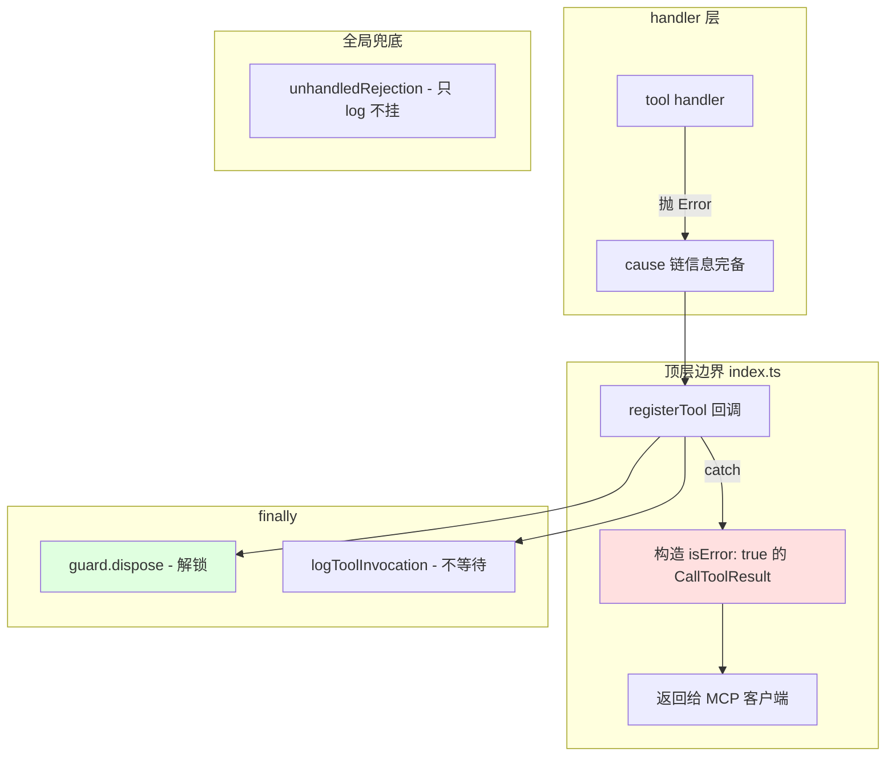

# 20 - 错误处理、自愈式报错与资源清理模式

> 关键源码：`src/index.ts`、`src/browser.ts`、`src/tools/input.ts`、`src/McpPage.ts`、`src/WaitForHelper.ts`

## 1. 三大原则

MCP Server 与 Agent 对话的错误处理哲学：

1. **Never crash**：异常绝不能让 stdio 传输断开，否则 Agent 对话中断；
2. **Actionable errors**：错误要告诉 Agent 下一步做什么；
3. **Resource safety**：资源泄漏（ElementHandle、Observer、Dialog listener）必须 100% 清理。

这三点对应设计原则里的 **Self-Healing Errors**。

## 2. 顶层错误边界

```194:275:src/index.ts
async (params): Promise<CallToolResult> => {
  const guard = await toolMutex.acquire();
  const startTime = Date.now();
  let success = false;
  try {
    ...
    await tool.handler(...);
    ...
    success = true;
    return result;
  } catch (err) {
    logger(`${tool.name} error:`, err, err?.stack);
    let errorText = err && 'message' in err ? err.message : String(err);
    if ('cause' in err && err.cause) {
      errorText += `\nCause: ${err.cause.message}`;
    }
    return {
      content: [{type: 'text', text: errorText}],
      isError: true,
    };
  } finally {
    void clearcutLogger?.logToolInvocation({...});
    guard.dispose();
  }
}
```

### 2.1 抓住一切

`catch (err)` 不带类型 —— 任何异常都进这里。handler 内部 throw 的 Error 不会渗透到 MCP 协议层。

### 2.2 `isError: true` 协议级标记

MCP 协议定义了这个字段，Agent 看到后知道"这次调用失败了"。返回正常的 `CallToolResult` 结构，**连接不断**。

### 2.3 Cause chain 展示

```253:256:src/index.ts
if ('cause' in err && err.cause) {
  errorText += `\nCause: ${err.cause.message}`;
}
```

JavaScript 的 `new Error('top', {cause: lower})` 链，展示根本原因。整个项目大量使用这个语法（见下）。

### 2.4 永远释放 Mutex

`guard.dispose()` 在 `finally`，绝不漏释放——避免死锁。

### 2.5 遥测 fire-and-forget

`void clearcutLogger?.logToolInvocation(...)` 无 await，log 失败也不影响返回。

## 3. 错误上下文注入：`cause` 链

```246:258:src/browser.ts
} catch (error) {
  if (userDataDir && error.message.includes('The browser is already running')) {
    throw new Error(
      `The browser is already running for ${userDataDir}. Use --isolated to run multiple browser instances.`,
      {cause: error},
    );
  }
  throw error;
}
```

- **包装 Puppeteer 的原始错误**为更友好的消息；
- **保留原始 error 作为 cause**，调试/日志里依然能看到底层堆栈；
- **给出具体操作建议**（"Use --isolated"）—— Agent 可以直接调整参数重试。

类似模式：

```345:355:src/McpPage.ts
async #resolveElementHandle(node, uid): Promise<ElementHandle<Element>> {
  const message = `Element with uid ${uid} no longer exists on the page.`;
  try {
    const handle = await node.elementHandle();
    if (!handle) throw new Error(message);
    return handle;
  } catch (error) {
    throw new Error(message, {cause: error});
  }
}
```

```37:42:src/tools/input.ts
function handleActionError(error: unknown, uid: string) {
  logger('failed to act using a locator', error);
  throw new Error(
    `Failed to interact with the element with uid ${uid}. The element did not become interactive within the configured timeout.`,
    {cause: error},
  );
}
```

## 4. 自愈式错误示例

### 4.1 指向修复工具

```328:332:src/McpPage.ts
async getElementByUid(uid: string): Promise<ElementHandle<Element>> {
  if (!this.textSnapshot) {
    throw new Error(`No snapshot found for page ${this.id ?? '?'}. Use ${takeSnapshot.name} to capture one.`);
  }
  ...
}
```

Agent 第一次调用 `click` 前没拍 snapshot → 错误消息**直接说**"Use `take_snapshot` to capture one"。Agent 读消息后自动调 take_snapshot 再 click。

### 4.2 Dialog 引导

```747:761:src/McpResponse.ts
const dialog = this.#page?.getDialog();
if (dialog) {
  response.push(`# Open dialog
${dialog.type()}: ${dialog.message()}${defaultValueIfNeeded}.
Call ${handleDialog.name} to handle it before continuing.`);
  ...
}
```

任何工具返回时，如果检测到未处理的 dialog，主动提示调 `handle_dialog`。

### 4.3 参数范围修正

```42:50:src/bin/chrome-devtools-mcp-cli-options.ts
wsEndpoint: {
  coerce: (url) => {
    try {
      const parsed = new URL(url);
      if (parsed.protocol !== 'ws:' && parsed.protocol !== 'wss:') {
        throw new Error(`Provided wsEndpoint ${url} must use ws:// or wss:// protocol.`);
      }
      ...
    }
  },
},
```

错误消息里**包含用户输入的值**——不是泛泛说"invalid URL"。

### 4.4 Close Page 特殊处理

```231:241:src/McpContext.ts
async closePage(pageId: number): Promise<void> {
  if (this.#pages.length === 1) {
    throw new Error(CLOSE_PAGE_ERROR);
  }
  ...
}
```

```342:343:src/tools/ToolDefinition.ts
export const CLOSE_PAGE_ERROR =
  'The last open page cannot be closed. It is fine to keep it open.';
```

```137:150:src/tools/pages.ts
handler: async (request, response, context) => {
  try {
    await context.closePage(request.params.pageId);
  } catch (err) {
    if (err.message === CLOSE_PAGE_ERROR) {
      response.appendResponseLine(err.message);
    } else {
      throw err;
    }
  }
  ...
}
```

**导出常量字符串**比较错误类型 → **转为非错误文本提示**。关 page 关到"最后一个"是合理场景，不应该让 Agent 视为失败。

## 5. 资源清理的三种模式

### 5.1 try/finally + dispose

ElementHandle 必须手动释放：

```61:83:src/tools/input.ts
handler: async (request, response) => {
  const uid = request.params.uid;
  const handle = await request.page.getElementByUid(uid);
  try {
    await request.page.waitForEventsAfterAction(async () => {
      await handle.asLocator().click({...});
    });
    ...
  } catch (error) {
    handleActionError(error, uid);
  } finally {
    void handle.dispose();
  }
},
```

- `handle.dispose()` 释放 CDP 侧的 RemoteObject；
- `void` 表明不等 dispose 完成（非关键路径）；
- `finally` 保证无论成功失败都释放。

### 5.2 `Promise.allSettled` + dispose

脚本执行时有多个 args：

```117:120:src/tools/script.ts
} finally {
  void Promise.allSettled(args.map(arg => arg.dispose()));
}
```

**`Promise.allSettled`** 而非 `Promise.all`：一个 dispose 失败不影响其他。

### 5.3 AbortController 串联清理

WaitForHelper 里：

```159:178:src/WaitForHelper.ts
try {
  await action();
} catch (error) {
  this.#abortController.abort();  // 取消所有挂起的监听
  throw error;
}

try {
  await navigationFinished;
  await this.waitForStableDom();
} catch (error) {
  logger(error);
} finally {
  this.#abortController.abort();
}
```

一个 `AbortController` 串联多个异步任务（navigation wait + DOM observer + 页面侧 observer）。action 抛错 → abort 一次 → 所有挂起的等待都终止，observer 被 disconnect。

## 6. 事件监听的对称注销

```59:69:src/McpPage.ts
constructor(page: Page, id: number) {
  this.pptrPage = page;
  this.id = id;
  this.#dialogHandler = (dialog: Dialog): void => {
    this.#dialog = dialog;
  };
  page.on('dialog', this.#dialogHandler);
}

dispose(): void {
  this.pptrPage.off('dialog', this.#dialogHandler);
}
```

**保存 handler 引用** + `dispose()` 里精确 off。匿名函数 `page.on('dialog', () => ...)` **无法注销**——这是 Node 事件监听的经典陷阱，项目全程避免。

类似的在 `ConsoleCollector.PageEventSubscriber`（`src/PageCollector.ts` 283-295）：

```283:295:src/PageCollector.ts
unsubscribe() {
  this.#seenKeys.clear();
  this.#seenIssues.clear();
  this.#page.off('framenavigated', this.#onFrameNavigated);
  this.#page.off('issue', this.#onIssueAdded);
  this.#session.off('Runtime.exceptionThrown', this.#onExceptionThrown);
  if (this.#issueAggregator) {
    this.#issueAggregator.removeEventListener(...);
  }
}
```

## 7. 清理中的 try/catch 包装

```62:73:src/WaitForHelper.ts
this.#abortController.signal.addEventListener('abort', async () => {
  try {
    await stableDomObserver.evaluate(observer => {
      observer.observer.disconnect();
      observer.resolver.resolve();
    });
    await stableDomObserver.dispose();
  } catch {
    // Ignored cleanup errors
  }
});
```

**清理代码里独立 try/catch**：因为清理时另一个错误可能已经发生（比如 page 已关闭导致 evaluate 失败），不能让 cleanup 再抛出盖过原始错误。

这是教科书级别的写法——**error in error handler 是调试噩梦**。

## 8. 文件操作的 swallow

```62:72:src/utils/check-for-updates.ts
try {
  const parentDir = path.dirname(cachePath);
  await fs.mkdir(parentDir, {recursive: true});
  const nowTime = new Date();
  if (stats) {
    await fs.utimes(cachePath, nowTime, nowTime);
  } else {
    await fs.writeFile(cachePath, JSON.stringify({version: VERSION}));
  }
} catch {
  // Ignore errors.
}
```

对于"锦上添花"的功能（版本检查缓存），**任何文件 IO 错误都吞掉**。主流程不受影响。

## 9. unhandledRejection 兜底

```37:41:src/bin/chrome-devtools-mcp-main.ts
if (process.env['CHROME_DEVTOOLS_MCP_CRASH_ON_UNCAUGHT'] !== 'true') {
  process.on('unhandledRejection', (reason, promise) => {
    logger('Unhandled promise rejection', promise, reason);
  });
}
```

**双保险**：即使某个 `void somePromise()` 被漏处理导致 UnhandledRejection，进程只 log 不退出。**但**允许用环境变量切换（测试/排查时让进程真的崩）。

## 10. Close 行为统一

```239:241:src/McpContext.ts
await page.pptrPage.close({runBeforeUnload: false});
```

`runBeforeUnload: false` 避免关页面时弹"你确定要离开吗"这种 dialog 挂住。

```256:261:src/daemon/client.ts
const transport = new PipeTransport(socket, socket);
transport.onmessage = async (message: string) => {
  clearTimeout(timer);
  resolve(JSON.parse(message));
};
socket.on('error', error => { ... });
socket.on('close', () => { ... reject(new Error('Socket closed')); });
```

Socket 既要响应消息，又要处理关闭（包括远端主动 close）—— 两种情况都 resolve/reject 掉 Promise，不会挂住。

## 11. 错误处理层级图



## 12. 错误消息设计的检查清单

项目中每个错误消息都符合：

- ✅ 具体（包含相关参数值、对象名）；
- ✅ 操作导向（"Use X to fix"）；
- ✅ 不泄露内部实现（不暴露栈到最终用户）；
- ✅ cause 链保留底层信息（debug log 里可见）；
- ✅ i18n-ready（没有硬编码字符串模板）。

**反例（避免的）**：

- ❌ "Error occurred"（无信息）
- ❌ "TypeError: Cannot read property 'x' of undefined"（暴露内部代码）
- ❌ "Please contact admin"（没法 Agent 自愈）

## 13. 可迁移经验

| 经验 | 说明 |
| --- | --- |
| 顶层 try/catch 转 isError | MCP / JSON-RPC 协议层的必须 |
| `Error(..., {cause})` 包装 | 保留原始错误链，用户看友好消息 |
| 错误消息指向修复工具 | 自愈式设计的核心 |
| 命名 handler + 对称 off | 避免匿名函数无法注销 |
| `finally` 里 dispose | 100% 资源释放 |
| AbortController 串联 | 多个异步任务的统一取消 |
| 清理代码独立 try/catch | 不让错误处理再出错 |
| `unhandledRejection` 兜底 | 防止孤立 promise 炸进程 |
| 锦上添花的 IO 全吞 | 不关键路径不可失败 |

## 14. 延伸阅读

- Mutex 在错误处理里的位置 → [03-mutex-serialization.md](./03-mutex-serialization.md)
- WaitForHelper 的 AbortController 用法 → [06-wait-for-helper.md](./06-wait-for-helper.md)
- Response 层的 Dialog 自愈提示 → [08-mcp-response-builder.md](./08-mcp-response-builder.md)

---

**至此 20 篇文档全部完成**。建议按照本系列的阅读路径建议，从 01-mcp-server-architecture 开始，按兴趣分支深入各子系统。每一篇都尽量独立成章，又互相引用，形成一个立体的技术地图。
