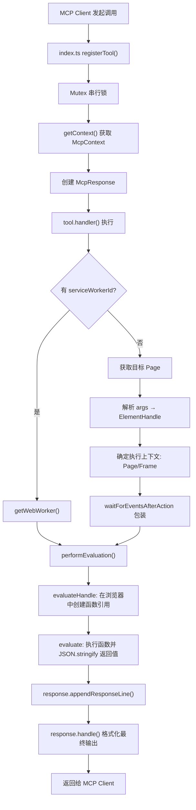
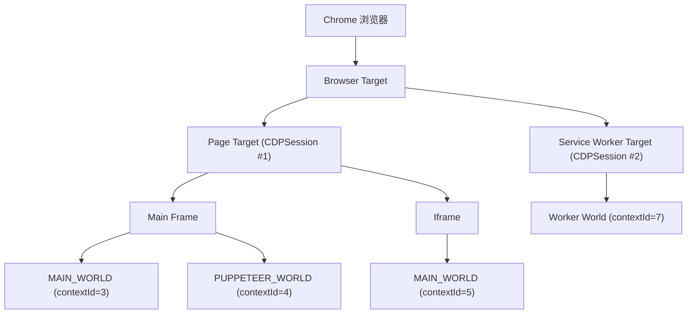

# evaluate_script_file 方案调研与设计

## 一、现有 evaluate_script 实现分析

### 1.1 架构总览



### 1.2 核心文件

| 文件 | 作用 |
|------|------|
| `src/tools/script.ts` | **核心实现** — 定义 `evaluateScript` 工具 |
| `src/tools/ToolDefinition.ts` | 工具定义框架 — `defineTool`、类型定义 |
| `src/tools/tools.ts` | 工具注册汇总 |
| `src/index.ts` | MCP 服务入口 — `registerTool` 注册到 MCP Server |
| `src/McpPage.ts` | 页面抽象 — `waitForEventsAfterAction`、`getElementByUid` |
| `src/WaitForHelper.ts` | 等待辅助 — 导航等待、DOM 稳定等待、对话框处理 |
| `src/McpResponse.ts` | 响应格式化 |
| `tests/tools/script.test.ts` | 测试文件 |

### 1.3 工具定义方式 — 工厂函数

`evaluateScript` 使用 `defineTool` 的**工厂函数**形式（接受 `cliArgs` 参数），这使它能根据启动参数动态调整 schema：

```typescript
export const evaluateScript = defineTool(cliArgs => {
  return {
    name: 'evaluate_script',
    schema: {
      function: zod.string(),                         // 必填：函数表达式字符串
      args: zod.array(zod.string()).optional(),        // 可选：元素 UID 数组
      dialogAction: zod.string().optional(),           // 可选：对话框处理
      // 条件性 schema
      ...(cliArgs?.experimentalPageIdRouting ? pageIdSchema : {}),
      ...(cliArgs?.categoryExtensions ? { serviceWorkerId: ... } : {}),
    },
    handler: async (request, response, context) => { ... },
  };
});
```

与 `take_screenshot` 等使用 `definePageTool` 的工具不同——`evaluate_script` **不是** `pageScoped`，因此它自行管理页面获取逻辑，以便支持 Service Worker 这种非页面的执行目标。

### 1.4 参数 Schema

| 参数 | 类型 | 必须 | 描述 |
|------|------|------|------|
| `function` | `string` | 是 | JS 函数声明字符串，如 `() => document.title` |
| `args` | `string[]` | 否 | 元素 UID 数组（来自页面快照），传给函数作为 `ElementHandle` 参数 |
| `dialogAction` | `string` | 否 | 对话框处理：`"accept"` / `"dismiss"` / 自定义字符串（用于 prompt） |
| `pageId` | `number` | 否 | 仅当 `experimentalPageIdRouting` 启用时出现 |
| `serviceWorkerId` | `string` | 否 | 仅当 `categoryExtensions` 启用时出现 |

### 1.5 Handler 的两条路径

**路径 A：Service Worker 模式**（`serviceWorkerId` 存在时）

```
serviceWorkerId → getWebWorker() → performEvaluation(worker, fnString, [], response)
```

**路径 B：普通页面模式**（默认）

```
获取 McpPage → 将 args UID 解析为 ElementHandle → 确定 Frame → performEvaluation(pageOrFrame, fnString, args, response)
```

两条路径最终都调用 `performEvaluation()`，区别在于 CDP 消息发到哪个 Target Session。

| 维度 | 路径 A (Service Worker) | 路径 B (普通页面) |
|------|------------------------|------------------|
| 执行目标 | `WebWorker` 实例 | `Page` 或 `Frame` 实例 |
| 底层 CDP Session | Worker 的独立 CDPSession | 页面的 CDPSession |
| 全局对象 | `self` (WorkerGlobalScope) | `window` / `document` |
| 能否传 DOM 元素 | 不能（Worker 无 DOM） | 能（通过 UID → ElementHandle） |
| Frame 选择 | 无 Frame 概念 | 可根据元素所在 Frame 切换执行上下文 |

### 1.6 核心评估逻辑 — performEvaluation()

```typescript
const performEvaluation = async (evaluatable, fnString, args, response) => {
  // 步骤 1: 将函数字符串转为浏览器端的远程对象句柄
  const fn = await evaluatable.evaluateHandle(`(${fnString})`);
  try {
    // 步骤 2: 在浏览器上下文中执行函数并序列化返回值
    const result = await evaluatable.evaluate(
      async (fn, ...args) => JSON.stringify(await fn(...args)),
      fn, ...args,
    );
    // 步骤 3: 格式化输出
    response.appendResponseLine('Script ran on page and returned:');
    response.appendResponseLine('```json');
    response.appendResponseLine(`${result}`);
    response.appendResponseLine('```');
  } finally {
    void fn.dispose();
  }
};
```

**当前实现严格要求传入的是函数表达式**，不支持经典脚本，也不支持任意表达式。原因：`(${fnString})` 包裹后求值必须得到一个函数对象，否则下一步 `fn(...args)` 会报错。

### 1.7 错误处理（多层级）

| 层级 | 处理 |
|------|------|
| 参数验证 | `args` + `serviceWorkerId` 互斥、`pageId` + `serviceWorkerId` 互斥、跨 Frame 检查 |
| UID 解析 | 无快照报错、UID 找不到报错、元素已销毁报错 |
| 执行层 | 函数句柄在 `finally` 中 `dispose()`，args 的 JSHandle 用 `Promise.allSettled` 清理 |
| 服务层 (`index.ts`) | 整个 handler 被 `try/catch` 包裹，异常转为 `{isError: true}` 返回 |

### 1.8 WaitForHelper — 对话框和导航包装

`waitForEventsAfterAction` 在执行评估前后提供智能包装：

- **对话框处理**：根据 `dialogAction` 自动 accept/dismiss/填写 prompt
- **导航检测**：通过 CDP `Page.frameStartedNavigating` 事件
- **DOM 稳定**：MutationObserver 监听，100ms 无变化视为稳定，3s 超时

### 1.9 现有限制

1. **返回值必须 JSON 可序列化** — DOM 节点、函数、循环引用、`undefined`、`BigInt` 无法直接返回
2. **函数必须是声明式** — 被包裹为 `(${fnString})` 求值，必须是函数表达式
3. **args 只能是元素 UID** — 不支持传入任意 JS 值
4. **跨 Frame 限制** — 多个 args 元素必须在同一 Frame 内
5. **Service Worker 模式不支持元素参数** — SW 无 DOM
6. **所有 MCP 工具串行执行** — 通过 Mutex 保证

---

## 二、底层原理：JS 代码如何发送给浏览器执行

### 2.1 物理通信层 — WebSocket

```
Node.js 进程  ←——WebSocket——→  Chrome 浏览器进程
```

所有 CDP 命令都是 JSON 消息，通过 WebSocket 双向传输。

### 2.2 CDP 协议层 — 两个核心方法

#### Runtime.evaluate — 求值表达式字符串

```json
{
  "method": "Runtime.evaluate",
  "params": {
    "expression": "(() => document.title)",
    "contextId": 3,
    "returnByValue": true,
    "awaitPromise": true,
    "userGesture": true
  }
}
```

V8 内部等价于 `eval("(() => document.title)")`。

#### Runtime.callFunctionOn — 调用函数并传参

```json
{
  "method": "Runtime.callFunctionOn",
  "params": {
    "functionDeclaration": "async (fn, ...args) => JSON.stringify(await fn(...args))",
    "executionContextId": 3,
    "arguments": [
      { "objectId": "fn-ref-123" },
      { "objectId": "elem-456" }
    ],
    "returnByValue": true,
    "awaitPromise": true
  }
}
```

V8 通过 `objectId` 在堆中找到对应对象，然后调用函数。

### 2.3 Puppeteer 抽象层 — ExecutionContext

Puppeteer 的 `ExecutionContext.#evaluate()` 是核心分发点：

- 传入**字符串** → 使用 `Runtime.evaluate`
- 传入**函数** → `stringifyFunction()` 序列化 + `convertArgument()` 处理参数 → 使用 `Runtime.callFunctionOn`
- `evaluate` vs `evaluateHandle` 的**唯一区别**是 `returnByValue` 参数（`true` vs `false`），不是选择不同的 CDP 方法

### 2.4 参数跨进程传递

`convertArgument()` 将 Node.js 端的参数转为 CDP 格式：

| 参数类型 | CDP 表示 |
|---------|---------|
| 普通值 (number/string/boolean) | `{ value: 42 }` |
| BigInt | `{ unserializableValue: "42n" }` |
| -0, NaN, Infinity | `{ unserializableValue: "-0" }` |
| JSHandle / ElementHandle | `{ objectId: "node-xxx-yyy" }` |

**ElementHandle 跨进程原理**：之前某次 CDP 调用返回了 `RemoteObject` 包含 `objectId`，这个 ID 是 V8 堆中对象的引用标识符。传递时只传 objectId，Chrome 端自动解引用为实际的 DOM Element。

### 2.5 evaluate_script 的完整 CDP 调用链

```
用户字符串 "() => document.title"
    │
    ▼ [evaluate_script handler]
包裹为 "(()  => document.title)"
    │
    ▼ [Puppeteer evaluateHandle — 传入字符串]
CDP: Runtime.evaluate { expression: "(()=>document.title)", returnByValue: false }
    │
    ▼ [WebSocket → Chrome V8]
V8 解析并求值表达式，返回函数对象引用
    │
    ▼ [Chrome → Puppeteer]
RemoteObject { objectId: "fn-ref-123" } → 包装为 JSHandle
    │
    ▼ [Puppeteer evaluate — 传入函数 + JSHandle 参数]
CDP: Runtime.callFunctionOn {
  functionDeclaration: "async(fn,...args)=>JSON.stringify(await fn(...args))",
  arguments: [{ objectId: "fn-ref-123" }, { objectId: "elem-456" }]
}
    │
    ▼ [WebSocket → Chrome V8]
V8 通过 objectId 解引用，执行函数，JSON.stringify 序列化结果
    │
    ▼ [Chrome → Puppeteer → evaluate_script]
返回字符串值 → 格式化为 MCP 响应
```

### 2.6 执行上下文如何确定



每个 Frame/Worker 创建时，Chrome 通过 `Runtime.executionContextCreated` 事件通知 Puppeteer 新的 `contextId`。之后所有 CDP 调用都带上这个 `contextId`，Chrome 就知道在哪个 V8 隔离区中执行代码。

---

## 三、三种 JS 代码格式在 Chrome 中的区别

### 3.1 裸函数表达式

```javascript
(el) => {
  return el.innerText;
}
```

- V8 通过 `Runtime.evaluate("((el) => { return el.innerText; })")` 求值得到一个**函数对象**
- 可以用 `Runtime.callFunctionOn` 传 `objectId` 参数调用
- 有明确返回值，支持 args ✅

### 3.2 Classic Script（经典脚本）

```javascript
const items = document.querySelectorAll('.item');
Array.from(items).map(el => el.textContent);
```

- V8 通过 `Runtime.evaluate(...)` 逐行执行语句
- 返回最后一个表达式的值
- **无法传参**（没有形参列表）❌
- 不能被 `()` 包裹（`const` 声明在括号内是语法错误）

### 3.3 ESM（ES Module）

```javascript
export default function(el) {
  return el.innerText;
}
```

- `Runtime.evaluate` **无法执行** ❌
- `export` 是 Module 语法，不是 Script 语法，V8 按 Script 模式解析会报 `SyntaxError`
- 必须通过 `<script type="module">` 或动态 `import()` 加载，但这是异步的，无法同步返回值

### 3.4 对比总结

| | 裸函数 | Classic Script | ESM |
|---|---|---|---|
| CDP 执行方式 | `Runtime.evaluate` + `callFunctionOn` | `Runtime.evaluate` | 无法直接执行 |
| 能否传参 | ✅ | ❌ | N/A |
| 返回值 | `return` 语句 | 最后一个表达式的值 | N/A |
| 能否传 ElementHandle | ✅ | ❌ | N/A |
| 当前 evaluate_script 支持 | ✅ | ❌ | ❌ |

---

## 四、Feature Request 背景

### 4.1 问题描述

使用 `evaluate_script` 时，整个 JS 代码必须作为字符串参数传递，存在以下问题：

1. **大脚本**：数百行的脚本需要完整传递，效率低且在 AI Agent 场景下可能超 token 限制
2. **特殊字符**：含模板字符串、正则、转义字符的脚本在字符串参数传递中容易损坏
3. **脚本复用**：同一脚本需多次执行时必须每次重新发送
4. **开发流程**：开发者通常有预写的 JS 文件想注入页面，当前必须手动复制内容

### 4.2 维护者反馈

**OrKoN**（维护者）：
> "I think if we execute a script from file we should not require it to be a function. Instead, it should support a classic or an ESM module (probably configurable)."

核心顾虑：**文件和函数是两种不同的心智模型**。文件天然是模块或脚本，不应强迫套函数壳子。

**natorion**（维护者）：
> "I think we can settle on one format that we want to have. This would also be useful for use in our skills I think."

核心顾虑：
1. **不要两种格式并存**——选定一种标准
2. **Skills 复用**——Skills 可以附带预写的 JS 文件

---

## 五、最终设计方案

### 5.1 新增工具 `evaluate_script_file`

**不扩展现有 `evaluate_script`，而是新增独立工具。**

理由：
- 维护者 OrKoN 认为文件执行和行内执行是不同的语义
- `evaluate_script` 的 `function` 参数当前是 required，改为 optional + 互斥会增加 schema 复杂度
- 项目已有类似先例（`take_screenshot` 和 `take_snapshot` 是独立工具）
- 新工具的 description 可以更清晰，AI Agent 选工具时更精准

### 5.2 支持两种模式：function 和 script

- **function 模式**（默认）：文件内容是函数表达式，支持 args，复用 `performEvaluation` 逻辑
- **script 模式**：文件内容是经典脚本，不支持 args，通过 `Runtime.evaluate` 直接执行，返回最后一个表达式的值
- **不支持 ESM**：`Runtime.evaluate` 无法直接执行 ESM 语法

### 5.3 通过 mode 参数显式声明格式

**不使用 AST 自动检测**（引入 Babel 成本过高，简单正则有误判风险），而是让用户通过 `mode` 参数显式声明。

### 5.4 Schema 设计

```typescript
export const evaluateScriptFile = defineTool(cliArgs => {
  return {
    name: 'evaluate_script_file',
    description: 'Evaluate a JavaScript file inside the currently selected page. ' +
      'In "function" mode, the file should contain a function expression — supports args. ' +
      'In "script" mode, the file contains classic JavaScript statements — returns last expression value.',
    annotations: {
      category: ToolCategory.DEBUGGING,
      readOnlyHint: false,
    },
    schema: {
      filePath: zod.string().describe(
        'Absolute path to a JavaScript file to evaluate.'
      ),
      mode: zod.enum(['function', 'script']).default('function').describe(
        '"function": file contains a function expression like `(el) => el.innerText` — supports args. ' +
        '"script": file contains classic JavaScript statements — returns last expression value, no args support.'
      ),
      args: zod.array(zod.string()).optional().describe(
        'Element UIDs from snapshot, only supported when mode is "function".'
      ),
      dialogAction: zod.string().optional().describe(
        'Handle dialogs: "accept", "dismiss", or string for prompt response. Defaults to accept.'
      ),
      ...(cliArgs?.experimentalPageIdRouting ? pageIdSchema : {}),
      ...(cliArgs?.categoryExtensions ? {
        serviceWorkerId: zod.string().optional().describe(
          'Service worker ID to evaluate in. Only supported in "function" mode.'
        ),
      } : {}),
    },
    handler: async (request, response, context) => { ... },
  };
});
```

### 5.5 Handler 核心逻辑

```typescript
handler: async (request, response, context) => {
  const { filePath, mode, args: uidArgs, dialogAction, serviceWorkerId, pageId } = request.params;

  // 1. 读取文件
  const content = await fs.readFile(filePath, 'utf-8');
  const trimmedContent = content.trim();

  if (!trimmedContent) {
    throw new Error(`File is empty: ${filePath}`);
  }

  // 2. mode = "function"：复用现有 performEvaluation 逻辑
  if (mode === 'function') {
    // 和现有 evaluate_script 的 handler 逻辑一致
    // 支持 serviceWorkerId、args、dialogAction 等全部功能
    // ...（Service Worker 路径、页面路径、Frame 检测、args 解析等）
    await performEvaluation(evaluatable, trimmedContent, args, response);
  }

  // 3. mode = "script"：直接 Runtime.evaluate
  if (mode === 'script') {
    if (uidArgs?.length) {
      throw new Error('args are not supported in script mode.');
    }
    if (serviceWorkerId) {
      throw new Error('serviceWorkerId is not supported in script mode.');
    }

    const mcpPage = context.getSelectedMcpPage();
    await mcpPage.waitForEventsAfterAction(
      async () => {
        const result = await mcpPage.pptrPage.evaluate(trimmedContent);
        response.appendResponseLine('Script ran on page and returned:');
        response.appendResponseLine('```json');
        response.appendResponseLine(JSON.stringify(result));
        response.appendResponseLine('```');
      },
      { handleDialog: dialogAction ?? 'accept' },
    );
  }
}
```

### 5.6 使用示例

#### function 模式（默认）

文件 `/path/to/get-text.js`：
```javascript
(el) => {
  return el.innerText;
}
```

调用：
```json
{
  "filePath": "/path/to/get-text.js",
  "args": ["1_3"]
}
```

#### script 模式

文件 `/path/to/collect-data.js`：
```javascript
const items = document.querySelectorAll('.product');
const data = Array.from(items).map(el => ({
  name: el.querySelector('.name')?.textContent,
  price: el.querySelector('.price')?.textContent,
}));
data;
```

调用：
```json
{
  "filePath": "/path/to/collect-data.js",
  "mode": "script"
}
```

### 5.7 安全考虑

- 用 `path.resolve()` 规范化路径
- 验证文件存在且可读（`fs.readFile` 失败时抛出明确错误）
- 不限制路径范围（与 `screenshot` 的 `filePath` 参数保持一致）

---

## 六、待讨论的问题

1. **script 模式是否需要支持 Service Worker？** — 建议先不支持，Service Worker 通常执行的是模块化代码
2. **是否需要支持文件编码选择？** — 建议默认 UTF-8，覆盖绝大多数场景
3. **是否需要文件大小限制？** — 建议暂不限制，Chrome 的 `Runtime.evaluate` 对表达式大小没有硬性限制
4. **Skills 集成方式** — Skills 的 `.js` 文件可以直接通过 `filePath` 引用，建议和 natorion 确认 Skills 的文件路径约定
