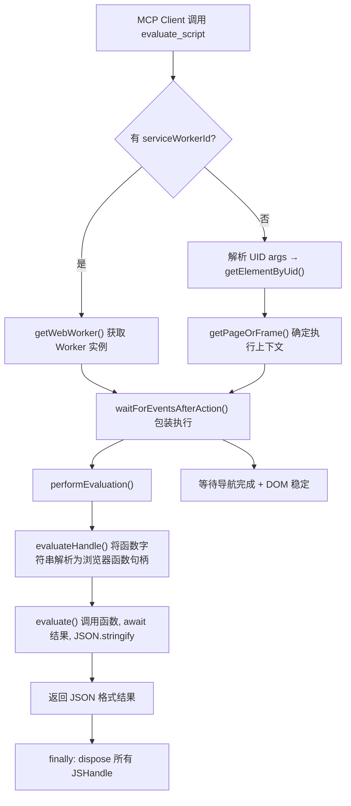
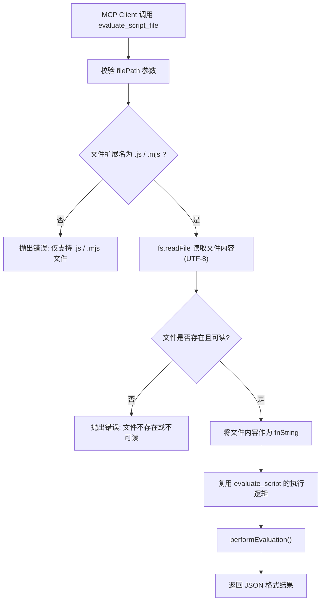

# evaluate_script_file 功能调研与实现方案

> 日期：2026-04-23
> 关联 Issue：[#1775](https://github.com/ChromeDevTools/chrome-devtools-mcp/issues/1775)
> 关联 PR：[#1772](https://github.com/ChromeDevTools/chrome-devtools-mcp/pull/1772)

---

## 一、现有 evaluate_script 实现分析

### 1.1 文件定位

| 用途 | 文件路径 |
|------|---------|
| 核心实现 | `src/tools/script.ts` |
| 工具注册 | `src/tools/tools.ts` |
| 工具定义框架 | `src/tools/ToolDefinition.ts` |
| 测试文件 | `tests/tools/script.test.ts` |
| 文档 | `docs/tool-reference.md` |
| CLI 定义（自动生成） | `src/bin/cliDefinitions.ts` |
| McpPage（元素解析 + 事件等待） | `src/McpPage.ts` |
| WaitForHelper（dialog 处理 + 导航等待） | `src/WaitForHelper.ts` |

### 1.2 输入参数

| 参数 | 类型 | 必填 | 描述 |
|------|------|------|------|
| `function` | `string` | **是** | 要在页面中执行的 JavaScript 函数声明（箭头函数字符串） |
| `args` | `string[]` | 否 | 可选的元素 UID 列表，作为函数参数传入 |
| `dialogAction` | `string` | 否 | 对话框处理方式：`"accept"` / `"dismiss"` / 自定义字符串 |
| `pageId` | `number` | 否 | 仅 `experimentalPageIdRouting` 启用时可用 |
| `serviceWorkerId` | `string` | 否 | 仅 `categoryExtensions` 启用时可用 |

### 1.3 核心执行流程



### 1.4 关键实现：`performEvaluation` 函数

```typescript
const performEvaluation = async (
  evaluatable: Evaluatable,  // Page | Frame | WebWorker
  fnString: string,
  args: Array<JSHandle<unknown>>,
  response: Response,
) => {
  // 1. 将函数字符串转为浏览器中的函数句柄（底层: CDP Runtime.evaluate）
  const fn = await evaluatable.evaluateHandle(`(${fnString})`);
  try {
    // 2. 调用函数并 JSON 序列化结果（底层: CDP Runtime.callFunctionOn）
    const result = await evaluatable.evaluate(
      async (fn, ...args) => {
        return JSON.stringify(await fn(...args));  // 支持 async 函数
      },
      fn,
      ...args,
    );
    // 3. 格式化输出
    response.appendResponseLine('Script ran on page and returned:');
    response.appendResponseLine('```json');
    response.appendResponseLine(`${result}`);
    response.appendResponseLine('```');
  } finally {
    void fn.dispose();
  }
};
```

**关键特性：**
- 通过 Puppeteer 的 `evaluateHandle` + `evaluate` 间接使用 CDP 协议
- `async (fn, ...args) => JSON.stringify(await fn(...args))` 天然支持异步函数
- 返回值必须是 JSON 可序列化的
- 通过 `finally` 确保 JSHandle 资源释放

### 1.5 错误处理机制

| 错误场景 | 处理方式 |
|---------|---------|
| Service Worker + args 不兼容 | 抛出 Error |
| Service Worker + pageId 互斥 | 抛出 Error |
| 跨 Frame 元素不兼容 | 抛出 Error |
| 快照不存在 | 提示使用 `take_snapshot` |
| 元素 UID 不存在 | 抛出 Error |
| JSHandle 泄漏 | `finally` 块 `dispose()` 所有句柄 |

---

## 二、Issue #1775 分析

### 2.1 需求背景

作者 [achideal](https://github.com/achideal) 提出，当前 `evaluate_script` 在以下场景中存在痛点：

1. **大型脚本**：数百行的脚本需要完整作为参数传递，在 AI Agent 场景中可能触及 token 限制
2. **特殊字符**：含模板字面量、正则表达式或转义字符的脚本在字符串编码过程中可能被破坏
3. **脚本复用**：同一脚本需在不同页面多次执行时，必须每次重新发送
4. **开发工作流**：开发者已有的本地 JS 文件需要手动复制粘贴

### 2.2 期望方案

新增 `evaluate_script_file` 工具：
- 接受 `filePath` 参数，指向本地 JavaScript 文件
- 从本地文件系统读取文件内容
- 在当前选中的页面内执行文件中定义的 JavaScript 函数
- 支持可选的 `args` 参数
- 以 JSON 格式返回结果

### 2.3 社区讨论

#### OrKoN（Collaborator）的反馈

- OrKoN 是 Puppeteer / Chrome DevTools 团队的核心成员
- 在 PR #1772 中，OrKoN 的唯一反馈是：**要求先提交 Feature Request（Issue）并详细说明使用场景**
- 表明项目团队对此功能持**开放但谨慎**的态度——需要先通过 feature request 流程验证需求的合理性
- 该 Issue 目前标签为 `collecting-feedback`，说明仍在收集社区意见

#### natorion 的情况

- 截至当前（2026-04-23），**natorion 尚未在 Issue #1775 或 PR #1772 中参与任何讨论**
- 在项目的 commits 历史中也未找到 natorion 的直接贡献记录

#### achideal（PR 作者）的实现

- 已在 PR #1772 中提交了初步实现
- 实现使用 `fs.readFileSync`（UTF-8 编码）读取 JavaScript 文件
- 支持与 `evaluate_script` 相同的 `args` 参数
- PR 目前处于早期阶段，尚未通过 CLA 签署和代码审查

---

## 三、evaluate_script_file 完整实现方案

### 3.1 设计原则

1. **最大化复用现有代码**：复用 `performEvaluation`、`getPageOrFrame`、`getWebWorker` 等现有函数
2. **一致的用户体验**：参数命名、返回格式与 `evaluate_script` 保持一致
3. **安全优先**：严格校验文件路径、文件扩展名、文件大小
4. **异步文件操作**：使用 `fs/promises` 而非同步 API

### 3.2 参数设计

| 参数 | 类型 | 必填 | 描述 |
|------|------|------|------|
| `filePath` | `string` | **是** | JavaScript 文件的绝对路径或相对路径 |
| `args` | `string[]` | 否 | 可选的元素 UID 列表 |
| `dialogAction` | `string` | 否 | 对话框处理方式 |
| `pageId` | `number` | 否 | 仅 `experimentalPageIdRouting` 启用时 |
| `serviceWorkerId` | `string` | 否 | 仅 `categoryExtensions` 启用时 |

### 3.3 实现架构



### 3.4 核心代码实现

在 `src/tools/script.ts` 中，紧邻 `evaluateScript` 导出新的 `evaluateScriptFile`：

```typescript
import fs from 'node:fs/promises';
import path from 'node:path';

const ALLOWED_EXTENSIONS = new Set(['.js', '.mjs']);
const MAX_FILE_SIZE = 1024 * 1024; // 1MB 限制

export const evaluateScriptFile = defineTool(cliArgs => {
  return {
    name: 'evaluate_script_file',
    description: `Read a JavaScript file from the local filesystem and evaluate it inside the currently selected page${cliArgs?.categoryExtensions ? ' or service worker' : ''}.

The file should contain a JavaScript function declaration (e.g., an arrow function or function expression).
Returns the response as JSON, so returned values have to be JSON-serializable.

This is useful for evaluating large scripts without needing to pass the entire script content as a parameter.`,
    annotations: {
      category: ToolCategory.DEBUGGING,
      readOnlyHint: false,
    },
    schema: {
      filePath: zod.string().describe(
        `The absolute path to a JavaScript file containing a function declaration to be executed in the currently selected page.

The file content should be a JavaScript function declaration, for example:
\`() => { return document.title; }\` or \`async () => { return await fetch("example.com"); }\`

Example with arguments: \`(el) => { return el.innerText; }\``,
      ),
      args: zod
        .array(
          zod
            .string()
            .describe(
              'The uid of an element on the page from the page content snapshot',
            ),
        )
        .optional()
        .describe('An optional list of arguments to pass to the function.'),
      dialogAction: zod
        .string()
        .optional()
        .describe(
          'Handle dialogs while execution. "accept", "dismiss", or string for response of window.prompt. Defaults to accept.',
        ),
      ...(cliArgs?.experimentalPageIdRouting ? pageIdSchema : {}),
      ...(cliArgs?.categoryExtensions
        ? {
            serviceWorkerId: zod
              .string()
              .optional()
              .describe(
                `The optional service worker id to evaluate the script in.`,
              ),
          }
        : {}),
    },
    handler: async (request, response, context) => {
      const {
        serviceWorkerId,
        args: uidArgs,
        filePath: rawFilePath,
        pageId,
        dialogAction,
      } = request.params;

      // 1. 校验并读取文件
      const fnString = await readScriptFile(rawFilePath);

      // 2. 以下逻辑与 evaluate_script 完全一致
      if (cliArgs?.categoryExtensions && serviceWorkerId) {
        if (uidArgs && uidArgs.length > 0) {
          throw new Error(
            'args (element uids) cannot be used when evaluating in a service worker.',
          );
        }
        if (pageId) {
          throw new Error('specify either a pageId or a serviceWorkerId.');
        }
        const worker = await getWebWorker(context, serviceWorkerId);
        await context.getSelectedMcpPage().waitForEventsAfterAction(
          async () => {
            await performEvaluation(worker, fnString, [], response);
          },
          {handleDialog: dialogAction ?? 'accept'},
        );
        return;
      }

      const mcpPage = cliArgs?.experimentalPageIdRouting
        ? context.getPageById(request.params.pageId)
        : context.getSelectedMcpPage();
      const page = mcpPage.pptrPage;

      const args: Array<JSHandle<unknown>> = [];
      try {
        const frames = new Set<Frame>();
        for (const uid of uidArgs ?? []) {
          const handle = await mcpPage.getElementByUid(uid);
          frames.add(handle.frame);
          args.push(handle);
        }
        const evaluatable = await getPageOrFrame(page, frames);
        await mcpPage.waitForEventsAfterAction(
          async () => {
            await performEvaluation(evaluatable, fnString, args, response);
          },
          {handleDialog: dialogAction ?? 'accept'},
        );
      } finally {
        void Promise.allSettled(args.map(arg => arg.dispose()));
      }
    },
  };
});

/**
 * 读取并校验脚本文件
 */
async function readScriptFile(filePath: string): Promise<string> {
  const resolvedPath = path.resolve(filePath);
  const ext = path.extname(resolvedPath).toLowerCase();

  // 校验文件扩展名
  if (!ALLOWED_EXTENSIONS.has(ext)) {
    throw new Error(
      `Unsupported file extension "${ext}". Only .js and .mjs files are allowed.`,
    );
  }

  // 校验文件存在性和大小
  let stats;
  try {
    stats = await fs.stat(resolvedPath);
  } catch {
    throw new Error(`File not found or not accessible: ${resolvedPath}`);
  }

  if (!stats.isFile()) {
    throw new Error(`Path is not a file: ${resolvedPath}`);
  }

  if (stats.size > MAX_FILE_SIZE) {
    throw new Error(
      `File size (${stats.size} bytes) exceeds the maximum allowed size (${MAX_FILE_SIZE} bytes).`,
    );
  }

  // 读取文件内容
  const content = await fs.readFile(resolvedPath, 'utf-8');
  const trimmed = content.trim();

  if (trimmed.length === 0) {
    throw new Error(`File is empty: ${resolvedPath}`);
  }

  return trimmed;
}
```

### 3.5 工具注册

在 `src/tools/tools.ts` 中无需额外修改——因为新的 `evaluateScriptFile` 导出在同一个 `script.ts` 模块中，`scriptTools` 的 `Object.values()` 会自动将其收集到工具列表。

### 3.6 测试方案

在 `tests/tools/script.test.ts` 中新增测试：

```typescript
describe('evaluate_script_file', () => {
  it('evaluates a script from file', async () => {
    // 创建临时 JS 文件
    const tmpFile = path.join(os.tmpdir(), 'test-script.js');
    fs.writeFileSync(tmpFile, '() => 2 * 5');
    try {
      await withMcpContext(async (response, context) => {
        await evaluateScriptFile().handler(
          { params: { filePath: tmpFile } },
          response, context,
        );
        const lineEvaluation = response.responseLines.at(2)!;
        assert.strictEqual(JSON.parse(lineEvaluation), 10);
      });
    } finally {
      fs.unlinkSync(tmpFile);
    }
  });

  it('evaluates async functions from file', async () => { /* ... */ });

  it('supports args with file', async () => { /* ... */ });

  it('throws for non-existent file', async () => {
    await withMcpContext(async (response, context) => {
      await assert.rejects(
        evaluateScriptFile().handler(
          { params: { filePath: '/nonexistent/path.js' } },
          response, context,
        ),
        { message: /File not found/ },
      );
    });
  });

  it('throws for unsupported file extension', async () => {
    // 测试 .txt 等非法扩展名
  });

  it('throws for empty file', async () => { /* ... */ });

  it('throws for file exceeding size limit', async () => { /* ... */ });
});
```

### 3.7 安全考虑

| 安全措施 | 说明 |
|---------|------|
| 文件扩展名白名单 | 仅允许 `.js` 和 `.mjs`，防止读取敏感文件 |
| 文件大小限制 | 最大 1MB，防止内存溢出 |
| 路径解析 | 使用 `path.resolve()` 转为绝对路径，行为可预测 |
| 异步文件操作 | 使用 `fs/promises` 不阻塞事件循环 |
| 文件存在性检查 | 在读取前先 `stat()` 验证 |

> **注意**：当前 `evaluate_script` 本身已允许在页面中执行任意 JavaScript，因此 `evaluate_script_file` 不会引入额外的安全风险——它只是改变了脚本的来源（从参数字符串变为本地文件）。MCP Server 本身运行在用户本地机器上，具有文件系统访问权限。

### 3.8 需要修改的文件清单

| 文件 | 变更类型 | 说明 |
|------|---------|------|
| `src/tools/script.ts` | **修改** | 新增 `evaluateScriptFile` 导出和 `readScriptFile` 辅助函数 |
| `tests/tools/script.test.ts` | **修改** | 新增测试用例 |
| `docs/tool-reference.md` | **自动生成** | 运行 `npm run gen` 自动更新 |
| `src/bin/cliDefinitions.ts` | **自动生成** | 运行 `npm run cli:generate` 自动更新 |
| `README.md` | **修改** | 更新 Debugging 工具数量 |

### 3.9 与 achideal PR #1772 实现的差异

| 对比项 | PR #1772 | 本方案 |
|--------|----------|--------|
| 文件读取 | `fs.readFileSync`（同步） | `fs.readFile`（异步），不阻塞事件循环 |
| 文件校验 | 基础存在性检查 | 扩展名白名单 + 大小限制 + 类型检查 |
| 代码复用 | 部分复制 `evaluate_script` 逻辑 | 完全复用 `performEvaluation` 等现有函数 |
| Service Worker 支持 | 未明确 | 与 `evaluate_script` 完全一致 |
| `dialogAction` 支持 | 未明确 | 与 `evaluate_script` 完全一致 |

---

## 四、总结

`evaluate_script_file` 是 `evaluate_script` 的自然扩展，核心价值在于：

1. **减少 token 消耗**：AI Agent 无需先读取文件内容再传给 `evaluate_script`
2. **避免编码损坏**：特殊字符（模板字面量、正则等）不会在字符串传递过程中被破坏
3. **脚本复用**：同一文件可在多个页面/多次调用中复用

实现上，最关键的设计决策是**完全复用现有的 `performEvaluation` 函数**——将 `filePath → 文件内容 → fnString` 的转换放在 handler 入口处，后续执行流程与 `evaluate_script` 完全一致。这样可以最大程度减少代码重复，同时确保行为一致性。
